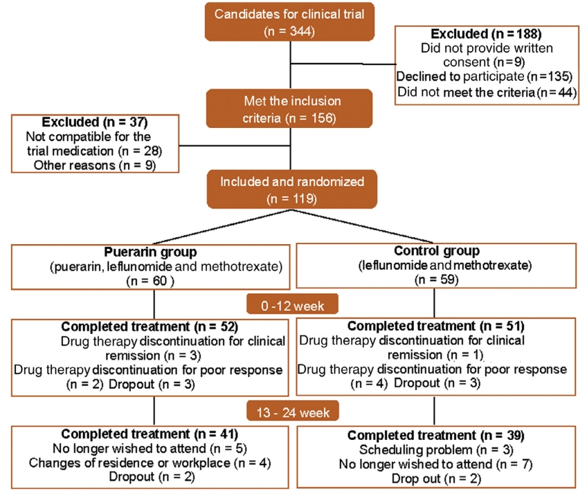
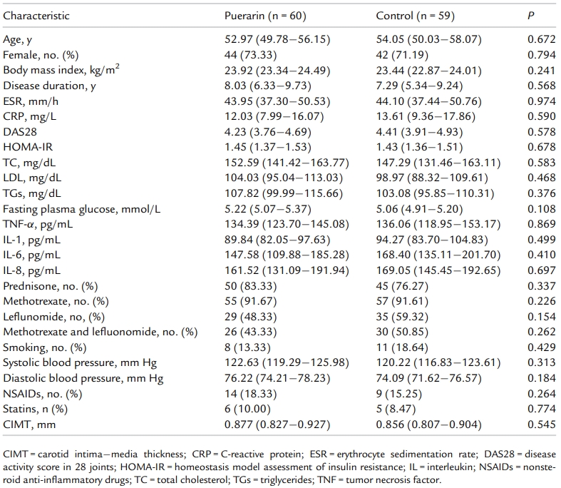
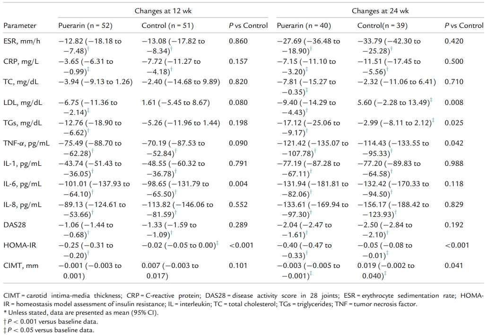

```{r setup, include=FALSE}
knitr::opts_chunk$set(dev = 'pdf')
library(ggplot2)
library(showtext)
showtext::showtext_auto()
```
## 

\LARGE 第十章$~$协方差分析

## 一项关于葛根素对类风湿关节炎病人的临床研究

- 119例类风湿关节炎病人，随机使用（60例）或者不使用（59例）400mg剂量葛根素进行干预

- 分别收集入组，干预后12周，干预后24周的数据

- 通过数据评价葛根素对病人动脉粥样硬化和胰岛素抵抗的临床效果

The Effect of Puerarin on Carotid Intima-media Thickness in Patients With Active Rheumatoid Arthritis: A Randomized Controlled Trial

https://doi.org/10.1016/j.clinthera.2018.08.014

## 一项关于葛根素对类风湿关节炎病人的临床研究

- 临床实验过程中病例脱落情况

```{r echo=FALSE, fig.align='center'}

```

## 一项关于葛根素对类风湿关节炎病人的临床研究

- 病人入组的相关指标统计

```{r echo=FALSE, fig.align='center'}

```

## 一项关于葛根素对类风湿关节炎病人的临床研究

- 干预后12和24的相关指标统计

```{r echo=FALSE, fig.align='center'}

```
## 一项关于葛根素对类风湿关节炎病人的临床研究

- 临床中经常碰到这类设计：
  - 研究对象分为两组，接受不同治疗（如治疗组和安慰组），
  - 每组分别在治疗前和治疗后测量观察指标
  - 通过观测指标评价治疗效果

\begin{table}[]
\begin{tabular}{lllll}
\hline
\multicolumn{1}{|l|}{干预前}  & \multicolumn{1}{l|}{指标1} & \multicolumn{1}{l|}{指标2} & \multicolumn{1}{l|}{…} & \multicolumn{1}{l|}{指标n} \\ \hline
\multicolumn{1}{|l|}{受试药物} & \multicolumn{1}{l|}{}    & \multicolumn{1}{l|}{}    & \multicolumn{1}{l|}{}  & \multicolumn{1}{l|}{}    \\ \hline
\multicolumn{1}{|l|}{安慰剂}  & \multicolumn{1}{l|}{}    & \multicolumn{1}{l|}{}    & \multicolumn{1}{l|}{}  & \multicolumn{1}{l|}{}    \\ \hline
                           &                          &                          &                        &                         
\end{tabular}
\end{table}

\begin{table}[]
\begin{tabular}{lllll}
\hline
\multicolumn{1}{|l|}{干预后}  & \multicolumn{1}{l|}{指标1} & \multicolumn{1}{l|}{指标2} & \multicolumn{1}{l|}{…} & \multicolumn{1}{l|}{指标n} \\ \hline
\multicolumn{1}{|l|}{受试药物} & \multicolumn{1}{l|}{}    & \multicolumn{1}{l|}{}    & \multicolumn{1}{l|}{}  & \multicolumn{1}{l|}{}    \\ \hline
\multicolumn{1}{|l|}{安慰剂/对照}  & \multicolumn{1}{l|}{}    & \multicolumn{1}{l|}{}    & \multicolumn{1}{l|}{}  & \multicolumn{1}{l|}{}    \\ \hline
                           &                          &                          &                        &                         
\end{tabular}
\end{table}

## 一项关于葛根素对类风湿关节炎病人的临床研究

- 对于这种典型的临床设计，应该着手评价药物干预效果？

- 例如：

  - 方法1：针对每个指标，使用假设检验进行比较?
  
  - 方法2：先看干预前指标是否有差异，然后比较治疗后两组的差异？
  
  - 方法3: 先比较“受试药物”治疗前后的差异，再比较“安慰剂/对照”治疗前后的差异，通过差异的大小证明治疗效果？
  
## 一项关于葛根素对类风湿关节炎病人的临床研究

- 方法1：针对每个指标，直接使用假设检验进行比较?

  - 有问题，没有考虑干预前受试病人的差异
  - 一般临床实验是随机盲法，很难避免组间差异的存在
  - 一个简单的例子
    - 在三个班级评价教学方法的效果
    - 班级A成绩最好
    
\begin{table}[]
\begin{tabular}{|l|l|l|l|}
\hline
教学评价     & 班级1 & 班级2 & 班级3 \\ \hline
教学后的平均成绩 & 90  & 85  & 80  \\ \hline
\end{tabular}
\end{table}

## 一项关于葛根素对类风湿关节炎病人的临床研究

- 方法1：针对每个指标，直接使用假设检验进行比较?

  - 有问题，没有考虑干预前受试病人的差异
  - 一般临床实验是随机盲法，很难避免组间差异的存在
  - 一个简单的例子
    - 在三个班级评价教学方法的效果
    - 班级C的成绩上升最快

\begin{table}[]
\begin{tabular}{|l|l|l|l|}
\hline
教学评价     & 班级1 & 班级2 & 班级3 \\ \hline
教学前的平均成绩 & 95  & 85  & 60  \\ \hline
教学后的平均成绩 & 90  & 85  & 80  \\ \hline
\end{tabular}
\end{table}

  - 不应该只看治疗后的差异，不能说明问题

## 一项关于葛根素对类风湿关节炎病人的临床研究

- 方法2：先看干预前指标是否有差异，然后比较治疗后两组的差异？

  - 统计学上的差异不显著未必可靠，跟病例数量（样本量）有很大关系
  
    - 样本量低，即使有效应，也难以通过统计检验显示出来
    
    - 样本量高，即使效应微弱，也可能因为检验的功效提高而发现差异
  
  - 如果差异显著，代表数据没有可比性？
  
- 方法3: 先比较“受试药物”组治疗前后的差异，再比较“安慰剂/对照”组治疗前后的差异，通过差异的大小证明治疗效果？

  - 可以进行调整，利用倍差法
    - 分别对每个病例求出干预前后的指标差值，变成差值的比较
    - 再进行方差分析或者$t$检验
    
  - 虽然“受试药物”组治疗前后的差异更大，但是仅从数字看的话，很难说明有效果
    
    - 从差异上看显著，但是差值太小
  
## 一项关于葛根素对类风湿关节炎病人的临床研究

- 衡量效应的大小

  - Cohen's d：提供了一种不依赖于样本大小的效应大小度量
  - 公式 $d = \frac{\mu_1 - \mu_2}{\sigma_{\mu_1,\mu_2}}$，两个组的均值差值除以合并标准差
  - Cohen's d反映两组均值差异的大小，相对于两组的变异程度
  - $d=0.5$代表两个组之间的均值差异大约是它们标准差的一半
    - 小效应0.2
    - 中效应0.2  0.5
    - 大效应0.5
    
## 方差分析

- 对观测值的变异进行分解，处理效应和误差效应
  - 处理/组间均值的变异$\leftarrow$ 处理效应
  - 处理/组内的变异$\leftarrow$ 随机误差
    
- 方差分解
  
  $\sum_{i=1}^{k}\sum_{j=1}^{n}(x_{ij} - \bar{x_{::}})^2 = \sum_{i=1}^{k}\sum_{j=1}^{n}(x_{ij} - \bar{x_{i:}})^2 + n\sum_{i=1}^{k}(x_{i:} - \bar{x_{::}})^2$

- 但是在方差分析中，一些分析变量本身是一个受到另一个或多个自变量影响的因变量

- 对这些自变量难以进行有效控制，但又要消除其对因变量的影响，以提高试验结果的可靠程度
  - 例如：不同饲料对动物增重的影响
    - 试验动物的初始体重不同
    - 可能会增大处理间差异，也可能会增大处理内差异

## 协方差分析

- 协方差分析Analysis of Covariance，ANCOVA

  - 初始体重$x$对增重$y$的影响可以通过回归分析来度量
  
  - 矫正初始体重的影响后再对增重$y$进行方差分析
  
  - 在协方差分析中，$y$为因变量，$x$为协变量（covariance，COV）
  
- ANCOVA是把回归分析与方差分析结合起来的分析方法
  - 将离均差的乘积和与平方和同时按照变异来源进行分解
  
  - 利用协变量来降低试验误差，矫正处理平均数，实现统计控制，分析不同变异来源的相关关系
  
- 协方差分析也是用于分析多组均数之间的差异有无显著意义，只是多考虑了一个协变量因素
  
## 第一节$~$协方差分析的作用$~$`一、降低试验误差，实现统计控制` 

- 要提高试验的精确度和灵敏度，必须严格控制试验条件的均匀性

- 但是某些情况下，很难使试验控制达到预期要求

- 如果试验条件$x$与因变量$y$之间存在直线回归关系
  
  - 可以通过$x$来矫正$y$
  
  - 使$y$的比较能够在相同试验条件下进行
  
  - 得到正确结论
  
- 用统计方法来矫正因自变量的不同而对因变量所产生的影响，使试验误差减小，对试验处理效应的估计更加准确
  

## 第一节$~$协方差分析的作用$~$`二、分析不同变异来源的相关关系` 

- 协方差

$$
COV_{xy}  = \frac{\sum{(x-\mu_x)(y - \mu_y)}}{N}
$$

- 总体相关系数可以用总体方差和协方差表示

$$
\rho = \frac{COV} {\sigma_x \sigma_y}
$$

- 根据以上，可以得到不同来源协方差组分的估计值
- 并进一步估算两个变量之间各个变异来源的相关系数

## 第一节$~$协方差分析的作用$~$`三、估计缺失数据` 

- 方差分析中估计缺失数据是建立在误差平方和最小的基础上

  - 缺点：处理平方和发生偏倚

- 协方差分析中估计缺失数据
  
  - 保证误差平方和最小
  
  - 得到无偏的处理平方和


## 第二节$~$单因素试验资料的协方差分析

- 设有$k$组双变量资料，每组样本皆有$n$对$(x,y)$观测值，数据模式为

$$
\begin{split}
1&:
\begin{matrix}
x_{11} & x_{12} & \cdots & x_{1j} & \cdots & x_{1n}\\
y_{11} & y_{12} & \cdots & y_{1j} & \cdots & y_{1n}
\end{matrix}\\
2&:
\begin{matrix}
x_{21} & x_{22} & \cdots & x_{2j} & \cdots & x_{2n}\\
y_{21} & y_{22} & \cdots & y_{2j} & \cdots & y_{2n}
\end{matrix}\\
\vdots\\
i&:
\begin{matrix}
x_{i1} & x_{i2} & \cdots & x_{ij} & \cdots & x_{in}\\
y_{i1} & y_{i2} & \cdots & y_{ij} & \cdots & y_{in}
\end{matrix}\\
\vdots\\
k&:
\begin{matrix}
x_{k1} & x_{k2} & \cdots & x_{kj} & \cdots & x_{kn}\\
y_{k1} & y_{k2} & \cdots & y_{kj} & \cdots & y_{kn}
\end{matrix}\\
\end{split}
$$

## 第二节$~$单因素试验资料的协方差分析$~$`一、协方差分析的数学模型` 

- 协方差分析的数学模型为
$$
y_{ij} = \mu_y + \alpha_i + \beta(x_{ij} - \mu_x) + \epsilon_{ij}
$$
  - $\mu_x$ 和$\mu_y$为平均值，$\alpha_i$为第$i$个处理效应，$\beta$为总体回归系数

- 若令$y_{ij}' = y_{ij} - \alpha_i$，此时协方差分析就是$y_{ij}'$与$x_{ij}$的线性回归分析
$$
y_{ij}' = \mu_y + \beta(x_{ij} - \mu_x) + \epsilon_{ij}
$$ 
- 若令$y_{ij}'' = y_{ij} - \beta(x_{ij} - \mu_x)$，此时协方差分析就是在消除了$x_{ij}$不一致对$y_{ij}$影响之后，对$y_{ij}''$的方差分析
$$
y_{ij}'' = \mu_y + \alpha_i + \epsilon_{ij}
$$

## 第二节$~$单因素试验资料的协方差分析$~$`二、协方差分析的基本假定`

- $x$是固定的变量（各个处理的效应是固定的常量）

- $\epsilon_{ij}$是独立的，跟处理效应无关，服从正态分布

- 各个处理的$(x, y)$总体都是线性的，具有共同的回归系数$\beta$

  - 各处理总体的回归是一条平行的直线
  
  - 对样本来说，各个处理之间回归系数的差异不显著（回归系数的齐性/同质性检验）

## 第二节$~$单因素试验资料的协方差分析

- 在方差分析里，一个变量的平方和$\sum_{i=1}^{k}\sum_{j=1}^{n}(y_{ij}-\bar{y_{::}})^2$ 与自由度$df$可以分解

- 同样，两个变量$x$和$y$的总乘积和$SP_T$（$\sum_{i=1}^{k}\sum_{j=1}^{n}(y_{ij}-\mu_y)(x_{ij}-\mu_x)$也可以分解

- $SP_T$可以分解为组间乘积和（$SP_t$）与组内乘积和（$SP_e$）两部分
  
$$
SP_T = SP_t + SP_e
$$
$$
\begin{split}
\sum_{i=1}^{k}\sum_{j=1}^{n}(x_{ij} - \bar{x})(y_{ij} - \bar{y}) = 
n\sum_{i=1}^{k}\sum_{j=1}^{n}(\bar{x}_{i:} - \bar{x})(\bar{y}_{i:} - \bar{y}) + \\
\sum_{i=1}^{k}\sum_{j=1}^{n}(x_{ij} - \bar{x}_{i:})(y_{ij} - \bar{y}_{i:})
\end{split}
$$

  - 对应的自由度
$$
df_T = df_t + df_e
$$
$$
nk-1 = (k - 1) + k(n -1)
$$

## 第二节$~$单因素试验资料的协方差分析

- 检验处理/组内的回归系数是否存在直线关系
  - 对$y$和$x$进行显著性检验
  - $H_0: \beta = 0$ $H_1: \beta \neq 0$

- 如果不存在直线关系，直接进行方差分析

- 如果存在直线关系， 需要消除协变量$x$的影响后，再比较$y$值差异显著性

  - 根据直线回归模型，$y$的平方和$(y - \bar{y})^2$可以分解为回归平方和$(\hat{y} - \bar{y})^2$与残差平方和$(y - \hat{y})^2$
  
  - 消除$x$的影响，校正$y$的平方和已经是去除了协方差$x$对$y$的影响，也就是扣除了$(\hat{y} - \bar{y})^2$
  
  - 对残差平方和进行进一步分解,不必对各个处理/组内的校正y值进行分别计算
  
  $$
  (y - \hat{y})^2 = (y - \hat{y})^2_{adj} + (y - \hat{y})^2_{t}
  $$
  

## 第二节$~$单因素试验资料的协方差分析$~$`总结`

- 认为对$y$有影响的因素$x$看作协变量

- 建立$y$对$x$的线性回归

- 利用回归关系对各组内的$y$进行修正并比较，$y$修正后的均值是假定$x$取值固定在其总均值时$y$的均值


## 第二节$~$单因素试验资料的协方差分析$~$`三、计算变量各变异来源的平方和、乘积和与自由度` 

- 3种饲料($A_1, A_2, A_3$)饲喂试验中猪的始重$x$与增重$y$资料
$$
\begin{split}
A_1&:
\begin{matrix}
x: & 18 & 16 & 11 & 14 & 14 & 13 & 17 & 17 \\
y: & 85 & 89 & 65 & 80 & 78 & 83 & 91 & 85 
\end{matrix}\\
A_2&:
\begin{matrix}
x: & 17 & 18 & 18 & 19 & 21 & 21 & 16 & 22 \\
y: & 95 & 100 & 94 & 98 & 104 & 97 & 90 & 106 
\end{matrix}\\
A_3&:
\begin{matrix}
x: & 18 & 23 & 23 & 20 & 24 & 25 & 25 & 26 \\
y: & 91 & 89 & 98 & 82 & 100 & 98 & 102 & 108
\end{matrix}\\
\end{split}
$$

- 猪的始重在各组相差较大

- 始重大的猪增重快，始重小的猪增重慢

- 直接使用方差分析的方法忽略了始重不同的影响，不能反映3种饲料的真实效应

- 需要用协方差分析的方法，矫正始重对增重的影响

## 第二节$~$单因素试验资料的协方差分析$~$`三、计算变量各变异来源的平方和、乘积和与自由度`

R DEMO

不考虑始重时的方差分析
```{r}
pig_weight <- data.frame(x = c(18, 16, 11, 14, 14, 13, 17, 17, 17, 18, 18, 19, 21, 21, 16, 22, 18, 23, 23, 20, 24, 25, 25, 26), 
                         y = c(85, 89, 65, 80, 78, 83, 91, 85, 95, 100, 94, 98, 104, 97, 90, 106, 91, 89, 98, 82, 100, 98, 102, 108),
                         groups = as.factor(rep(c("A1", "A2", "A3"), each = 8))
                         )
summary(aov(y ~ groups, data = pig_weight))
```
组间平方和1216，组内平方和1126，F值11.34

## 第二节$~$单因素试验资料的协方差分析$~$`四、检验x和y是否存在直线回归关系` 

- 从组内项变异中找出$x$(始重)与$y$(增重)之间是否存在真实的线性回归关系

  - 计算处理内（组内）的回归系数，并对线性回归关系进行显著性检验
  
- 假设$H_0: \beta = 0, H_A: \beta \neq 0$
  - 如果接受$H_0: \beta = 0$，则二者之间回归关系不显著
  - 说明$y$(增重)不受$x$(始重)的影响
  - 不用考虑始重，直接对增重进行方差分析
  
- 计算误差项（处理内或组内）的回归系数、回归平方和与自由度
$$
\begin{cases}
b_e = \frac{SP_e}{SP_{e_x}}\\
U_e = \frac{SP_e^2}{SP_{e_x}}\\
df_e = 1
\end{cases}
$$

## 第二节$~$单因素试验资料的协方差分析$~$`四、检验x和y是否存在直线回归关系` 

R DEMO
```{r message=FALSE, prompt=TRUE, fig.asp=1, fig.align='center', out.height = "80%"}
plot(y~x, data = pig_weight, type='p')
```

## 第二节$~$单因素试验资料的协方差分析$~$`四、检验x和y是否存在直线回归关系`

R DEMO
\tiny
```{r, prompt=TRUE}
summary(lm(y~x,  data = pig_weight))
```

## 第二节$~$单因素试验资料的协方差分析`四、检验x和y是否存在直线回归关系`

R DEMO
```{r message=FALSE, prompt=TRUE, out.height="60%", fig.align='center'}
library(HH)
ancovaplot(y ~ groups+x, data= pig_weight)
```

- $y$对$x$有显著的直线回归关系，确实受到影响


## 第二节$~$单因素试验资料的协方差分析`五、 检验矫正平均数间的差异显著性` 

R DEMO

注意要把协变量写在前面
```{r}
summary(aov(y ~ x + groups , data = pig_weight)) 
```
校正后的组间方差235.2，校正后的组内方差19.8，F值为11.90

## 第二节$~$单因素试验资料的协方差分析

R DEMO
```{r message=FALSE, prompt=TRUE, out.height="60%", fig.align='center'}
model <- ancova(y ~ x + groups , data= pig_weight)
summary(model)
```

- 通过矫正后消除始重的影响后，各饲料组间矫正增重达到显著水平，需要进行多重比较