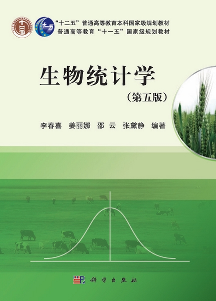
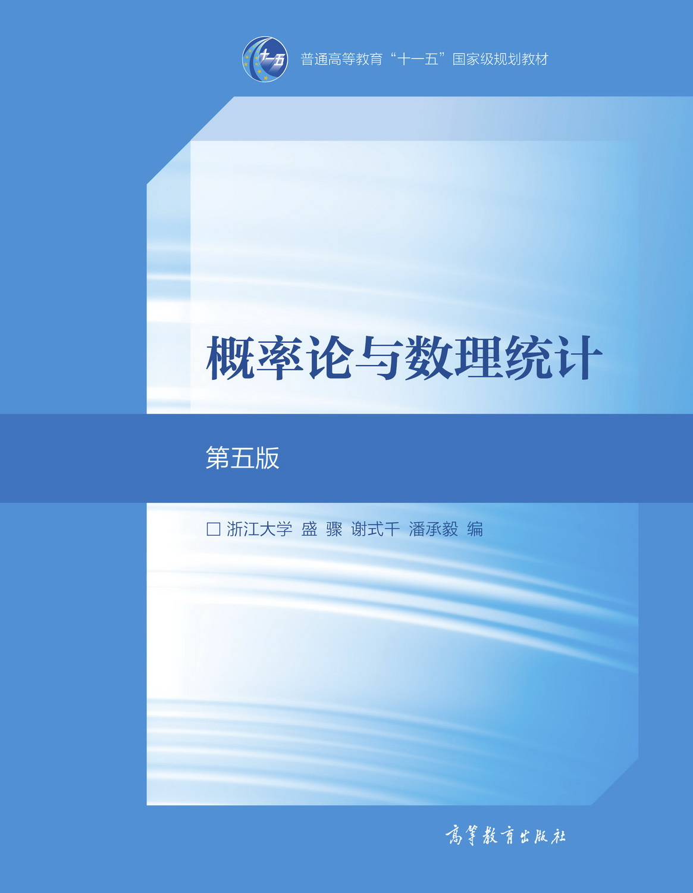
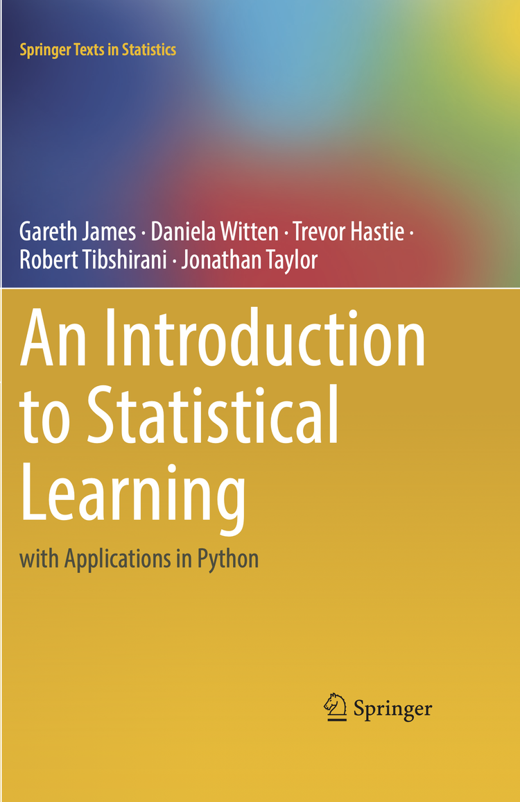
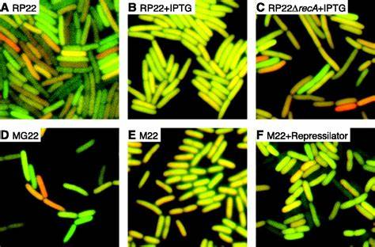
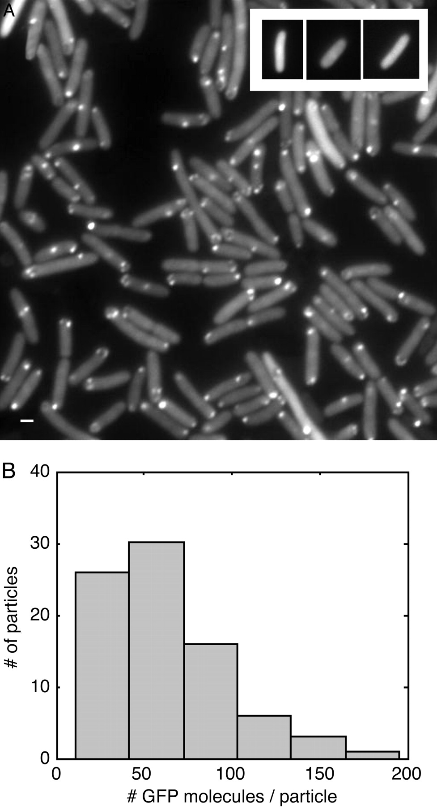

---
title: |
  | 生物试验设计
  | 第一章$~$概论
author: |
  | 王超
  |
  | 广东药科大学中医药研究院
  | 
  | Email: wangchao@gdpu.edu.cn
date: |
  | {width=1.5in} 
  | `r Sys.Date()`

fontsize: 10pt
output: beamer_presentation
---
```{r setup, include=FALSE}
knitr::opts_chunk$set(dev = 'pdf')
library(ggplot2)
library(showtext)
showtext::showtext_auto()
```

## 

-   省代谢病研究中心，附一院代谢病临床项目办公室
-   硕士研究生导师
-   教育经历：华南理工大学博士研究生毕业
-   工作经历：BGI Shenzhen, [COMP\@HKBU](mailto:COMP@HKBU){.email}，[SCM\@HKBU](mailto:SCM@HKBU){.email}
-   电子邮箱：[wangchao\@gdpu.edu.cn](mailto:wangchao@gdpu.edu.cn){.email}
-   学术主页：wangchao.netlify.com
-   办公室地址：广东药科大学科技楼五楼
-   研究方向：系统生物学，计算生物学，中西医结合临床医学

## 注册学习通

账号：本人学号

初始密码：s654321s

```{r echo=FALSE, fig.align='center', out.width="75%"}

```

## 

\LARGE 课程介绍

## 课程资源

-   Github：[Solipugids/biostatistics_course_2022](https://github.com/Solipugids/biostatistics_course_2022.git) {width="10%"}
-   下载Github Desktop后选择`Clone reposit...`
-   安装git后在\textcolor{red}{终端}中输入命令 `git clone https://github.com/Solipugids/biostatistics_course_2022.git`

```{r echo=FALSE, fig.align='center', out.width="75%"}

```

## 学习资源

-   工具
    -   办公软件：WPS表格，Microsoft Excel
    -   专业软件：GraphPad-Prism，Matlab
    -   计算语言：{width="5%"} $~~$ [R](https://www.r-project.org/) & [CRAN](https://cran.r-project.org/)

> R is 'GNU S', a freely available language and environment for statistical computing and graphics which provides a wide variety of statistical and graphical techniques: linear and nonlinear modelling, statistical tests, time series analysis, classification, clustering, etc.

-   参考书籍：
    -   生物统计学（第五版），李春喜，科学出版社
    -   概率论与数理统计（第五版），浙江大学，高等教育出版社

{width="20%"} {width="20%"} {width="20%"}

## RStudio

-   RStudio Desktop
    -   {width="10%"} RStudio <https://www.rstudio.com/>
-   RStudio Server
    -   中研院 e032-120-85-130-202.ngrok.io，校内网访问地址 10.91.10.250:8787（通过邮件申请使用权限）
    -   官方 <https://rstudio.cloud/> (自行注册账号使用)

```{r echo=FALSE, fig.align='center', out.width="80%"}

```

## DEMO-data

-   `diamonds`数据集是包括近54000颗钻石的价格和其他属性的内置数据集，共`53940`行条目和`10`个变量。
-   每行数据代表一个不同的钻石的属性数据（价格、重量、颜色、透明度等）。

```{r echo=FALSE, message=FALSE}
print(diamonds[1:5, 1:8])
```

## DEMO-vis

一批次钻石中每颗钻石的具体数据

```{r warning=FALSE, message=FALSE, tidy=FALSE, fig.align='center', fig.height=4, fig.width=8, crop=TRUE}
ggplot(diamonds, aes(carat, price,colour=cut)) +
  geom_point(alpha = 1/3) + stat_smooth()
```

## 课程考核

-   成绩评定
    -   平时成绩

        -   课堂考勤
        -   日常作业

    -   考试成绩

    -   平时成绩 30%, 考试成绩 70%
-   作业要求
    -   独立思考
    -   演算正确
    -   作图清楚
    -   书写整齐

## 学习重点

-   重点讲解统计方法在生物学中的应用；
-   不强调\textcolor{red}{公式的推导和证明}，但是要大概了解过程；
-   及时完成作业，按时提交和反馈。

## Q&A

-   QQ群
    -   海洋药学22：862588942
    -   生物工程类22(1)，生物工程类22(2)：741120411
-   发送邮件$\star$
    -   [wangchao\@gdpu.edu.cn](mailto:wangchao@gdpu.edu.cn){.email}
-   Github Issues

```{r echo=FALSE, fig.align='center', out.width="60%"}

```

## 

\LARGE 第一章$~$概论

## 第一节$~$生物统计学的概念

- 生物统计学是数理统计在生物学研究中的应用

- 用数理统计的原理和方法来分析和解释生物界各种现象和试验调查资料的科学

- 属于生物数学的范畴

    - 涉及到数列、排列、组合、矩阵、微积分等知识

## 第一节$~$生物统计学的概念

表型水平的噪声

```{r echo=FALSE, fig.align='center', out.width="70%"}

```

> Stochastic Gene Expression in a Single Cell. Michael B. Elowitz et al., Science, 297,1183-1186(2002).

> <https://doi.org/10.1126/science.1070919>

## 第一节$~$生物统计学的概念

分子水平的噪声

```{r echo=FALSE, fig.align='center', out.width="25%"}

```

> RNA dynamics in live Escherichia coli cells. Ido Golding and Edward C. Cox, July 26, 2004, 101 (31) 11310-11315.

> <https://doi.org/10.1073/pnas.0404443101>

## 第一节$~$生物统计学的概念

为什么要学习统计学？

-   为我们提供数据整理分析的方法

-   为我们提供由样本推断总体的方法

-   为我们分析变异因素提供一系列决策和方法

-   帮助我们分析现象之间的关系

-   对试验设计有指导作用

## 第二节$~$统计学发展概况

-   统计实践随着计数活动开始（原始社会）

-   上升到理论成为系统的统计学（17世纪英国）

    -   政治算数：Political Arithmetick, 1690, W. Petty.
    -   该书分为两部分：英法荷三国国力比较，英国国情国力和增长分析

-   发展经历三个阶段

    -   古典记录统计学
    -   近代描述统计学
    -   现代推断统计学

## 第二节$~$统计学发展概况$~$`一、古典记录统计学`

-   17世纪中叶-19世纪中叶

-   初步建立了统计研究的方法和规则

-   引进概率论，逐渐成为一种较为成熟的方法

    -   伯努利大数定律

        -   在N重伯努利实验（抛硬币）中，在实验次数足够大条件下某一事件发生的频率可无限接近真实发生的概率。

    -   拉普拉斯中心极限定理

    -   正态分布理论：高斯

<!-- {width=10%} -->

## 第二节$~$统计学发展概况$~$`一、古典记录统计学`

大数定律

-   通过大量重复实验用事件发生的\textcolor{red}{频率}去估计\textcolor{red}{概率}

```{r cache = TRUE, fig.showtext = TRUE, out.width="80%", fig.align = 'center', echo = FALSE, message = FALSE, warning = FALSE, crop = TRUE}
bnl_big <- function(n=10, p=0.5){
  count <- 0
  for (i in 1:n){
    if (sample(c(0, 1), 1, prob = c(p, 1-p))==1)
      count <- count+1 # 随机产生0或1，统计等于1的个数
  }
  return(count/n)
}
exp_times <- 10^seq(0,5,0.1)
exp_pro <- unlist(lapply(exp_times, bnl_big))
plot(exp_pro~exp_times, type = 'l', xlab = "Number of Rolls", ylab = "Probability", log="x", lwd = 3)
```

## 第二节$~$统计学发展概况$~$`一、古典记录统计学`

-   赌场经济学：通过赌场大量玩家参与的赌博事件拉高庄家赢的概率

```{r cache = TRUE, fig.showtext = TRUE, out.width="80%", fig.align = 'center', echo = FALSE, message = FALSE, warning = FALSE, crop = TRUE}
player <- function(n=10, p=0.6){
  count <- 0
  for (i in 1:n){
    if (sample(c(0, 1), 1, prob = c(p, 1-p))==1)
      count <- count+1 
  }
  return(count/n)
}
casino <- function(n=10, p=0.7){
  count <- 0
  for (i in 1:n){
    if (sample(c(0, 1), 1, prob = c(p, 1-p))==1)
      count <- count+1 # 随机产生0或1，统计等于1的个数
  }
  return(count/n)
}
exp_times <- 10^seq(0,5,0.1)
player_pro <- unlist(lapply(exp_times, player))
casino_pro <- unlist(lapply(exp_times, casino))
plot(casino_pro~exp_times, type = 'l', xlab = "Number of Rolls", ylab = "Probability", log="x",  col = "red", lwd = 3)
lines(player_pro~exp_times, type = 'l',  col = "blue", lwd = 3)
legend("topright", c("庄家", "玩家"), lty = c(1,1), col = c("red", "blue"))
```

- 医学研究领域

- 保险产业应用

## 第二节$~$统计学发展概况$~$`二、近代描述统计学`

-   19世纪中叶-20世纪上半叶

-   统计学应用于生物学研究的开始

-   分析父母和子女的变异，探寻遗传规律，应用统计方法研究人种特性和遗传

    -   中位数、百分位数、四分位数、分布：Galton

    -   相关、回归、$\chi_2$检验：Pearson

## 第二节$~$统计学发展概况$~$`三、现代推断统计学`

-   20世纪初至20世纪中叶

-   各种事物与现象之间繁杂的数量关系以及未知的数量变化，单靠记录或描述的统计方法难以奏效

-   要求采用推断的方法来掌握事物之间的真正联系，并对事物进行预测

    -   t分布和t检验：小样本分布检验的理论和方法，Gosset

    -   方差和方差分析：显著性检验和估计理论，Fisher

    -   统计假设检验学说：Pearson，Newman

## 第二节$~$统计学发展概况$~$`中国的统计学历史`

- 明朝从明太祖朱元璋开始，官方主导编制《大明会典》
```{r echo=FALSE, fig.align='center', out.width="45%"}

```
- 万历会计录
```{r echo=FALSE, fig.align='center', out.width="50%"}
knitr::include_graphics("./KJL.png")
```


## 第二节$~$统计学发展概况$~$`中国的统计学历史`

- 学习借鉴欧美统计理论和方法

  - 1902 年，《钦定京师大学堂章程》规定，在商科大学正式讲授统计学课程

  - 日本社会统计学者横山雅男先生所著的《统计讲义录》被译成中文

  - 顾澄教授翻译了《统计学之理论》

- 学习苏联的统计学建设

- 变成了一门独立建设的一级学科

  - 计算机逐渐引入国内


## 第三节$~$常用统计学术语$~$`一、总体与样本`


- 总体：具有相同性质的个体所组成的集合
    - 个体：组成总体的基本单元
    - 无限总体和有限总体
    - 研究总体的困难：个体数目多/试验具有破坏性/试验成本很高
    - 抽样：从总体中抽取一部分个体进行研究
- 样本$\clubsuit$： 从总体中抽出若干个体所构成的集合
    - 样本单位：构成样本的每个个体
    - 样本容量：样本中个体的数目，记为$n$
    - 从样本中来估计总体
    - 小样本($< 30$)和大样本（$>= 30$），注意区别

## 第三节$~$常用统计学术语$~$`二、参数与统计数`

- 参数：对一个总体特征的度量（常常是未知的）
    - 总体平均数$\mu$，总体标准差$\sigma$
- 统计数：由样本计算所得的数值，描述样本的特征
    - 样本平均数$\bar{x}$，样本标准差$s$
- 通过抽样，根据样本的统计数来估计总体的参数

## 第三节$~$常用统计学术语$~$`三、变量与资料`

- 变量$\clubsuit$：相同性质的事物间表现差异性的某项特征或性状，是试验指标
  - 资料：变量的观察结果，也称为变量值
  - 定量变量
    - 连续型变量
    - 离散型变量，通常是整数
  - 定性变量
  - 变量的类型根据研究目的确定，各类变量可以相互转化

- 常量：代表事物特征和性质的数值，通常由变量计算而来，一定过程中一般是不变的
  - 总体平均数、标准差、变异系数

## 第三节$~$常用统计学术语$~$`四、因素与水平`

- 因素：试验中所研究的影响试验指标的原因或原因组合
    - 抽象概念
- 因素水平：每个试验因素的不同状态
    - 较为具体的概念
- 可控因素（人为调控）/非控因素（随机产生）

## 第三节$~$常用统计学术语$~$`五、处理与重复`

- 处理：对受试对象（试验单位）给予的某种外部干预
  - 单因素处理：试验中涉及的因素只有一个
  - 多因素处理：试验中涉及两个或两个以上的因素
    - 研究因素的主效
    - 研究因素之间的交互作用
- 重复：在试验中，将一个处理实施在两个或两个以上的试验单位上
    - 处理实施的试验单位数即为重复数

## 第三节$~$常用统计学术语$~$`六、效应与互作`

-   效应/主效：试验因素相对独立的作用
-   互作效应：两个或两个以上处理因素间相互作用所产生的效应（正效应/负效应）
    -   氮磷肥共施对作用产量产生交互作用

## 第三节$~$常用统计学术语$~$`七、准确性与精确性`

-   准确性：调查或试验中某一试验指标或性状的观测值与真值接近的程度
    -   反映测定值与真值符合程度的大小
-   精确性：调查或试验中同一试验指标或性状的重复观测值彼此接近程度的大小
    -   反映多次测定值的变异程度
-   准确性不等于精确性

## 第三节$~$常用统计学术语$~$`八、误差和错误`

-   误差：也称为试验误差，是指观测值偏离真值的差异，分为随机误差和系统误差。
    -   随机误差：由于试验中许多无法控制的偶然因素所造成的试验结果与真实值之间的差异，是**不可避免**的。
    -   系统误差：由于试验处理以外的其他条件明显不一致所产生的带有倾向性的或定向性的偏差。
-   错误：在实验过程中，人为因素引起的差错。

## 第三节$~$常用统计学术语$~$`思考题`

通过合理的试验设计和和精心管理可以减小,但无法消除的一类试验误差是_____（单选题）

A、 样本误差 

B、 随机误差 

C、 系统误差 

D、 总体误差 

## 第三节$~$常用统计学术语$~$`思考题`

下面变量中属于非连续变量的是_____（单选题）

A、 血糖含量

B、 血型

C、 血脂含量

D、 血压 


## 第三节$~$常用统计学术语$~$`思考题`

下面有关统计学术语的描述,错误的一项是_____（单选题）

A、 互作是指两个或两个以上处理因素间的相互作用产生的效应

B、 统计数是描述样本特征的数量,常用拉丁字母表示 

C、 试验中所研究的影响试验指标的原因或原因组合称为水平 

D、 样本是从总体中抽出的若干个个体所构成的集合 

## 第四节$~$资料特征数的计算$~$

- 变量分布的两个基本特征

  - 集中性
    
    - 平均数：算数平均数，中位数，众数
  
  - 离散性
  
    - 变异数：极差，方差，标准差，变异系数

## 第四节$~$资料特征数的计算$~$`一、平均数`

- 算数平均数：$$ \bar{x} = \frac{1}{N}\sum_{i=1}^{N}x_i $$

- 中位数：居于中间位置的观测值

- 众数：出现次数最多的观测值

- 几何平均数：$$ G = \sqrt[n]{x_1 x_2 x_3 x_3 x_5} $$

## 第四节$~$资料特征数的计算$~$`二、变异数`

- 极差：最大值和最小值之差

- 方差：$$ s^2  = \frac{\sum{(x-\mu)}^2}{N} $$

- 标准差：$$ s  = \sqrt{\frac{\sum{(x-\mu)}^2}{N}} $$

- 变异系数：$$CV=\frac{s}{\bar{x}} \times 100\% $$

  - 变异系数是一个相对变异量，不带单位。
  
  - 使用变异系数可以比较不同样本相对变异程度的大小。
  
## 第四节$~$资料特征数的计算$~$`思考题`  

如果对各观测值加上一个常数$a$,其标准差_____（单选题）

A、 不变 

B、 扩大$a^2$倍 

C、 扩大$a$倍 

D、 缩小$a$倍 

  
## 第五节$~$生物统计学的内容与作用

基本内容

- 试验设计：应用统计的原理与方法制订试验方案、选择试验材料并进行合理分组，使我们获得可靠的数据资料。
    -   对比设计
    -   随机区组设计
    -   裂区设计
    -   拉丁方设计
    -   正交设计

## 第五节$~$生物统计学的内容与作用

基本内容

- 统计分析：应用统计的原理与方法对数据资料进行分析和推断，主要包括统计描述和统计推断，涉及的知识：
    -   数据搜集整理
    -   特征数计算
    -   假设检验
    -   方差分析
    -   回归和相关分析
    -   协方差分析

## 第五节$~$生物统计学的内容与作用

- 统计分析可以为试验设计提供合理的依据

- 试验设计是统计分析方法的进一步应用

## 第五节$~$生物统计学的内容与作用

基本作用

- 提供整理和描述数据资料的科学方法

- 判断试验结果的可靠性

- 提供由样本推断总体的方法

- 提供试验设计的一些重要原则

## 第五节$~$生物统计学的内容与作用`思考题`

生物统计学是数理统计在生物学研究中的应用,它是用数理统计的原理和方法来分析和解释生物界各种现象和试验调查资料的科学,它的主要内容包括____（单选题）

A、 资料调查 

B、 数据处理 

C、 试验设计和统计分析 

D、 假设检验 

## 课后思考题

资料可以分为哪些种类？

这些资料分类之间有什么区别？

资料之间如何进行转换？
