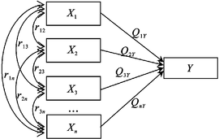

```{r setup, include=FALSE}
knitr::opts_chunk$set(dev = 'pdf')
library(ggplot2)
library(showtext)
showtext::showtext_auto()
```
## 

\LARGE 第十二章$~$逐步回归与通径分析

## Check In App Release version_0.87

```{r echo=FALSE, crop=TRUE, fig.align='center'}
p <- c(1, 2, 3)
pp <- expand.grid(p ,p)
pp$Var2 <- pp[9:1, 2]

random_lib <- list(
  a <-list(c(1,2), c(1, 4), c(1, 5)),
  b <-list(c(2,1), c(2, 5), c(2, 3)),
  c <-list(c(3,2), c(3, 5), c(3, 6)),
  d <-list(c(4,1), c(4, 5), c(4, 7)),
  e <-list(c(5,2), c(5, 4), c(5, 6), c(5, 8)),
  f <-list(c(6,3), c(6, 5), c(6, 9)),
  g <-list(c(7,4), c(7, 5), c(7, 8)),
  h <-list(c(8,7), c(8, 5), c(8, 9)),
  i <-list(c(9,6), c(9, 5), c(9, 8))
)
random_generate <- function(x){
  repeat {
    m <- x
    n <- sample(random_lib[[m]], 1)[[1]][2]
    o <- sample(random_lib[[n]], 1)[[1]][2]
    p <- sample(random_lib[[o]], 1)[[1]][2]
    random_out <- c(m, n, o, p)
    if (sum(duplicated(random_out))==FALSE) {
      break
    }
  }
  return(random_out)
}
checkin <- random_generate(sample(1:9, 1))
par(xaxs = "i", yaxs = "i")

plot(expand.grid(p ,p), type = 'p', pch = 20, cex = 10, col="red", xlim = c(-1, 5), ylim = c(xlim = c(-1, 3.5)), axes = F, main=bquote("Check In Code: "*.(checkin[1])*.(checkin[2])*.(checkin[3])*.(checkin[4])) , xlab=NA, ylab=NA)
text(1, 3, "1", col='white', family="sans")
text(2, 3, "2", col='white', family="sans")
text(3, 3, "3", col='white', family="sans")
text(1, 2, "4", col='white', family="sans")
text(2, 2, "5", col='white', family="sans")
text(3, 2, "6", col='white', family="sans")
text(1, 1, "7", col='white', family="sans")
text(2, 1, "8", col='white', family="sans")
text(3, 1, "9", col='white', family="sans")
for (n in 1:3) {
  pos1 <- pp[checkin[n], ]
  pos2 <- pp[checkin[n+1], ]
  arrows(x0 = pos1$Var1, y0 = pos1$Var2, x1 = pos2$Var1, y1 = pos2$Var2, angle = 20, length = 0.1, lwd = 2, col = rgb(0, 0, 255, 80, maxColorValue=255))
}
```

## 一元与多元回归

- 对于多变量资料，既包含对因变量$y$具有显著线性效应的自变量，又包含对$y$不具有显著线性效应的自变量

- 分析中必须将不具有显著效应的自变量予以舍去，使所得到的多元线性回归方程中的自变量对因变量$y$均具有显著效应，这就是最优多元线性回归方程

- 可通过逐步回归方法建立最优回归方程，来简洁准确地分析和预测因变量$y$的反应

- 通径分析是另一种研究多个相关变量间线性关系的统计方法

## 第一节$~$逐步回归分析

- 逐步回归分析的两种基本途径：

  - 向前逐步回归
  
    - 从一元回归分析开始，按各自变量对$y$作用的秩次，依次每步仅选入一个对$y$作用显著的自变量
    
    - 每引入一个自变量后，对在此之前已引入的自变量进行重新检验，有不显著者即舍弃
    
    - 直到选入的自变量都显著，未被选入的自变量都不显著为止
    
  - 向后逐步回归
  
    - 从$m$元回归分析开始，每步舍去一个不显著且偏回归平方和为最小的自变量
    
    - 每次舍去一个偏回归不显著且平方和最小的自变量之后，需对回归方程和各自变量重新进行假设检验
    
    - 直到回归方程所包含的自变量全部显著
    
    - 自变量个数较少，且大多都显著时，这种方法就比较实用
    
  - 从多元回归模型种取消一个自变量$x_i$后，总回归平方和减少的部分，称为自变量$x_i$对$y$的偏回归平方和，也就是$x_i$对$y$的回归贡献

## 第一节$~$逐步回归分析 $~$`一、逐个淘汰不显著自变量的回归方法`

- $m$元回归分析

  - 若各自变量的偏回归皆显著，分析结束
  
  - 若有一个或一个以上自变量的偏回归不显著，则舍弃\textcolor{red}{偏回归平方和最小的自变量}，进入下一步
  
- $m-1$元回归分析

  - 将舍弃的自变量所在的行、列及其$K$列划去，重新计算$m-1$阶系数矩阵的逆矩阵元素
  
  - 如果仍有自变量偏回归不显著，则再将偏回归平方和最小的自变量舍去，进入下一步
  
- 重复进行，直至留下所有自变量的偏回归系数皆显著，即得到最优回归方程

## 第一节$~$逐步回归分析 $~$`一、逐个淘汰不显著自变量的回归方法`

在进行$m$元回归分析的基础上，余下自变量的偏回归系数和逆矩阵$A^{-1}$中$c_{ij}$的计算，可根据舍弃前的偏回归系数和$c_{ij}$，通过公式直接求出

设$x_k$为舍弃的自变量，则
$$
\begin{split}
b^*_i &= b_i - \frac{c_{ik}b_k}{c_{kk}} (i \neq k)\\
c^*_{ij} &= c_{ij} - \frac{c_{ik}c_{kj}}{c_{kk}} (i,j \neq k)
\end{split}
$$


## 第一节$~$逐步回归分析 $~$`一、逐个淘汰不显著自变量的回归方法`
R DEMO
\tiny
```{r echo=TRUE, message=FALSE, highlight=TRUE, prompt=TRUE}
library(caret)
fc <- data.frame(
  x1 = c(10, 9, 10, 13, 10, 10, 8, 10, 10, 10, 10, 8, 6, 8, 9),
  x2 = c(23, 20, 22, 21, 22, 23, 23, 24, 20, 21, 23, 21, 23, 21, 22),
  x3 = c(3.6, 3.6, 3.7, 3.7, 3.6, 3.5, 3.3, 3.4, 3.4, 3.4, 3.9, 3.5, 3.2, 3.7, 3.6),
  x4 = c(113, 106, 111, 109, 110, 103, 100, 114, 104, 110, 104, 109, 114, 113, 105),
  y = c(15.7, 14.5, 17.5, 22.5, 15.5, 16.9, 8.6, 17.0, 13.7, 13.4, 20.3, 10.2, 7.4, 11.6, 12.3)
)
lbw_model <- train(y ~., data = fc, method = "leapBackward")
lbw_model$results
```

## 第一节$~$逐步回归分析 $~$`一、逐个淘汰不显著自变量的回归方法`
R DEMO
\tiny
```{r echo=TRUE, message=FALSE, highlight=TRUE, prompt=TRUE}
lbw_model$bestTune
summary(lbw_model$finalModel)
coef(lbw_model$finalModel, 3)
```
## 第一节$~$逐步回归分析 $~$`二、逐个选入显著自变量的回归方法`

（一）计算各变量的简单相关系数，得到$m+1$阶相关矩阵$R^{(0)}$
$$
R^{(0)} = 
\begin{bmatrix} 
r_{11}^{(0)} & r_{12}^{(0)} & \dots & r_{1m}^{(0)} & r_{1y}^{(0)}\\ 
r_{21}^{(0)} & r_{22}^{(0)} & \dots & r_{2m}^{(0)} & r_{2y}^{(0)}\\
\vdots\\
r_{m1}^{(0)} & r_{m2}^{(0)} & \dots & r_{mm}^{(0)} & r_{my}^{(0)}\\
r_{y1}^{(0)} & r_{y2}^{(0)} & \dots & r_{ym}^{(0)} & r_{yy}^{(0)}
\end{bmatrix} 
$$
- 简记为$R^{(0)} = (r_{ij}^{(0)}), (i,j = 1,2,3,\dots, m, y)$
```{r echo=FALSE, warning=FALSE, message=FALSE, out.height="30%", fig.align='center'}
library(corrplot)
corrplot::corrplot(cor(fc), method = "number", type = "full", order = "original", addshade = "all", tl.cex = 3, cl.cex = 3, pch.cex = 5)
```


## 第一节$~$逐步回归分析 $~$`二、逐个选入显著自变量的回归方法`

（二）选入自变量逐步回归

- 选入自变量逐步回归
  
  - 以$R^{(0)}$为基础，每进行一步回归选入一个显著的自变量，并对相关矩阵做一次变换
    
  - 在第一步，将$R^{(0)}=(r_{ij}^{(0)})$变为$R^{(1)}=(r_{ij}^{(1)})$
    
  - 在第二步，将$R^{(1)}=(r_{ij}^{(1)})$变为$R^{(2)}=(r_{ij}^{(2)})$
    
  - 在第$k$步，将$R^{(k-1)}=(r_{ij}^{(k-1)})$变为$R^{(k)}=(r_{ij}^{(k)})$
  
  
## 第一节$~$逐步回归分析 $~$`二、逐个选入显著自变量的回归方法`
（二）选入自变量逐步回归

- 在第$k$步（$k=1,2,\dots, m+1$），由下式算得任一尚未入选自变量$x_i$的标准偏回归平方和
$$
U_i^{(k)} = \frac{(r_{iy}^{(k-1)})^2}{r_{ii}^{(k-1)}}
$$

- 设最大$U_i^{(k)}$的自变量$x_i(i=l)$，则$x_l$在第$k$步是否入选由下式决定
$$
F = \frac{U_l^{(k)}}{\frac{r_{yy}^{(k-1)}-U_l^{(k)}}{n-m-1}}
$$

## 第一节$~$逐步回归分析$~$`二、逐个选入显著自变量的回归方法`
（二）选入自变量逐步回归

- 若$F>F_\alpha$，则引入自变量$x_l$，并将$R^{(k-1)}$变换成$R^k$。变换时由元素$r_{ij}^{(k-1)}$计算元素$r_{ij}^{(k)}$的通式为
$$
\begin{cases}
r_{ll}^{(k)} = \frac{1}{r_{ll}^{(k-1)}}\\
r_{lj}^{(k)} = \frac{r_{lj}^{(k-1)}}{r_{ll}^{(k-1)}}\\
r_{il}^{(k)} = -\frac{r_{il}^{(k-1)}}{r_{ll}^{(k-1)}}\\
r_{ij}^{(k)} = r_{ij}^{(k-1)} - (\frac{r_{il}^{(k-1)}r_{lj}^{(k-1)}}{r_{ll}^{(k-1)}})
\end{cases}
$$

## 第一节$~$逐步回归分析$~$`二、逐个选入显著自变量的回归方法`
（二）选入自变量逐步回归

- 由$R^k$可以得到入选自变量$x_i$的标准偏回归系数、偏回归平方和、离回归平方和及$F$值
$$
\begin{split}
b_i^{(k)} = r_{iy}^{(k)}\\
U_l^{(k)} = \frac{b_i^{(k)}}{r_{ii}^{(k)}}\\
Q^{(k)} = r_{yy}^{(k)}\\
F = \frac{U_l^{(k)}}{\frac{Q^{(k)}}{n-m-1}}
\end{split}
$$
- 根据$F$值决定是否需要剔除$x_l$前的自变量

## 第一节$~$逐步回归分析$~$`二、逐个选入显著自变量的回归方法`

（三）计算偏回归系数，建立最优回归方程

- 自变量挑选结束结束即可建立最优回归方程

- 将各种标准化统计数还原为原来单位的统计数

- 在第$k$步，原来单位的统计数和标准化统计数的关系为
$$
\begin{split}
U = U_i^{(k)} SS_y\\
Q = Q^{(k)} SS_y
\end{split}
$$
- 偏回归系数和标准化偏回归系数的关系为
$$
b_i = b_i^{(k)}\sqrt{\frac{SS_y}{SS_i}}
$$

## 第一节$~$逐步回归分析$~$`二、逐个选入显著自变量的回归方法`
R DEMO
\tiny
```{r echo=TRUE, message=FALSE, highlight=TRUE, prompt=TRUE, warning=FALSE}
lfw_model <- train(y ~., data = fc, method = "leapForward")
lfw_model$results
lfw_model$bestTune
```

## 第一节$~$逐步回归分析$~$`二、逐个选入显著自变量的回归方法`
R DEMO
\tiny
```{r echo=TRUE, message=FALSE, highlight=TRUE, prompt=TRUE, warning=FALSE}
summary(lbw_model$finalModel)
coef(lbw_model$finalModel, 3)
```

## 第一节$~$逐步回归分析

- 自变量的选择，主要应根据专业知识和前人已经开展的研究，从专业角度选择有关自变量

- 在认真搜集可靠数据的基础上，再做多元线性回归分析，用数学方法得到最优回归方程


## 第二节$~$通径分析

- 多元回归中，由于各个$x_i$单位不同和$x_i$变异度不同，各个$x_i$对$y$的贡献大小就不能直接进行比较

- 相关分析

  - 变量之间是一种平等关系，$x_i$与$y$仅表示两个变量之间的密切程度，但无法解释这种关系的构成和来源

- 通径分析

  - 将相关系数$r_{ij}$剖分为$x_i$对$y$的直接作用和$x_i$通过与其相关的各个$x_i$对$y$的间接作用

- 通径分析是分析相关变量间因果关系的一种统计方法

## 第二节$~$通径分析$~$`一、通径与通径系数的概念`

- 通径图

  - 用来表示相关变量间的因果关系与平行关系的图形称为通径图
  
```{r echo=FALSE, fig.align='center', out.width="30%"}

```
- 通径图存在两种路径

  - 一种是表示$X_i$到$y$之间的单向路径，从因到果，称为通径
  
  - 一种是自变量间平行关系的双向路径，即互为因果的路径，称为相关线
  
  - 直接通径/间接通径
  
- 将$X_i$对$y$直接作用的统计量称为通径系数，用$P_{iy}$表示，从数量关系上表示通径的相对重要程度与性质
  

## 第二节$~$通径分析$~$`一、通径与通径系数的概念`

假设变量$y$与自变量$x_1, x_2, x_3, \dots, x_m$之间存在线性关系，且$x_1, x_2, x_3, \dots, x_m$彼此相关，则有

$$
\hat{y} = a+ b_1 x_1 + b_2 x_2 + \dots + b_m x_m
$$
或
$$
y = a+ b_1 x_1 + b_2 x_2 + \dots + b_m x_m + e
$$
$e$为$y$和$\hat{y}$之间的误差

## 第二节$~$通径分析$~$`二、通径系数的求解方法`

- 已知
$$
\begin{split}
&y = a+ b_1 x_1 + b_2 x_2 + \dots + b_m x_m + e\\
&\bar{y} = a+ b_1 \bar{x}_1 + b_2 \bar{x}_2 + \dots + b_m \bar{x}_m
\end{split}
$$

- 两式相减，可得
$$
y - \bar{y} = b_1(x_1 - \bar{x}_1) + b_2 (x_2 - \bar{x}_2) + \dots + b_m(x_m - \bar{x}_m) + e
$$

- 以上等式两端各除以$s_y$，并作恒等变形，有
$$
\frac{(y - \bar{y})}{s_y} = b_1 \frac{s_1}{s_y} \frac{x_1 - \bar{x}_1}{s_1} + b_2 \frac{s_2}{s_y} \frac{x_2 - \bar{x}_2}{s_2} + \dots + b_m \frac{s_m}{s_y} \frac{x_m - \bar{x}_m}{s_m} + \frac{s_e}{s_y}\frac{e}{s_e}
$$
  - $s_1, s_2, \dots, s_m, s_e$分别为$x_1, x_2, \dots, x_m, e$的标准差
  - $b_1 \frac{s_1}{s_y}, b_2 \frac{s_2}{s_y}, b_m \frac{s_m}{s_y}$为$x_1, x_2, \dots, x_m$的通径系数$P_i$
  - 通径系数代表自变量$x_1, x_2, \dots, x_m$对$y$的影响的相对重要程度和性质
  
## 第二节$~$通径分析$~$`二、通径系数的求解方法`
- 因为通径系数$P_i = b_i \frac{s_i}{s_y}$，即$P_i = b_i \sqrt{\frac{SS_i}{SS_y}}$
- 所以
$$
b_i = P_i \sqrt{\frac{SS_y}{SS_i}}
$$
- 由以上可知，$P_i$就是标准化后的偏回归系数

## 第二节$~$通径分析$~$`二、通径系数的求解方法`

- 将$b_i = P_i \sqrt{\frac{SS_y}{SS_i}}$代入多元线性回归方程组
$$
\begin{cases}
  b_1SS_1 + b_2 SP_{12} + \dots + b_m SP_{1m} = SP_{1y}\\
  b_1SP_{12} + b_2 SS_2 + \dots + b_m SP_{2m} = SP_{2y}\\
  \vdots\\
  b_1SP_{1m} + b_2 SP_{2m} + \dots + b_m SS_m = SP_{my}
\end{cases}
$$
- 得到
$$
\begin{cases}
  P_1 \sqrt{\frac{SS_y}{SS_1}} \times SS_1 + b_2 SP_{12} + \dots + b_m SP_{1m} = SP_{1y}\\
  b_1SP_{12} + P_2 \sqrt{\frac{SS_y}{SS_2}} \times SS_2 + \dots + b_m SP_{2m} = SP_{2y}\\
  \vdots\\
  b_1SP_{1i} + b_2 SP_{2i} + \dots P_i \sqrt{\frac{SS_y}{SS_i}} \times SS_i \dots + b_m SP_{im} = SP_{iy}\\
  \vdots\\
  b_1SP_{1m} + b_2 SP_{2m} + \dots + b_m SS_m = SP_{my}
\end{cases}
$$

## 第二节$~$通径分析$~$`二、通径系数的求解方法`

- 方程组的一般形式
$$
b_1SP_{1i} + b_2 SP_{2i} + \dots P_i \sqrt{SS_y SS_i} \dots + b_m SP_{im} = SP_{iy}
$$
- 因为相关系数$r = \frac{SP_{iy}}{\sqrt{{SS_i}\times {SS_y}}}$

- 方程组等式两边除以$\sqrt{SS_y SS_i}$，多元线性方程组可以变形为
$$
\begin{cases}
  P_{1y} + r_{12} P_{2y} + \dots + r_{1m}P_{my} = r_{1y}\\
  r_{12} P_{1y} + P_{2y} + \dots + r_{2m}P_{my} = r_{2y}\\
  \vdots\\
  r_{1m} P_{1y} + r_{2m} P_{2y} + \dots + P_{my} = r_{my}
\end{cases}
$$

## 第二节$~$通径分析$~$`二、通径系数的求解方法`

- 方程组说明每个自变量与因变量的相关系数都可以分解为$x_i$对$y$的直接作用与间接作用的和
$$
 r_{i1} P_{1y} + r_{i2} P_{2y} + \dots P_{iy} \dots + r_{im}P_{my} = r_{iy}
$$
  - $x_i$与$y$的相关系数$r_{iy}$等于$x_i$到$y$的直接通径系数$P_{iy}$，和其他相关的各个$x_j$（$j\neq i$）对$y$的所有间接通径系数$\sum r_{ij}P{jy}$之和。

- 矩阵表示形式
$$
\begin{bmatrix} 
r_{11} & r_{12} & \dots & r_{1m} \\ 
r_{21} & r_{22} & \dots & r_{2m}\\
\vdots\\
r_{m1} & r_{m2} & \dots & r_{mm}
\end{bmatrix} 
\times
\begin{bmatrix} 
P_{1y}\\
P_{2y}\\
\vdots\\
P_{my}
\end{bmatrix} 
= 
\begin{bmatrix}
r_{1y}\\
r_{2y}\\
\vdots\\
r_{my}
\end{bmatrix}
$$

## 第二节$~$通径分析$~$`二、通径系数的求解方法`

- 如果将各相关系数计算出来，可根据方程组和求解矩阵来求出通径系数

- 也可以通过对偏回归系数$b_i$进行标准化得出

- 间接通径系数可以通过$r_{ij}P_{iy}$算出

- 根据以上，可以进行原因对结果的直接或间接作用的分析

## 第二节$~$通径分析

R DEMO
```{r echo=FALSE, fig.align='center', out.width="80%"}
corrplot::corrplot(cor(fc), method = "number", type = "full", order = "original", addshade = "all", tl.cex = 3, cl.cex = 1, pch.cex = 2)
```

## 第二节$~$通径分析

R DEMO
\tiny
```{r echo=TRUE, message=FALSE, highlight=TRUE, prompt=TRUE, warning=FALSE}
library(lavaan)
model = 'y ~ x1 + x2 + x3'
fit <- cfa(model, data = fc[, -4])
summary(fit, fit.measures = TRUE, standardized = TRUE)$pe
```

## 第二节$~$通径分析$~$

R DEMO
\tiny
```{r  echo=TRUE, prompt=TRUE, warning=FALSE, fig.align='center', out.width="60%"}
library(semPlot)
semPaths(fit, layout = "tree", whatLabels = 'std')
```
## 第二节$~$通径分析$~$

R DEMO
\tiny
```{r echo=TRUE, message=FALSE, highlight=TRUE, prompt=TRUE, warning=FALSE}
library(agricolae)
y <- fc[, 5] # 调出因变量
x <- fc[, -5] # 调出自变量
cor.y<- correlation(y, x)$correlation # 计算自变量和因变量之间的相关系数
cor.y
cor.x <- correlation(x)$correlation # 计算自变量之间的相关系数
cor.x
path.analysis(cor.x, cor.y)
```