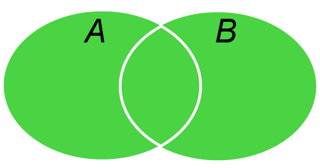

```{r setup, include=FALSE}
knitr::opts_chunk$set(dev = 'pdf')
library(ggplot2)
library(showtext)
showtext::showtext_auto()
```
## 

\LARGE 第三章$~$概率与概率分布

## 目的和要求

为什么学习概率？

- 进行资料统计的目的不在于描述部分样本

- 而是通过样本统计数来推断数据总体的参数（统计推断）

- 统计推断的基础是：概率和概率分布

学习要求

- 掌握：事件、频率、概率的定义

- 熟悉：正态分布

## 第一节$~$概率基础知识 $~$`一、概率的概念`


（一）事件

在一定条件下，某种事物出现与否被称为是**事件**。

- 确定事件：

  - 必然事件$U$：在一定条件下必然出现的现象 。
  
  - 不可能事件$V$：在一定条件下必然不出现的事件。
  
- 随机事件：

  - 有可能发生，也可能不发生。


## 第一节$~$概率基础知识 $~$`一、概率的概念`

（二） 频率
  
- 在$n$次试验中，事件$A$出现的次数$m$称为事件$A$出现的频数，比值$\frac{m}{n}$称为事件$A$出现的`频率`
  $$
  W(A) = \frac{m}{n}, 0\le W(A)\le 1
  $$

  为测定某批玉米种子的发芽率，分别取10，20，50，100，200，500，1000粒种子。在相同条件下进行发芽试验：
  ```{r echo=FALSE}
  n <- c(10, 20, 50, 100, 200, 500, 1000)
  m <- c(9, 19, 47, 91, 186, 459, 920)
  p <- m/n
  df_seed <- data.frame(n = n, m = m, p = m/n)
  knitr::kable(x=df_seed, align = 'l', caption = "某批种子的发芽试验结果", col.names = c("种子总数", "发芽种子总数", "种子发芽率"))
  ```
  
  种子发芽率在0.92附近摆动

## 第一节$~$概率基础知识 $~$`一、概率的概念`

（三）概率

  - ！！假设在相同的条件下，进行大量重复试验，若事件$A$的频率稳定地在某一确定值$p$的附近摆动，则称$p$为事件$A$出现的概率
  $$
  P(A) = p = \lim_{x \to \infty} \frac{m}{n} 
  $$
    不可能完全准确得到$p$，在$n$充分大时，频率$W(A)$作为$P(A)$的近似值。

  - 概率的基本性质：
    1. 任何事件的概率都在0和1之间 $0\leqslant P(A)\leqslant 1$;
    2. 必然事件的概率等于1 $P(U)=1$
    3. 不可能事件的概率等于0 $P(V)=0$
    
## 第一节$~$概率基础知识 $~$`二、概率的计算`

（一）事件的相互关系

- 和事件

  - 事件A和事件B至少有一件发生而构成的新事件，$A+B$
  
```{r echo=FALSE, fig.align='center', out.width="75%"}

```

$A \cup B$

## 第一节$~$概率基础知识 $~$`二、概率的计算`

（一）事件的相互关系

- 积事件

  - 事件A和事件B同时发生而构成的新事件, $A\cdot B$
```{r echo=FALSE, fig.align='center', out.width="75%"}

```
$A \cap B$

- 互斥事件

  - 事件A和事件B不能同时发生，$A\cdot B = V$

  
## 第一节$~$概率基础知识 $~$`二、概率的计算`

（一）事件的相互关系

- 对立事件

  - 事件A和事件B必有一个事件发生，但二者不能同时发生，$A\cap B=V, A\cup B=U, \bar{A}=B, \bar{B}=A$
  - 新生儿要么为男孩，要么为女孩
```{r echo=FALSE, fig.align='center', out.width="75%"}

```

## 第一节$~$概率基础知识 $~$`二、概率的计算`

（一）事件的相互关系

- 独立事件

  - 事件A的发生与事件B的发生毫无关系
  - 独立事件群：多个事件$A_1, A_2, A_3,\cdots,A_n$彼此独立
  - 条件概率：当 A 发生时，B 发生的概率$P(B|A)$

- 完全事件系

  - 多个事件$A_1, A_2, A_3,\cdots,A_n$两两相斥，且每次试验结果必然发生其一

## 第一节$~$概率基础知识 $~$`二、概率的计算`

（二）概率计算法则

- 乘法定理
  
  - 如果事件A和事件B为\textcolor{red}{独立事件}，则事件A与事件B同时发生的概率等于事件A和事件B各自概率的乘积，称为**乘法定理**。
  $$
  P(A\cap B)=P(A)\cdot P(B)
  $$
    - 推理： 如果$A_1, A_2, A_3,\cdots,A_n$彼此独立，则$P(A_1\cdot A_2\cdot \ldots \cdot A_n)=P(A_1)\cdot P(A_2)\cdot \ldots \cdot P(A_n)$

  - 如果是非独立事件，则$P(A\cap B) = P(A) \cdot P(B|A)$

## 第一节$~$概率基础知识 $~$`二、概率的计算`
（二）概率计算法则

- 加法定理
  
  - \textcolor{red}{互斥事件}A和B的和事件的概率等于事件A和事件B的概率之和，称为**加法定理**。
  $$
  P(A\cup B)=P(A)+P(B)
  $$
    - 推理1：如果$A_1, A_2, A_3,\cdots,A_n$为$n$个互斥事件，则其和事件的概率为$P(A_1+ A_2+ A_3+\ldots+A_n)=P(A_1)+P(A_2)+\ldots+P(A_n)$
  
    - 推理2：对立事件$\bar{A}$的概率为$P(\bar{A})=1-P(A)$
  
    - 推理3：完全事件系和事件的概率等于1
  
  - 如果事件A和B不互斥，那需要减去两个事件的交集
    $$
  P(A\cup B)=P(A)+P(B)-P(A\cap B)
  $$
 
## 第一节$~$概率基础知识 $~$`二、概率的计算`
（二）概率计算法则 
    
- 贝叶斯定理：事件 A 在事件 B 发生的条件下与事件 B 在事件 A 发生的条件下，它们两者的概率并不相同，但是它们两者之间存在一定的相关性,并具有以下关系：

$$
P(A|B)=\frac{P(B|A)P(A)}{P(B)}
$$
     
- 统计学两大学派：贝叶斯学派和频率学派
- 推导过程：

  $P(A\cap B) = P(B\cap A)$

  $P(A)\cdot P(B|A) = P(B)\cdot P(A|B)$

  $P(A|B)= \frac{P(B|A)P(A)}{P(B)}$
  

## 第一节$~$概率基础知识 $~$`思考题`

新冠疫情发生期间为社区人群做核酸筛查，筛查结果可能为阳性，也可能为阴性，这样的事件是____（单选题）

{width="50%"}

A、 必然事件 

B、 不可能事件 

C、 独立事件 

D、 随机事件 
    
## 第一节$~$概率基础知识 $~$`三、概率分布`

- 研究随机变量主要是研究变量的取值范围，也就是取值的概率

- 随机变量的概率分布：随机变量的取值与取这些值的概率之间的对应关系
  
- 随机变量的概率分布可以用分布函数表述

- 离散型变量的概率分布
  - 二项分布
  - 泊松分布
  
- 连续型变量的概率分布
  - 正态分布
  
## 第一节$~$概率基础知识 $~$`三、概率分布`
（一）离散型随机变量的概率分布

\small
**【复习】**离散型变量/非连续变量：在变量数列中仅能取得固定数值，并且通常是整数
\normalsize

- 离散型随机变量$x$所有可能的取值为$x=x_i(i=1,2,\cdots,n)$
- 对于任意一个$x_i$，都有一个相应的概率为$p_i(i=1,2,\cdots,n)$

可以用下式表示为,
$$
P(x=x_i)=p_i~~~(i=1,2,\cdots,n)
$$

- $x_i$与$p_i$为数值，表示事件“变量$x$取值为$x_i$时”的概率等于$p_i$

并且，
$$
\sum_{i=1}^{n}p_i=1
$$

## 第一节$~$概率基础知识 $~$`三、概率分布`
（二）连续型随机变量的概率分布

\small
**【复习】**连续变量：在变量范围内可抽出某一范围内的所有值，变量之间是连续的、无限的
\normalsize

- 对于连续型随机变量，可以通过分组整理成次数分布表

- 如果从总体中抽取样本的容量$n$相当大，则频率分布就趋于稳定，近似地看成总体的概率分布

- 对连续型随机变量的次数分布表作直方图，直方图中同一间距内的频率密度是相等的

- 当$n$无限大，频率转化为概率，频率密度转化为概率密度，直方图逼近光滑连续曲线

  - 概率密度曲线（曲线下的总面积为1）
  - 概率密度函数$f(x)$

## 第一节$~$概率基础知识 $~$`三、概率分布`
（二）连续型随机变量的概率分布
```{r echo=FALSE, fig.asp=1, crop=TRUE}
    par(mfrow=c(2,2))
    set.seed(2022)
    wheat_e2 <- round(rnorm(100, mean = 40, sd = 5))
    hist(wheat_e2, breaks = 40, freq = FALSE, xlim = c(10, 70), ylim = c(0, 0.1), xlab = "鲢鱼体长(cm)", main = expression(n==10^2))
    wheat_e3 <- round(rnorm(1000, mean = 40, sd = 5))
    hist(wheat_e3, breaks = 40, freq = FALSE, xlim = c(10, 70), ylim = c(0, 0.1), xlab = "鲢鱼体长(cm)", main = expression(n==10^3))
    wheat_e4 <- round(rnorm(10000, mean = 40, sd = 5))
    hist(wheat_e4, breaks = 40, freq = FALSE, xlim = c(10, 70), ylim = c(0, 0.1), xlab = "鲢鱼体长(cm)", main = expression(n==10^4))
    wheat_e5 <- round(rnorm(100000, mean = 40, sd = 5))
    hist(wheat_e5, breaks = 40, freq = FALSE, xlim = c(10, 70), ylim = c(0, 0.1), xlab = "鲢鱼体长(cm)", main = expression(n==10^5))
```

## 第一节$~$概率基础知识 $~$`三、概率分布`
（二）连续型随机变量的概率分布
```{r echo=FALSE, fig.showtext = TRUE, fig.align = 'center', crop=TRUE, fig.asp=0.5}
  set.seed(2022)
  wheat_e5 <- round(rnorm(100000, mean = 40, sd = 5))
  hist(wheat_e5, breaks = 40, col = c(rep("gray",15), rep("yellow",5), rep("gray",20)), freq = FALSE, xlim = c(0, 80), ylim = c(0, 0.1), xlab = "鲢鱼体长(cm)", main = expression(n==10^5))
  lines(density(wheat_e5, bw = 1), col = 'red', lwd = 3)
```
对于一个连续型变量x，取值于区间内的概率即黄色阴影部分的面积，也就是概率密度函数$f(x)$的积分，即
$$
P(x_1\le x \le x_2) = \int_{x_1}^{x_2}f(x)dx
$$

## 第一节$~$概率基础知识 $~$`四、大数定律`

当$n$足够大的时候，为什么可以用样本中的$W(A)$代替$P(A)$?

大数定律是用来阐述大量随机现象的平均结果稳定性的一系列定律

- 伯努利大数定律

- 辛钦大数定律

样本容量越大，样本的统计数与总体参数之差越小

## 第一节$~$概率基础知识 $~$`四、大数定律`
（一）伯努利大数定律

- $m$是$n$次独立试验中事件$A$出现的次数，$p$是事件$A$在每次试验中出现的概率，对于任意小的正数$\epsilon$，有：
$$
\lim_{n\to\infty}P\left\{\left|\frac{m}{n}-p\right|<\epsilon\right\}=1
$$
  - 以上，$P$为实现$\left|\frac{m}{n}-p\right|<\epsilon$这一事件的概率，$P=1$是必然事件。

- $n$无限大的情况下，$\frac{m}{n}$与理论概率$p$可以基本相等

## 第一节$~$概率基础知识 $~$`四、大数定律`
（二）辛钦大数定律

- 设一个随机变量$x_i$，是由一个总体平均数$\mu$和随机误差$\epsilon_i$构成
$x_i=\mu + \epsilon_i$

- 从总体中抽取$n$个随机变量构成一组样本，样本的平均数是
$$
\bar{x} = \frac{1}{n}\sum_{i=1}^{n}x_i = \frac{1}{n}\sum_{i=1}^{n}(\mu + \epsilon_i) = \mu +\frac{1}{n}\sum_{i=1}^{n}\epsilon_i 
$$
- 当样本容量$n$越来越大，$\frac{1}{n}\sum_{i=1}^{n}\epsilon_i$就越小，使得$\bar{x}$逼近$\mu$

- 样本容量越大，样本统计数与总体参数之差越小

## 第二节$~$几种常见的理论分布

随机变量的概率分布可以用分布函数来表述。

- 离散型变量的概率分布

  - 二项分布

  - 泊松分布

- 连续型变量的概率分布

  - 正态分布

## 第二节$~$几种常见的理论分布 $~$`一、二项分布`

（一）二项分布的概率函数

- 二项分布是一种离散型随机变量的分布。

  - 每次试验只有两个对立结果，$A$和$\bar{A}$，出现的概率分别记为$p$和$q$（$q=1-p$）。
  
  - 试验具有重复性和独立性。
  
    - 重复性：每次试验条件不变，在每次试验中事件$A$出现的概率都是$p$
    
    - 独立性：任何一次试验中事件$A$的出现与其余各次试验中出现的任何结果无关。

$P(x)$为随机变量$x$的二项分布，记为$B(n,p)$，概率分布函数为：
$$
P(x) = \mathrm{C}_{n}^{x}p^xq^{(n-x)}
$$
其中，$\mathrm{C}_{n}^{x}=\frac{n!}{x!(n-x)!}$，$q=1-p$。

重复实验$N$次，每次在$n$个试验中出现事件$A$为$x$的理论次数等于$N\cdot P(x)$

## 第二节$~$几种常见的理论分布 $~$`一、二项分布`

（二）二项分布的的性状和参数

- 二项分布的形状由n和p两个参数决定

  - $n$值不同的情况下，$p$值较小的时候，分布是偏倚的。
```{r, echo=FALSE, fig.height=5}
x_1 <- seq(0,10,by = 1)
y_1 <- dbinom(x_1, 10, 0.1)
plot(x_1, y_1, type = "b", xlim = c(0,20), xlab = "x", ylab="Probability", main = expression("p=0.1, n=10 or 50 or 100"))
x_2 <- seq(0,50,by = 1)
y_2 <- dbinom(x_2, 50, 0.1)
lines(x_2, y_2, type = "b")
x_3 <- seq(0,100,by = 1)
y_3 <- dbinom(x_3, 100, 0.1)
lines(x_3, y_3, type = "b")
```
  - $p$值趋于0.5的时候，分布趋于对称（如何图形化？）
  
## 第二节$~$几种常见的理论分布 $~$`一、二项分布`

（二）二项分布的的性状和参数
  
- 二项分布的参数
  - 二项分布的平均数
  $$
    \mu = np
  $$
  - 二项分布的总体标准差
  $$
    \sigma = \sqrt{npq}
  $$
  
## 第二节$~$几种常见的理论分布 $~$`二、泊松分布`

- 很多事件的发生概率很小，但是样本容量很大，即$n$很大和$p$很小
- 这是二项分布的特殊情况，即泊松分布
- 泊松分布的概率函数由二项分布推导得到：
$$
P(x) = \mathrm{C}_{n}^{x}p^x(1-p)^{(n-x)}
$$
由于是二项分布，所以$P(x)=np=\mu$，即$p = \frac{\mu}{n}$:
$$
P(x) = \frac{n!}{(n-k)!\cdot k!}(\frac{\mu}{n})^x(1-\frac{\mu}{n})^{n-x}
$$
考虑到$n$无限大，$\mu$和$x$相对较小，可以近似后得到：

$$
P(x) = \frac{e^{-\lambda} \lambda^x}{x!}
$$
其中$\lambda$是参数，$\lambda = np$；$e$为自然对数，$x$为正整数。

## 第二节$~$几种常见的理论分布 $~$`二、泊松分布`

- 泊松分布的平均数、方差和标准差为

  - $\mu = \lambda$
  - $\sigma^2 = \lambda$
  - $\sigma = \sqrt{\lambda}$
  
- 对于泊松分布来说，分布函数形状由$\lambda$决定。
```{r, echo=FALSE, fig.height=5}
x <- seq(0,10,by = 1)
y_1 <- dpois(x, 0.5)
plot(x, y_1, type = "b", xlim = c(0,10), xlab = "x", ylab="Probability", main = expression(paste(lambda, "=0.5 or 1.5 or 2.5")))
y_2 <- dpois(x, 1.5)
lines(x, y_2, type = "b")
y_3 <- dpois(x, 2.5)
lines(x, y_3, type = "b")
```

## 第二节$~$几种常见的理论分布 $~$`三、正态分布`

- 正态分布是一种连续型随机变量的概率分布

- 多数变量都围绕在平均值左右，由平均值到分布的两侧，变量数逐渐减少

- 在统计理论和应用上最重要的分布

  - 试验误差的分布一般都服从于这种分布
  - 许多生物现象的计量资料也服从于这种分布
  - 正态分布还可作为离散型随机变量或其他变量的近似分布（中心极限定理）

## 第二节$~$几种常见的理论分布 $~$`三、正态分布`

（一）正态分布概率密度函数

- 正态分布的概率密度函数根据二项分布的函数在$n\rightarrow \infty$时推导出
$$
f(x) = \frac{1}{\sigma\sqrt{2\pi}}e^{-\frac{1}{2}(\frac{x-\mu}{\sigma})^2}
$$
其中$\mu$为总体平均数，$\pi$为圆周率，$e$为自然对数底
- 正态分布记为$N(\mu, \sigma^2)$，表示平均数为$\mu$，方差为$\sigma^2$的正态分布
```{r, echo=FALSE, crop=TRUE, fig.height=5}
x <- pretty(c(-5, 5), 100)
y <- dnorm(x)
plot(x, y, type = 'l')
```

## 第二节$~$几种常见的理论分布 $~$`三、正态分布`

（二）正态分布特征

- 当$x=\mu$时，$f(x)$有最大值为$\frac{1}{\sigma\sqrt{2\pi}}$
- 当$x-\mu$的绝对值相等，$f(x)$值也相等
- $\frac{x-\mu}{\sigma}$的绝对值越大，$f(x)$的值越小，逼近但不等于0
- 正态分布曲线完全由参数$\mu$和$\sigma$决定
- 正态分布在$x = \mu \pm \sigma$处各有一个拐点
- 正态分布曲线在$x\in(-\infty, \infty)$皆能取值（$x$取值的完全事件系）


## 第二节$~$几种常见的理论分布 $~$`三、正态分布`

（二）正态分布特征


```{r, echo=FALSE, crop=TRUE, fig.height=3.5}
x <- pretty(c(-5, 5), 100)
y_1 <- dnorm(x, mean = 0, sd = 0.5)
plot(x, y_1, type = 'l', main = expression(paste(sigma, "= 0.5 or 1 or 2")))
y_2 <- dnorm(x, mean = 0, sd = 1)
lines(x, y_2, type = 'l')
y_3 <- dnorm(x, mean = 0, sd = 2)
lines(x, y_3, type = 'l')
```

```{r, echo=FALSE, crop=TRUE, fig.height=3.5}
x <- pretty(c(-5, 5), 100)
y_1 <- dnorm(x, mean = -1, sd = 1)
plot(x, y_1, type = 'l', main = expression(paste(mu, "= -1 or 0 or 1")))
y_2 <- dnorm(x, mean = 0, sd = 1)
lines(x, y_2, type = 'l')
y_3 <- dnorm(x, mean = 1, sd = 1)
lines(x, y_3, type = 'l')
```

## 第二节$~$几种常见的理论分布 $~$`三、正态分布`

（三）标准正态分布

- $\mu$确定了分布曲线的中心位置
- $\sigma$确定了分布曲线的变异度
- 对于$N(\mu, \sigma^2)$来说，是一条曲线系
- 为了便于一般化应用，令$\mu = 0, \sigma=1$，则
    
$$
f(u) = \frac{1}{\sqrt{2\pi}}e^{-\frac{1}{2}u^2}
$$

```{r, echo=FALSE, crop=TRUE, fig.height=4}
x <- pretty(c(-5, 5), 100)
y <- dnorm(x, mean = 0, sd = 1)
plot(x, y, type = 'l')
```

## 第二节$~$几种常见的理论分布 $~$`三、正态分布`

（三）标准正态分布

- 对于任何一个服从$N(\mu, \sigma^2)$的随机变量，都可以通过$u$进行标准化变换

$$
u = \frac{x-\mu}{\sigma}
$$

- $u$为标准正态离差，表示离开平均数$\mu$几个标准差$\sigma$

## 第二节$~$几种常见的理论分布 $~$`思考题`

有关正态分布的描述错误的是____（单选题）

A、是一种连续型随机变量的概率分布 

B、大多数变量围绕在平均值左右,由平均值到分布的两侧,变量数减少,即两头少,中间多,两侧对称 

C、正态分布曲线与X轴所围成的面积等于1 

D、$t$检验、方差分析等多种统计方法不要求分析的指标服从正态分布 


## 第三节$~$统计数的分布

统计学研究的两个方向：

- 由总体到样本（一般到特殊）

  - 从总体到总体抽样的变异特点
  
- 由样本到总体（特殊到一般）
  
  - 从一系列样本的统计数推断总体
  
  - 统计推断

## 第三节$~$统计数的分布 $~$`一、抽样检验与无偏估计`

- 理论上，从总体抽取所有可能的样本，就能获得有关统计数变异的全部信息

- 部分抽样或者复置抽样（小的有限总体）

- 复置抽样的样本容量可以是无限的，具有无限总体抽样的性质

## 第三节$~$统计数的分布 $~$`一、抽样检验与无偏估计`

近似正态总体：[3,4,5]

```{r echo=TRUE,eval=TRUE}
x <- c(3, 4, 5)
x_var <- mean((x-mean(x))^2) #population
x_var
x_sd <- sqrt(x_var) #population
x_sd
x_VAR <- var(x) #sampling
x_VAR
x_SD<- sd(x) #sampling
x_SD
```
## 第三节$~$统计数的分布 $~$`一、抽样检验与无偏估计`

以$n=2$作独立的放回式抽样

```{r echo=FALSE}
x_sampling <- expand.grid(x, x)
x_Sampling <- data.frame(x_sampling, "mean" = apply(x_sampling, 1, mean), "var"= apply(x_sampling, 1, var), "sd"=apply(x_sampling, 1, sd))
knitr::kable(x_Sampling)
```

## 第三节$~$统计数的分布 $~$`一、抽样检验与无偏估计`

对以上数据列进行求和
```{r echo=FALSE}
knitr::kable(apply(x_Sampling, 2, sum))
```

- 样本平均数$\bar{x}$的平均数$\mu_{\bar{x}} = \frac{36}{9} = 4 = \mu$

- 样本方差$s^2$的平均数$\mu_{s^2} =  \frac{6}{9} = 0.6667 = \sigma^2$

- 样本标准差$s$的平均数$\mu_{s}=\frac{5.6568}{9} = 0.6285\neq\sigma$

无偏估计值： 样本某一统计数的平均数等于总体的相应参数，该统计数为总体相应参数的无偏估计值

## 第三节$~$统计数的分布 $~$`二、样本平均数的分布`

样本容量$n=2$情况下样本平均数的概率分布

```{r echo=FALSE}
knitr::kable(table(x_Sampling$mean))
```
样本容量$n=4$情况下样本平均数的概率分布

```{r echo=FALSE}
y_sampling <- expand.grid(x, x, x, x)
y_Sampling <- data.frame(y_sampling, "mean" = apply(y_sampling, 1, mean), "var"= apply(y_sampling, 1, var), "sd"=apply(y_sampling, 1, sd))
```

```{r echo=FALSE, fig.asp=0.4}
plot(table(y_Sampling$mean), ylab = "Freq")
```

## 第三节$~$统计数的分布 $~$`二、样本平均数的分布`

样本平均数分布的性质：

- 样本平均数分布的平均数等于总体平均数：$\mu_{\bar{x}} = \mu$

- 样本平均数分布的方差等于总体方差除以样本容量，即：$\sigma^2_{\bar{x}}=\frac{\sigma^2}{n}$；平均数标准误：$\sigma_{\bar{x}}=\frac{\sigma}{\sqrt{n}}$

- 从正态总体$N(N, \sigma^2)$抽样，样本平均数$\bar{x}$是一个正态分布$N(\mu, \frac{\sigma^2}{n})$

- 如果不是正态总体，当样本容量$n$不断增大，样本平均数$\bar{x}$的分布也接近正态分布$N(\mu, \frac{\sigma^2}{n})$，这就是\textcolor{red}{中心极限定理}

无论何种分布，只要样本容量$n \ge 30$，认为样本平均数的分布是正态分布，可以对样本平均数进行标准化$u = \frac{\bar{x}-\mu}{\frac{\sigma}{\sqrt{n}}}$

## 第三节$~$统计数的分布 $~$`三、样本平均数差数的分布`

样本平均数差数分布的性质：

- 样本平均数差数的平均数等于总体平均数的差数：$\mu_{\bar{x_1}- \bar{x_2}} = \mu_{\bar{x_1}} - \mu_{\bar{x_2}}$

- 样本平均数差数的方差等于总体方差除以各自样本容量之和：$\sigma^2_{\bar{x_1}- \bar{x_2}} = \sigma^2_{\bar{x_1}} + \sigma^2_{\bar{x_2}}$

- 样本平均数差数的标准误：$\sigma_{\bar{x_1}- \bar{x_2}} = \sqrt{\frac{\sigma_1^2}{n_1} + \frac{\sigma_2^2}{n_2}}$

## 第三节$~$统计数的分布 $~$`四、t分布`

如果：

- 总体方差$\sigma^2$未知，且

- 样本容量不大（$n < 30$）的情况

则，$\frac{\bar{x}-\mu}{\frac{\sigma}{\sqrt{n}}}$不再服从正态分布

这时候，样本平均数服从$df = n -1$ 的 $t$分布

## 第三节$~$统计数的分布 $~$`四、t分布`

$t$分布

$$
t = \frac{\bar{x} - \mu}{s_{\bar{x}}}  = \frac{\bar{x}-\mu}{\frac{s}{\sqrt{n}}}
$$
$$
s_{\bar{x}} = \frac{s}{\sqrt{n}}
$$

## 第三节$~$统计数的分布 $~$`四、t分布`

$t$分布的特征

- $t$分布曲线左右对称

- 受到自由度$df = n -1$的制约，每个自由度都有一条曲线

- 和正态分布相比，$t$分布的顶部偏低，尾部偏高

```{r echo=FALSE, fig.asp=0.5, warning=FALSE}
library(plyr)
x <- seq(-4, 4, length=200)
df <- c(1, 5, 15, 20, 25, 30, 50, 100)
get.pt <- function(x, df) {
    prob <- dt(x, df)
    dd <- data.frame(x=x, df=factor(df), prob=prob)
    return(dd)
}
pt.df <- mdply(data.frame(x= rep(x, length(df)), df=rep(df, each=length(x))), get.pt)
plot(prob~x, data=pt.df[pt.df$df==1,], type ="l", ylim=c(0, 0.5), main = expression("df=1, 5, 15, 20, 25, 30, 50, 100"))
lines(prob~x, data=pt.df[pt.df$df==5,], type ="l")
lines(prob~x, data=pt.df[pt.df$df==15,], type ="l")
lines(prob~x, data=pt.df[pt.df$df==20,], type ="l")
lines(prob~x, data=pt.df[pt.df$df==25,], type ="l")
lines(prob~x, data=pt.df[pt.df$df==30,], type ="l")
lines(prob~x, data=pt.df[pt.df$df==50,], type ="l")
lines(prob~x, data=pt.df[pt.df$df==100,], type ="l")
x <- pretty(c(-4, 4), 200)
y <- dnorm(x, mean = 0, sd = 1)
lines(x, y, type = 'l', col= "red", lwd =2)
```

## 总结

- 介绍概率的基础知识

- 大数定律：当$n$充分大，可以用样本统计数对总体参数做出估计

- 常见的理论分布（前两种分布在特殊情况下可以向正态分布逼近）
  - 二项分布
  - 泊松分
  - 正态分布
