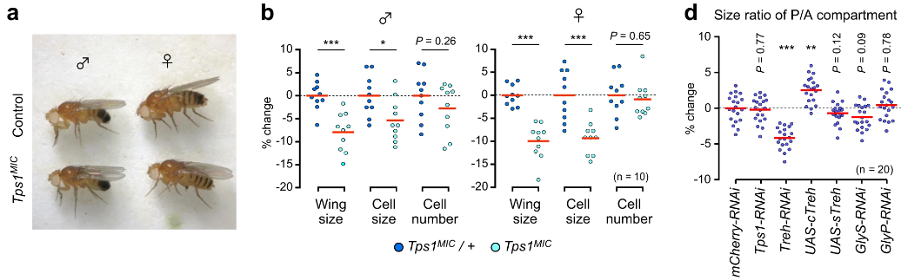

```{r setup, include=FALSE}
knitr::opts_chunk$set(dev = 'pdf')
library(ggplot2)
library(showtext)
showtext::showtext_auto()
```
## 

\LARGE 第四章$~$统计推断

## Check In App Release version_0.87

```{r echo=FALSE, crop=TRUE, fig.align='center'}
p <- c(1, 2, 3)
pp <- expand.grid(p ,p)
pp$Var2 <- pp[9:1, 2]

random_lib <- list(
  a <-list(c(1,2), c(1, 4), c(1, 5)),
  b <-list(c(2,1), c(2, 5), c(2, 3)),
  c <-list(c(3,2), c(3, 5), c(3, 6)),
  d <-list(c(4,1), c(4, 5), c(4, 7)),
  e <-list(c(5,2), c(5, 4), c(5, 6), c(5, 8)),
  f <-list(c(6,3), c(6, 5), c(6, 9)),
  g <-list(c(7,4), c(7, 5), c(7, 8)),
  h <-list(c(8,7), c(8, 5), c(8, 9)),
  i <-list(c(9,6), c(9, 5), c(9, 8))
)
random_generate <- function(x){
  repeat {
    m <- x
    n <- sample(random_lib[[m]], 1)[[1]][2]
    o <- sample(random_lib[[n]], 1)[[1]][2]
    p <- sample(random_lib[[o]], 1)[[1]][2]
    random_out <- c(m, n, o, p)
    if (sum(duplicated(random_out))==FALSE) {
      break
    }
  }
  return(random_out)
}
checkin <- random_generate(sample(1:9, 1))
par(xaxs = "i", yaxs = "i")

plot(expand.grid(p ,p), type = 'p', pch = 20, cex = 10, col="red", xlim = c(-1, 5), ylim = c(xlim = c(-1, 3.5)), axes = F, main=bquote("Check In Code: "*.(checkin[1])*.(checkin[2])*.(checkin[3])*.(checkin[4])) , xlab=NA, ylab=NA)
text(1, 3, "1", col='white', family="sans")
text(2, 3, "2", col='white', family="sans")
text(3, 3, "3", col='white', family="sans")
text(1, 2, "4", col='white', family="sans")
text(2, 2, "5", col='white', family="sans")
text(3, 2, "6", col='white', family="sans")
text(1, 1, "7", col='white', family="sans")
text(2, 1, "8", col='white', family="sans")
text(3, 1, "9", col='white', family="sans")
for (n in 1:3) {
  pos1 <- pp[checkin[n], ]
  pos2 <- pp[checkin[n+1], ]
  arrows(x0 = pos1$Var1, y0 = pos1$Var2, x1 = pos2$Var1, y1 = pos2$Var2, angle = 20, length = 0.1, lwd = 2, col = "blue")
}
```

## 内涵和作用

统计推断主要包括

- 假设检验

- 参数估计

统计推断的任务

- 分析误差产生的原因

- 确定差异的性质

- 排除误差的干扰

- 对总体的特征做出正确的判断


## 第一节$~$假设检验的原理与方法 $~$`一、假设检验的概念`

- 试验数据往往存在一定的差异，这种差异可能

  - 由于随机误差产生

  - 由于试验处理所引起

- 试验处理的效应往往和随机误差混淆，不容易分开

- 通过概率的计算和假设检验作出正确判断

## 第一节$~$假设检验的原理与方法 $~$`一、假设检验的概念`

假设检验

- 根据总体的理论分布和小概率原理，对未知或不完全知道的总体提出两种彼此对立的假设，然后由样本的实际结果，经过一定的计算，作出在一定概率意义上应该接受的那种假设的推断

如果：

- 抽样结果使小概率事件发生
  - 则拒绝假设
  
- 抽样结果没有使小概率事件发生
  - 则接受假设
  
小概率事件：概率$\le 0.05$ 或 $\le 0.01$的事件为小概率事件

## 第一节$~$概率基础知识 $~$`二、假设检验的步骤`

1. 提出假设

2. 确定显著水平

3. 计算统计数与相应的概率

4. 推断是否接受假设

## 第一节$~$概率基础知识 $~$`二、假设检验的步骤`

（一）提出假设

- 对总体提出假设，一般是两个彼此对立的假设

  - 无效假设或零假设$H_0$： 
  
    - 处理的效应跟总体参数之间没有真实的差异，试验结果中的差异是误差所致，即处理“无效”
  
  - 备择假设$H_A$：
  
    - 处理结果中的差异是由于总体参数不同所引起的，即处理“有效”
    
  - 无效假设与备择假设是对立事件：接受$H_0$则否定$H_A$，接受$H_A$则否定$H_0$

- $H_0$随研究内容的不同而不同：
  - $H_0$必须有意义
  - 根据$H_0$可以算出因抽样误差而获得样本结果的概率

## 第一节$~$概率基础知识 $~$`二、假设检验的步骤`

（一）提出假设

以样本平均数的假设为例：

- 对一个样本平均数的假设（样本与总体）

  - 假设平均数为$\bar x$的样本来自于一组具有$\mu$的总体，提出：
  
    - $H_0:\mu = \mu_0$
    - $H_A:\mu \neq \mu_0$
    
- 对两个样本平均数相比较的假设（样本与样本）

  - 假设两个样本平均数$\bar x_1$和$\bar x_2$分别来自具有平均数$\mu_1$和$\mu_2$的两个总体，提出：
    - $H_0:\mu_1 = \mu_2$
    - $H_A:\mu_1 \neq \mu_2$
    
- 可从假设的总体中推论其平均数的随机抽样分布，从而可以算出其一个样本平均数指定值出现的概率，这样就可以根据样本与总体的关系，作为假设检验的理论依据

## 第一节$~$概率基础知识 $~$`二、假设检验的步骤`

（一）提出假设

- 克矽平能否治疗矽肺病？

  > 矽肺病患者血红蛋白含量的平均数$\mu_0 = 126(mg/L)$，$\sigma^2 = 240(mg/L)^2$的正态分布$N(126, 240)$
  
  > 克矽平对6名患者进行治疗，治疗后测得平均血红蛋白含量$\bar x = 136(mg/L)$

- $\bar x$和$\mu_0$之间的差值是由抽样误差还是药物治疗造成的？
  
## 第一节$~$概率基础知识 $~$`二、假设检验的步骤`

（二）确定显著水平

- 确定一个否定$H_0$的概率标准，显著水平$\alpha$

- 人为规定的小概率界限

- 常用$\alpha = 0.05$和$\alpha = 0.01$

- 根据研究需要调整

```{r}
qnorm(0.025, mean = 0, sd = 1)
qnorm(0.005, mean = 0, sd = 1)
```

## 第一节$~$概率基础知识 $~$`二、假设检验的步骤`

（三）计算统计数与相应的概率

在 $H_0:\mu = \mu_0$的前提下，
$$
u = \frac{\bar{x} - \mu}{\sigma_{\bar{x}}} = \frac{136-126}{\sqrt{40}} = 1.58
$$

- 在$N(126, 40)$的总体中，以$n = 6$进行随机抽样，得到平均值$\bar{x}=136$与126相差10以上的概率是$P(|u|>1.58)= 2 \ast 0.05705=0.1141$

- 假设检验所计算的是超过实得差异得概率

- 概率的大小是推断$H_0$是否正确的依据

```{r}
pnorm(-1.58, 0, 1)
```

## 第一节$~$概率基础知识 $~$`二、假设检验的步骤`
  
（四）推断是否接受假设

- 小概率原理：小概率事件在单次抽样试验中几乎是不可能发生的

- 如果概率大于显著水平则不认为是小概率事件，应该接受$H_0$

- 差异显著水平（0.05或0.01）

- 差异显著水平的标记方法（\*或\*\*）

- 概率值为0.1141，大于0.05的显著水平，所以接受$H_0$

- 所以在治疗前后血红蛋白含量没有显著差异，差值应归于误差导致的

果蝇翅膀大小、细胞大小和细胞数量的倍数变化以及成年翼的大小比例差异（\*p < 0.05, \*\*p < 0.01, \*\*\*p < 0.001）
```{r echo=FALSE, fig.align='center', out.width="80%"}

```
\tiny
> Matsushita, R., Nishimura, T. Trehalose metabolism confers developmental robustness and stability in Drosophila by regulating glucose homeostasis. Commun Biol 3, 170 (2020).


## 第一节$~$概率基础知识 $~$`二、假设检验的步骤`
  
假设检验的步骤概括为：

1. 对样本所属总体提出无效假设$H_0$和备择假设$H_A$

2. 确定检验的显著水平$\alpha$

3. 在$H_0$正确的前提下，计算抽样分布的统计数或相应的概率值

4. 根据小概率原理，进行差异是否显著的判断并得出结论

## 第一节$~$概率基础知识 $~$`三、双尾检验和单尾检验`

在标准正态分布下，样本平均数的抽样分布

```{r echo=FALSE, fig.align='center', crop=TRUE, fig.asp=0.4}
par(xaxs = "i", yaxs = "i", mfrow= c(1,2))
x <- seq(-4.5, 4.5, by = 0.01)
y <- dnorm(x)
plot(x, y, type = "l", xlim = c(-4, 4), ylim = c(0, 0.7), main = expression(paste(N(mu == 0, sigma^2 == 1), ", ", alpha, "=0.05")), axes = FALSE, ylab = "Probability")
axis(1, at = c(-4, -1.96, 0, 1.96, 4), labels =  c(-4, -1.96, 0, 1.96, 4), lwd.ticks = 0.5)
axis(2)
conf_left <- which.min(abs(x - qnorm(0.025)))
conf_right <- which.min(abs(x - qnorm(0.975)))
x.cord <- c(x[conf_left], x[conf_left:conf_right], x[conf_right])
y.cord <- c(0, dnorm(x[conf_left:conf_right]), 0)
polygon(x.cord, y.cord, col = "gray")
text(0, 0.3, labels = "95%")
text(0, 0.5, labels = expression(paste("[ ", mu, " - 1.96", sigma[bar(x)], ", ", mu, " + 1.96", sigma[bar(x)], " ]")))

plot(x, y, type = "l", xlim = c(-4, 4), ylim = c(0, 0.7), main = expression(paste(N(mu == 0, sigma^2 == 1), ", ", alpha, "=0.01")), axes = FALSE, ylab = "Probability")
axis(1, at = c(-4, -2.58, 0, 2.58, 4), labels =  c(-4, -2.58, 0, 2.58, 4), lwd.ticks = 0.5)
axis(2)
conf_left <- which.min(abs(x - qnorm(0.005)))
conf_right <- which.min(abs(x - qnorm(0.995)))
x.cord <- c(x[conf_left], x[conf_left:conf_right], x[conf_right])
y.cord <- c(0, dnorm(x[conf_left:conf_right]), 0)
polygon(x.cord, y.cord, col = "gray")
text(0, 0.3, labels = "99%")
text(0, 0.5, labels = expression(paste("[ ", mu, " - 2.58", sigma[bar(x)], ", ", mu, " + 2.58", sigma[bar(x)], " ]")))
```
- 区间$[\mu - u_\alpha \sigma_{\bar{x}}, \mu + u_\alpha \sigma_{\bar{x}}]$，其中$u_\alpha$根据$u$分布查表或者计算获得

- 对于一定的$\alpha$，落在区间的$\bar{x}$有$1-\alpha$，落在区间外的是$\alpha$

- $1-\alpha$相当于接受$H_0$的区域--接受区

- $\alpha$ 相当于否定$H_0$的区域--否定区


## 第一节$~$概率基础知识 $~$`三、双尾检验和单尾检验`

否定区被接受区隔开，分为左尾和右尾两个：
```{r echo=FALSE, fig.align='center', crop=TRUE, fig.asp=0.4}
par(xaxs = "i", yaxs = "i")
x <- seq(-4.5, 4.5, by = 0.01)
y <- dnorm(x)
plot(x, y, type = "l", xlim = c(-4, 4), ylim = c(0, 0.7), main = expression(paste(N(mu == 0, sigma^2 == 1), ", ", alpha, "=0.05")), axes = FALSE, ylab = "Probability")
axis(1, at = c(-4, -1.96, 0, 1.96, 4), labels =  c(-4, -1.96, 0, 1.96, 4), lwd.ticks = 0.5)
axis(2)
conf_left <- which.min(abs(x - qnorm(0.025)))
conf_right <- which.min(abs(x - qnorm(0.975)))
x.cord <- c(x[conf_left], x[conf_left:conf_right], x[conf_right])
y.cord <- c(0, dnorm(x[conf_left:conf_right]), 0)
polygon(x.cord, y.cord, col = "gray")
text(0, 0.3, labels = "95%")
text(-3, 0.2, labels = "左尾否定区")
text(-3, 0.4, labels = expression(paste(bar(x), " < ", mu, " - 1.96", sigma[bar(x)])))
text(3, 0.2, labels = "右尾否定区")
text(3, 0.4, labels =  expression(paste(bar(x), " > ",mu, " + 1.96", sigma[bar(x)])))
```
- 临界点是$\mu \pm u_\alpha \sigma_{\bar{x}}$

## 第一节$~$概率基础知识 $~$`三、双尾检验和单尾检验`

- 具有两个否定区的检验称为双尾检验

  - 这时候备择假设有两种可能，$\mu > \mu_0$或$\mu < \mu_0$，落入左尾或者右尾否定区
  - 属于$\mu \neq \mu_0$的情况
  - 例如新旧药物疗效是否有差别，新药和旧药的疗效都有可能更好，所以应该是双尾检验
  
- 某些情况下，双尾检验不符合实际
  - 例如已知新药不可能比旧药疗效差
  - 已知处理后产生的效应并提出无效假设$H_0:\mu \le \mu_0$，备择假设$H_A:\mu > \mu_0$
  - 仅有一种可能性，否定区只有一个（左尾或右尾）的检验称为单尾检验

## 第一节$~$概率基础知识 $~$`三、双尾检验和单尾检验`

单尾和双尾检验的区别

```{r echo=FALSE, fig.align='center', crop=TRUE, fig.asp=0.4}
par(xaxs = "i", yaxs = "i", mfrow= c(1,2))
x <- seq(-4.5, 4.5, by = 0.01)
y <- dnorm(x)
plot(x, y, type = "l", xlim = c(-4, 4), ylim = c(0, 0.7), main = expression(paste(N(mu, sigma^2), ", ", alpha, "=0.05", ", two-tailed")), axes = FALSE, ylab = "Probability")
axis(1, at = c(-4, -1.96, 0, 1.96, 4), labels =  c(expression(-infinity), expression(paste(mu, "-1.96", sigma[bar(x)])), expression(mu), expression(paste(mu, "+1.96", sigma[bar(x)])), expression(+infinity)), lwd.ticks = 0.5)
axis(2)
conf_left <- which.min(abs(x - qnorm(0.025)))
conf_right <- which.min(abs(x - qnorm(0.975)))
x.cord <- c(x[conf_left], x[conf_left:conf_right], x[conf_right])
y.cord <- c(0, dnorm(x[conf_left:conf_right]), 0)
polygon(x.cord, y.cord, col = "gray")
text(0, 0.3, labels = "95%")
text(-3, 0.2, labels = expression(paste(frac(1,2), alpha, "=0.025")))
text(3, 0.2, labels = expression(paste(frac(1,2), alpha, "=0.025")))

plot(x, y, type = "l", xlim = c(-4, 4), ylim = c(0, 0.7), main = expression(paste(N(mu, sigma^2), ", ", alpha, "=0.05", ", one-tailed")), axes = FALSE, ylab = "Probability")
axis(1, at = c(-4, -1.64, 0, 1.64, 4), labels =  c(expression(-infinity), expression(paste(mu, "-1.64", sigma[bar(x)])), expression(mu), expression(paste(mu, "+1.64", sigma[bar(x)])), expression(+infinity)), lwd.ticks = 0.5)
axis(2)
conf_left <- which.min(abs(x - qnorm(0.00000001)))
conf_right <- which.min(abs(x - qnorm(0.95)))
x.cord <- c(-4, x[conf_left:conf_right], x[conf_right])
y.cord <- c(0, dnorm(x[conf_left:conf_right]), 0)
polygon(x.cord, y.cord, col = "gray")
text(0, 0.3, labels = "95%")
text(3, 0.2, labels = expression(paste(alpha, "=0.05")))
```
- 因为单尾检验，否定区在左尾或者右尾区的显著水平$\alpha=0.05$

- 在计算中应该注意查表的值发生了变化


## 第一节$~$概率基础知识 $~$`四、假设检验中的两类错误`

假设检验是推断，所以在一定的显著水平$\alpha$下：

- 否定$H_0$，并不等于证明$H_0$不真实

- 接受$H_0$，并不等于证明$H_0$真实

存在出现错误的可能：

- 第一类错误：
  - $H_0$是真实的，假设检验却否定了，就犯了一个否定真实假设的错误，称为第一类错误（$\alpha$错误）

- 第二类错误：
  - $H_0$不是真实的，假设检验却接受了$H_0$并否定了$H_A$，就犯了一个接受不真实假设的错误，称为第二类错误（$\beta$错误）

## 第一节$~$概率基础知识 $~$`四、假设检验中的两类错误`

犯第一类错误的概率等于相应的显著水平$\alpha$
```{r echo=FALSE, fig.align='center', crop=TRUE, fig.asp=0.6}
par(xaxs = "i", yaxs = "i")
x <- seq(-4.5, 4.5, by = 0.01)
y <- dnorm(x)
plot(x, y, type = "l", xlim = c(-4, 4), ylim = c(0, 0.7), main = expression(paste(N(mu, sigma^2), ", ", alpha, "=0.05", ", two-tailed")), axes = FALSE, ylab = "Probability")
axis(1, at = c(-4, -1.96, 0, 1.96, 4), labels =  c(expression(-infinity), expression(paste(mu, "-1.96", sigma[bar(x)])), expression(mu), expression(paste(mu, "+1.96", sigma[bar(x)])), expression(+infinity)), lwd.ticks = 0.5)
axis(2)
conf_left <- which.min(abs(x - qnorm(0.025)))
conf_right <- which.min(abs(x - qnorm(0.975)))
x.cord <- c(x[conf_left], x[conf_left:conf_right], x[conf_right])
y.cord <- c(0, dnorm(x[conf_left:conf_right]), 0)
polygon(x.cord, y.cord, col = "gray")
text(0, 0.3, labels = "95%")
text(-3, 0.2, labels = expression(paste(frac(1,2), alpha, "=0.025")))
text(3, 0.2, labels = expression(paste(frac(1,2), alpha, "=0.025")))
```

## 第一节$~$概率基础知识 $~$`四、假设检验中的两类错误`

- 在样本容量相同的情况下，犯第一类错误的概率减少，第二类错误就会增加；反之，犯第二类错误的概率减少，第一类错误就会增加

- 显著水平$\alpha$定得高，否定$H_0$时减少第一类错误，但是在接受$H_0$时可能增大第二类错误的概率

```{r echo=FALSE, fig.align='center', crop=TRUE, fig.asp=0.4}
par(xaxs = "i", yaxs = "i", mfrow= c(1,2))
x <- seq(-4.5, 4.5, by = 0.01)
y <- dnorm(x)
z <- dnorm(x, mean = 2.3, sd = 1)
plot(x, y, type = "l", xlim = c(-4, 4), ylim = c(0, 0.7), main = expression(paste(N(mu[0], sigma[0]^2), ", ", N(mu, sigma^2), ", ", alpha, "=0.05")), axes = FALSE, ylab = "Probability")
axis(1, at = c(-4, 0, 2.3, 4), labels =  c(expression(-infinity), expression(mu[0]), expression(mu),expression(+infinity)), lwd.ticks = 0.5)
axis(2)
conf_left <- which.min(abs(x - qnorm(0.025)))
conf_right <- which.min(abs(x - qnorm(0.975)))
x.cord <- c(x[conf_left], x[conf_left:conf_right], x[conf_right])
y.cord <- c(0, dnorm(x[conf_left:conf_right]), 0)
polygon(x.cord, y.cord, col = "gray")
text(0, 0.3, labels = "95%")
lines(z~x, type = "l", col='red')
lines(z~rep(2.3, length(x)), type = "l", col='red')

x <- seq(-4.5, 4.5, by = 0.01)
y <- dnorm(x)
z <- dnorm(x, mean = 2.3, sd = 1)
plot(x, y, type = "l", xlim = c(-4, 4), ylim = c(0, 0.7), main = expression(paste(N(mu[0], sigma[0]^2), ", ", N(mu, sigma^2), ", ", alpha, "=0.01")), axes = FALSE, ylab = "Probability")
axis(1, at = c(-4, 0, 2.3, 4), labels =  c(expression(-infinity), expression(mu[0]), expression(mu),expression(+infinity)), lwd.ticks = 0.5)
axis(2)
conf_left <- which.min(abs(x - qnorm(0.005)))
conf_right <- which.min(abs(x - qnorm(0.995)))
x.cord <- c(x[conf_left], x[conf_left:conf_right], x[conf_right])
y.cord <- c(0, dnorm(x[conf_left:conf_right]), 0)
polygon(x.cord, y.cord, col = "gray")
text(0, 0.3, labels = "99%")
lines(z~x, type = "l", col='red')
lines(z~rep(2.3, length(x)), type = "l", col='red')
```

- 一个假设的接受或否定，不可能保证百分百正确，可能会出现错误的推断

## 第二节$~$样本平均数的假设检验

- 一个样本平均数的假设检验
  - 判断一个样本平均数$\bar{x}$所属总体平均数$\mu$与已知总体平均数$\mu_0$是否有差异的检验

- 两个样本平均数的假设检验：
  - 判断两个样本平均数$\bar{x}_1$和$\bar{x}_2$所属的总体平均数$\mu_1$和$\mu_2$是否来自同一个总体

## 第二节$~$样本平均数的假设检验

样本平均数$\bar{x}$所属总体平均数$\mu$与已知总体平均数$\mu_0$是否有差异

- 总体方差$\sigma^2$已知

  - 样本平均数的分布服从正态分布
  
  - 正态分布进行$u = \frac{x-\mu}{\sigma}$标准化后服从标准化分布$F(u)$
  
  - $u$检验

- 总体方差$\sigma^2$未知
  
  - 样本容量$n \ge 30$
  
    - 根据中心极限定理，样本平均数近似服从正态分布
    
    - $u$检验
    
  - 样本容量$n < 30$
    - $t$检验
    - 小样本中的$s^2$和$\sigma^2$相差比较大，故$\frac{\bar{x}-\mu}{s_{\bar{x}}}$遵循自由度$df = n -1$的t分布

## 第二节$~$样本平均数的假设检验 $~$`一、一个样本平均数的假设检验`

- 常规育苗：1月龄鱼苗平均体长7.25，标准差1.58cm

- 新育苗方法：抽取100尾测得平均体长7.65cm

- 问题：常规和新育苗方法之间有无显著差异？

- $H_0$和$H_A$如何确定？

$$
\alpha = 0.05, 
u = \frac{\bar{x} - \mu }{\sigma_{\bar{x}}} =\frac{7.65-7.25}{\frac{1.58}{\sqrt(100)}} = 2.532 > 1.96
$$

- 否定$H_0$，接受$H_A$，有显著差异
- 且$\bar{x}>\mu_0$，所以新育苗方法体长更长

## 第二节$~$样本平均数的假设检验 $~$`一、一个样本平均数的假设检验`
总体方差未知，$n<30$

- 鱼塘水中的含氧量平均4.5mg/L

- 10个采集点：4.33, 4.62, 3.89, 4.14...

- 抽样测定和多年平均值是否有显著差异？

- $H_0$和$H_A$如何确定？

\tiny
```{r, tidy=TRUE, background="gray"}
t.test(c(4.33, 4.62, 3.89, 4.14, 4.78, 4.64, 4.52, 4.55,
         4.48, 4.26), mu = 4.5, alternative = "two.sided", conf.level = 0.95)
```
\normalsize

- $P= 0.3738>0.05$
- 接受$H_0$，否定$H_A$，没有显著差异

## 第二节$~$样本平均数的假设检验 $~$`二、两个样本平均数的假设检验`

- 两样本平均数差数的$\sigma$值计算
$$
\sigma_{\bar{x}_1-\bar{x}_2} = \sqrt{\frac{\sigma_1^2}{n_1}+\frac{\sigma_2^2}{n_2}}
$$
- 两样本平均数差数的$u$值计算：

$$
u = \frac{(\bar{x}_1-\bar{x}_2)-(\mu_1-\mu_2)}{\sigma_{\bar{x}_1-\bar{x}_2}}
$$

- 如果$H_0: \mu_1 = \mu_2$的情况下：

$$
u = \frac{\bar{x}_1-\bar{x}_2}{\sigma_{\bar{x}_1-\bar{x}_2}}
$$

## 第二节$~$样本平均数的假设检验 $~$`二、两个样本平均数的假设检验`

总体方差已知：

- 两种发酵方法生产青霉素

- 产品收率方差分别为$\sigma_1^2 = 0.46$和$\sigma_1^2 = 0.37$，均值分别为$\bar{x}_1=3.71, n=25$和$\bar{x}_2=3.46, n=30$

- 两种方法收率是否相同？

$$
\sigma_{\bar{x}_1-\bar{x}_2} = \sqrt{\frac{\sigma_1^2}{n_1}+\frac{\sigma_2^2}{n_2}}=\sqrt{\frac{0.46}{25}+\frac{0.37}{30}}=0.175
$$
$$
u = \frac{\bar{x}_1-\bar{x}_2}{\sigma_{\bar{x}_1-\bar{x}_2}}= \frac{3.71-3.46}{0.175} = 1.429
$$

- $u = 1.429<1.96, P>0.05$

- 接受$H_0$，否定$H_A$，两种发酵方法没有差异


## 第二节$~$样本平均数的假设检验 $~$`二、两个样本平均数的假设检验`

总体方差未知，$n<30$

- \textcolor{red}{成组数据}平均数比较

- 两个小麦品种千粒重的调查结果数据

- 问题：两种品种的千粒重是否有差别？

\tiny
```{r}
x1 <- c(50, 47, 42, 43, 39, 51, 43, 38, 44, 37)
x2 <- c(36, 38, 37, 38, 36, 39, 37, 35, 33, 37)
t.test(x1, x2, alternative = "two.sided", conf.level = 0.95, paired = FALSE, var.equal = TRUE)
```
\normalsize
- $t = 4.228, p-value = 0.0005057$

- 否定$H_0$，接受$H_A$，两个品种有显著差异

## 第二节$~$样本平均数的假设检验 $~$`二、两个样本平均数的假设检验`

总体方差未知，$n<30$

- \textcolor{red}{成对数据}平均数比较
- 要求两个样本配偶成对，每对随机给予不同处理
- 为加强试验条件控制，成对数据的比较效果较好
- 成组数据无法配对

- 成对数据中平均值差值的计算：
  - 各对的差数为$d = x_1 - x_2$
  - 差数均值为$\bar{d}= \frac{\sum{d}}{n}= \bar{x_1}-\bar{x_2}$
  - 差数方差为$s^2_d = \frac{\sum{(d - \bar{d}})^2}{n-1}$

## 第二节$~$样本平均数的假设检验 $~$`二、两个样本平均数的假设检验`

- 动物饮食中缺乏维生素E与正常饲养条件下，肝中维生素A含量是否有差异

- 配对饲养动物，分为正常饲养和维生素E缺乏饲养

\tiny
```{r}
m <- c(3550, 2000, 3000, 3950, 3800, 3750, 3450, 3050)
n <- c(2450, 2400, 1800, 3200, 3250, 2700, 2500, 1750)
t.test(m, n, alternative = "two.sided", conf.level = 0.95, paired = TRUE, var.equal = TRUE)
```
\normalsize
- $t=4.207, P = 0.004<0.01$
- 否定$H_0$, 接受$H_A$, 缺乏维生素E对肝中维生素A含量有影响


## 第三节$~$样本频率的假设检验

- 总体或者样本中的个体可以通过两种属性进行区分，这种总体服从二项分布

- 根据研究目的分为目标性状和非目标性状

- 具有目标性状的频率为$p$，非目标性状频率为$q$，$p+q=1$

- 频率的假设检验可以按照二项分布进行，样本容量大的时候可以按照正态分布处理

  - $np,nq <5$由二项分布展开式检验
  
  - $5<np,nq<30$用t检验
  
  - $np,nq>30$用u检验

## 第三节$~$样本频率的假设检验 $~$

- 种子发芽率$p_0=0.85$

- 抽500粒种子进行处理后有445例发芽

- 处理是否有效果？

- $n = 500, p = 0.85, q=0.15$，按照正态分布处理，直接用u检验

$$
u = \frac{\bar{x} - \mu }{\sigma_{\bar{x}}} = \frac{\bar{p} - p_0 }{\sigma_{p}} = \frac{\bar{p} - p_0 }{\sqrt{\frac{pq}{n}}} = \frac{0.89 - 0.85 }{0.016} = 2.5
$$

- 否定$H_0$，接受$H_A$，种子处理前后有显著差异

- 考虑到处理后发芽率高于平均发芽率，所以处理效果更好

## 第四节$~$参数的区间估计与点估计 

参数估计是：

- 由样本结果对总体参数在一定概率水平下做出的估计

  - 区间估计

  - 点估计

- 是建立在概率的理论分布基础上的方法


## 第四节$~$参数的区间估计与点估计 $~$`一、参数区间估计与点估计的原理`

- 只要抽样是大样本，近似服从正态分布 $N(\mu, \alpha^2)$

- 当 $\alpha = 0.05(P = 0.95)$或$\alpha = 0.01(P = 0.99)$

$P(\mu - 1.96 \sigma_{\bar{x}} \le \bar{x} \le \mu + 1.96 \sigma_{\bar{x}}) = 0.95$
$P(\mu - 2.58 \sigma_{\bar{x}} \le \bar{x} \le \mu + 2.58 \sigma_{\bar{x}}) = 0.99$

- 转换后可得

$P(\bar{x} - 1.96 \sigma_{\bar{x}} \le \mu \le \bar{x} + 1.96 \sigma_{\bar{x}}) = 0.95$
$P(\bar{x} - 2.58 \sigma_{\bar{x}} \le \mu \le \bar{x} + 2.58 \sigma_{\bar{x}}) = 0.99$

- 置信区间

$[L_1 = \bar{x} - u_\alpha \sigma_{\bar{x}}, L_2 = \bar{x} + u_\alpha \sigma_{\bar{x}}]$

## 第四节$~$参数的区间估计与点估计 $~$`一、参数区间估计与点估计的原理`

- $[L_1, L_2]$是用样本平均数$\bar{x}$对总体平均数$\mu$的置信度为$P=1-\alpha$的区间估计

- $L = \bar{x} \pm u_\alpha\sigma_{\bar{x}}$是点估计

- 所以对于不同$\alpha$，有不同的区间估计和点估计

- 对参数所进行的假设如果落在区间内，就说明假设与总体情况没有不同，可以接受$H_0$

- 反之，落在区间外，就说明假设与总体情况有本质不同，应该否定$H_0$而接受$H_A$

## 第四节$~$参数的区间估计与点估计 $~$`二、样本平均数的区间估计与点估计`

- 总体方差$\sigma^2$已知，或者方差未知但是为大样本，可以利用样本平均数与总体或样本方差做
  - 区间估计：$(\bar{x} - u_\alpha \sigma_{\bar{x}}, \bar{x} + u_\alpha \sigma_{\bar{x}})$

  - 点估计：$L = \bar{x} \pm u_\alpha \sigma_{\bar{x}}$
 
- 总体方差未知且小样本的情况下，根据样本方差$s^2$和t分布来做

  - 区间估计：$(\bar{x} - t_\alpha s_{\bar{x}}, \bar{x} + t_\alpha s_{\bar{x}})$
  
  - 点估计：$L = \bar{x} \pm t_\alpha s_{\bar{x}}$
