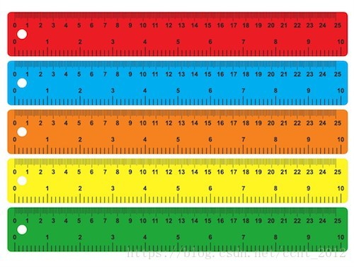
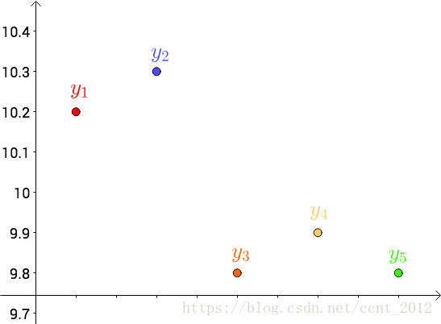
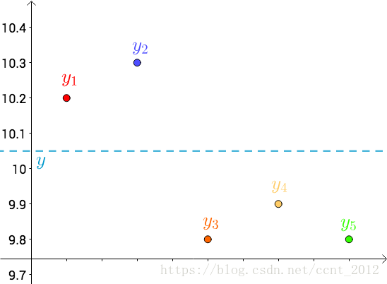
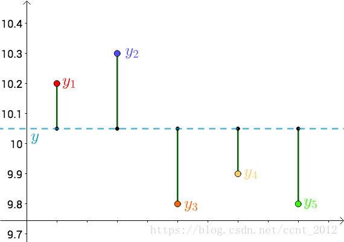

```{r setup, include=FALSE}
knitr::opts_chunk$set(dev = 'pdf')
library(ggplot2)
library(showtext)
library(r2symbols)
showtext::showtext_auto()
```
## 

\LARGE 第七章$~$直线回归与相关分析

## 第一节$~$回归和相关的概念 

- 变量间的相互关系：

  - 因果关系

    - 一个变量的变化受另一个变量或几个变量的制约

  - 平行关系

    - 两个以上变量之间共同受到另外因素的影响
  
- 两个变量的成对观测值可表示为 $(x_1, y_1), (x_2, y_2), (x_3, y_3), \ldots, (x_n, y_n)$

- 每对观测值在平面直角坐标系中表示成一个点，作成散点图


## 第一节$~$回归和相关的概念$~$`一、散点图`

- 散点图

```{r echo=FALSE, crop=FALSE, fig.align='center', fig.asp=0.33}
par(mfrow= c(1,3))
plot(mtcars$wt, mtcars$mpg, pch =20, col= 'red', pty = 2, xlab = "车重", ylab = "油耗(miles per gallon gas)", main = "负向直线关系")
plot(mtcars$wt, mtcars$disp, pch =20, col= 'red', pty = 2, xlab = "车重", ylab = "排量", main = "正向直线关系")
library(ggplot2)
plot(diamonds$carat, diamonds$price, pch =20, col= 'red', pty = 2, xlab = "价格", ylab = "克拉", main = "曲线关系")
```
- 从散点图可以看到：

  - 变量间关系的性质和程度
  - 变量间关系的类型
  - 是否有异常值干扰

## 第一节$~$回归和相关的概念$~$`一、散点图`

```{r echo=FALSE, crop=FALSE, fig.align='center', fig.asp=1}
pairs(~ mpg + disp + drat + wt, data=mtcars, main="mtcars数据集")
```

## 第一节$~$回归和相关的概念$~$`二、因果关系`

- 因果关系/回归分析$\clubsuit$

  - 用回归分析研究
  - 自变量$x$，因变量$y$
  - $y$是随$x$的变化而变化的，具有随机误差
  - 对于变量$x$的每一个可能值$x_i$，都有随机变量$y_i$的一个分布与之相对应，称随机变量$y$对变量$x$存在回归关系
  
- 一元回归分析
  - 一个自变量与一个因变量
  - 直线回归
  - 曲线回归

- 多元回归分析
  - 多个自变量与一个因变量
  
- 揭示因果关系的变量之间的联系形式，建立回归方程，利用回归方程预测和控制因变量
  
## 第一节$~$回归和相关的概念$~$`三、平行关系` 
  
- 平行关系/相关分析

  - 用相关分析研究
  - 变量$x$和变量$y$无自变量和因变量之分，都具有随机误差
  - 两个随机变量$x$和$y$，对于其中任一随机变量的每一个可能的值，另一个随机变量都有一个确定的分布与之相对应，称这两个变量间存在相关关系
  
- 直线相关分析
  - 两个变量的直线关系
  
- 复相关分析
  - 一个变量与多个变量间的线性相关
  
- 偏相关分析
  - 其余变量保持不变的情况下两个变量间的线性相关
  
- 研究两个变量之间相关的程度和性质或一个变量与多个变量之间相关的程度

## 第一节$~$回归和相关的概念$~$`思考题`

如果两个变量间的关系属于平行关系,一般用相关分析来进行研究。

相关分析是研究____（单选题）

A、 变量之间的变动关系 

B、 变量之间的相互关系的密切程度 

C、 变量之间的数量关系 

D、 变量之间的因果关系 

## 第一节$~$回归和相关的概念$~$`思考题`

相关分析是研究变量间的相关关系的统计学方法,适用于研究变量间的____（单选题）

A、 平行关系 

B、 因果关系 

C、 随机关系 

D、 以上都不对 


## 第二节$~$直线回归分析$~$`一、直线回归方程的建立`

- 对于自变量$x$的每一个取值$x_i$，都有因变量$y$的一个分布与之对应
- 条件平均数
  - 当$x = x_i$时，$y_i$的平均数$\mu_{y_i}$与之对应
  
- 利用直线回归方程描述这种关系：
  - $\hat{y} = a + bx$
  - $a$为截距，$b$为系数，$\hat{y}$为因变量$y$的点估计

## 第二节$~$直线回归分析$~$`一、直线回归方程的建立`

- 两个变量呈线性关系，可以用直线回归来描述

- 最小二乘法

  - 解决曲线拟合问题最常用的方法
  - 基本思路是求$a,b$,令因变量的观测值与回归估计值的离均差平方和Q值最小
  $$
  min(Q) = \sum_{1}^{n}(y-\hat{y})^2= \sum_{1}^{n}(y-a-bx)^2 
  $$
 
  - 天体运动论，1809，高斯
  - 计算谷神星轨道
  - 通过最小化误差的平方和寻找数据的最佳函数匹配
   
   
## 第二节$~$直线回归分析$~$`一、直线回归方程的建立`

用五把不同颜色的尺子分别测量一线段的长度，得到的数值分别为：
```{r echo=FALSE, fig.align='center', out.width="30%"}
measured_length <- data.frame("红" = 10.2, "蓝"= 10.3, "橙"=9.8, "黄"= 9.9, "绿"=9.8)

knitr::kable(measured_length)
```
一般用平均值来作为线段长度：

$$
\bar{x}= \frac{10.2+10.3+9.8+9.9+9.8}{5}=10
$$

## 第二节$~$直线回归分析$~$`一、直线回归方程的建立`

把测试得到的值画在坐标系中，分别记作$y_i$

```{r echo=FALSE, fig.align='center', out.width="60%"}

```

## 第二节$~$直线回归分析$~$`一、直线回归方程的建立`

把要猜测的线段长度的真实值用平行于横轴的直线来表示，分别记作$y$

```{r echo=FALSE, fig.align='center', out.width="60%"}

```

## 第二节$~$直线回归分析$~$`一、直线回归方程的建立`

每个点都向$y$做垂线，垂线的长度就是$y-y_i$，也可以理解为测量值和真实值之间的误差：

```{r echo=FALSE, fig.align='center', out.width="60%"}

```

## 第二节$~$直线回归分析$~$`一、直线回归方程的建立`

- 因为误差是长度，还要取绝对值，计算起来麻烦，就干脆用平方来代表误差：
$$
|y - y_i| \Rightarrow (y - y_i)^2
$$
- 总的误差平方就是

$$
 \sigma = \sum(y - y_i)^2
$$

- 因为$y$是猜测的，所以可以上下不断变换
- 方差不断变化

## 第二节$~$直线回归分析$~$`一、直线回归方程的建立`

- 勒让德（`Adrien-Marie Legendre`）提出让总的误差的平方最小的$y$ 就是真值，这是基于:
  - 如果误差是随机的，应该围绕真值上下波动
  - 无偏估计
  
$$
 \sigma = min \sum(y - y_i)^2
$$

- 对二次函数求导：

$$
 \frac{d}{dy}\sigma = \frac{d}{dy}\sum(y - y_i)^2 = 2\sum(y - y_i) = 2((y - y_1)+(y - y_2)+\ldots+(y - y_5)) = 0
$$
$$
5y = y_1 + y_2+\ldots+ y_5 \Rightarrow y = \frac{y_1 + y_2+\ldots+ y_5 }{5}
$$

## 第二节$~$直线回归分析$~$`一、直线回归方程的建立`

- 求真值的最小二乘法

$$
 \sigma = min \sum(y - y_i)^2
$$

- 求自变量和因变量关系的最小二乘法
$$
min(Q) = \sum_{1}^{n}(y-\hat{y})^2= \sum_{1}^{n}(y-a-bx)^2 
$$
  - 根据极值定理，对$a$和$b$分别求导：
$$
\frac{\partial Q}{\partial a} = -2\sum(y -a - bx) = 0, \frac{\partial Q}{\partial b} = -2\sum(y -a - bx)x = 0 
$$
  - 整理得到：
$$
\begin{cases}
an +b \sum x  = \sum y\\
a\sum x + b \sum x^2 = \sum xy
\end{cases}
$$
      
## 第二节$~$直线回归分析$~$`一、直线回归方程的建立`    
    
- 最后得到：
$$
\begin{cases}
a = \bar{y} - b \bar{x}\\
b = \frac{\sum(x- \bar{x})(y - \bar{y})}{\sum(x- \bar{x})^2}
\end{cases}
$$

- $a>0$，回归直线在第一象限与y轴相交

- $a<0$，回归直线在第一象限与x轴相交

- $b>0$，$y$随$x$的增加而增加

- $b<0$，$y$随$x$的增加而减小
    
```{r echo=FALSE, crop = TRUE, fig.align='center', fig.asp=1, out.height="45%"}
x <- seq(0, 4)
plot(x, -3+2*x, type = 'l', lwd = 2, xlim = c(0, 4), ylim = c(0, 4), xlab = "x", ylab = "y", col= "black", cex.axis = 2, cex.lab= 2)
text(3.5, 3, expression(y==2%*%x -3), cex = 2)
lines(x, 2+2*x, type = "l", lwd = 2, col= 'red')
text(1, 3, expression(y==2%*%x +2), col = 'red', cex = 2)
lines(x, 3-2*x, type = "l", lwd = 2, col= 'blue')
text(1, 1, expression(y==-2%*%x +3), col = 'blue', cex = 2)
lines(x, rep(2, length(x)), type = "l", lwd = 2, col= 'orange')
text(2, 2.1, expression(y==2), col = 'orange', cex = 2)
```

## 第二节$~$直线回归分析$~$`一、直线回归方程的建立` 

- 计算出$a$，$b$，将$x$代入$\hat{y} = a+ bx$，可以计算出$\hat{y}$

- 研究$y$和$\hat{y}$可以得到如下回归方程的三个基本性质：

  - 最小值 $minQ=\sum (y-\hat{y})^2$
  - $(y - \hat{y}) = 0$
  - 回归直线通过中心点$(\bar{x}, \bar{y})$
    
- 直线回归方程的另一种形式：
  
  $$
    \hat{y}= \bar{y}- b \bar{x} + bx  = \bar{y}+ b(x - \bar{x})
  $$

## 第二节$~$直线回归分析$~$`一、直线回归方程的建立`  


黏虫孵化历期平均温度与历期天数之间的关系：

```{r echo=FALSE, fig.align='center', out.width="30%"}
worms_period <- data.frame(tempreture = c(11.8, 14.7, 15.6, 16.8, 17.1, 18.8, 19.5, 20.4), days= c(30.1, 17.3, 16.7, 13.6, 11.9, 10.7, 8.3, 6.7))
knitr::kable(worms_period, col.names = c("平均温度", "历期天数"))
```
如何建立直线回归方程?

## 第二节$~$直线回归分析$~$`一、直线回归方程的建立` 

- 方程：
$$
      \begin{cases}
       a = \bar{y} - b \bar{x}\\
      b = \frac{\sum(x- \bar{x})(y - \bar{y})}{\sum(x- \bar{x})^2}
      \end{cases}
$$
- 计算回归分析的数据：

$\bar{x} = \frac{\sum x}{n}, \bar{y} = \frac{\sum y}{n}$

$a = \bar{y} - b \bar{x}, b = \frac{\sum xy - \frac{\sum x \sum y}{n}}{\sum x^2 - \frac{(\sum x)^2}{n}}$

- 得到：

 $a = 57.04, b = -2.53$
 
- 直线回归方程：

$\hat{y}= 57.04 - 2.53x$

## 第二节$~$直线回归分析$~$`一、直线回归方程的建立` 

```{r echo=FALSE, crop = TRUE, fig.align='center', fig.asp=0.55}
par(mfrow= c(1,2))
plot(worms_period, type= 'p', pch = 20, col = 'red')
plot(worms_period, type= 'p', pch = 20, col = 'red')
x <- seq(12, 20)
lines(x, 57.04 - 2.53*x, type='l', lwd=2, col= 'blue')
```
- 并非所有的散点都会落在回归直线上， 而是靠近回归直线

- 用$x$去估计$y$是存在随机误差的

- 必须根据回归的数学模型对随机误差进行估计，对回归方程进行检验

## 第二节$~$直线回归分析$~$`一、直线回归方程的建立`
R DEMO

```{r, prompt=TRUE}
worms_period <- data.frame(
tempreture = c(11.8, 14.7, 15.6, 16.8, 17.1, 18.8, 19.5, 20.4), 
  days= c(30.1, 17.3, 16.7, 13.6, 11.9, 10.7, 8.3, 6.7)
  )
lm(days~tempreture, data = worms_period )
```

## 第二节$~$直线回归分析 $~$`思考题`

建立回归方程的通用方法是____（思考题）

A、 散点图法

B、 最小二乘法

C、 F检验法

D、 t检验法 


## 第二节$~$直线回归分析$~$`二、直线回归的数学模型和基本假定` 

（一）直线回归的数学模型

- $y$总体的每个观测值可以分解为：

  - $y$的总体平均值$\mu_y$
  - 因x引起的$y$的变异$\beta(x-\mu_x)$
  - $y$的随机误差$\epsilon$
  
- 直线回归的数学模型为：
  - $y = \mu_y + \beta(x-\mu_x) + \epsilon$，或$y = \alpha + \beta x + \epsilon$
  - 总体回归截距$\alpha$，常量。是$y$的本底水平，$x$对$y$没有任何作用时$y$的值
  - 总体回归系数$\beta$，$\beta x$表示$y$的取值改变中，由$x$与$y$的线性回归关系所引起变化的部分
  - 回归估计误差$\epsilon$，也称为残差。表示因变量$y$的取值改变中未进入该模型或未知但可能与$y$有关的随机和非随机因素共同引起变化的部分。在回归方程中，第$i$个变量的残差$\epsilon_i$是实测值$y_i$与其估计值$\hat{y}_i$之差


## 第二节$~$直线回归分析$~$`二、直线回归的数学模型和基本假定` 

（二）直线回归的基本假定

- $x$是没有误差的固定变量，$y$是随机变量

- $x$的任一值都对应着一个$y$总体，且呈正态分布，平均值$\mu = a + \beta x$，方差不因$x$的变化而改变

- 随机误差$\epsilon$是相互独立的，呈正态分布，服从$N(0, \sigma_\epsilon^2)$

## 第二节$~$直线回归分析 $~$`思考题`

观测值与预测值之差叫做____（单选题）

A、极差 

B、离均差 

C、残差 

D、方差 


## 第二节$~$直线回归分析$~$`三、直线回归的假设检验` 

（一）直线回归的变异来源

- 因变量$y$是随机变量

- $y$的变异$(y-\bar{y})$可以分为两部分

  - 由$x$引起的变异$(\hat{y}-\bar{y})$
  
  - 误差所引起的变异$(y-\hat{y})$
  
- $y$的变异$\sum(y-\bar{y})^2 =\sum(\hat{y}-\bar{y})^2+\sum(y-\hat{y})^2$

- $\sum(\hat{y}-\bar{y})^2$为由$x$变异引起$y$变异的平方和，也就是在y的变异中可以用$x$解释的部分。$\sum(\hat{y}-\bar{y})^2$说明回归效果越好

- $\sum(y-\hat{y})^2$为误差因素引起的平方和，反映了除去$x$以外的其余因素使$y$发生变异的部分，也就是无法用$x$解释的部分。$\sum(y-\hat{y})^2$越小说明估计误差越小

## 第二节$~$直线回归分析$~$`三、直线回归的假设检验` 

（二）$F$检验

- $F$检验：通过比较两组数据的方差，以确定他们的密度是否有显著性差异

- 看两个变量是否存在直线关系，可以采用F检验进行

  - $H_0:$两变量之间无线性关系

  - $H_A:$两变量之间有线性关系
  
- 在$H_0$下，$\sum(\hat{y}-\bar{y})^2$和$\sum(y-\hat{y})^2$的比值服从$F$分布 

$$
F = \frac{\sum(\hat{y}-\bar{y})^2}{\sum(y-\hat{y})^2} \times (n - 2)
$$

## 第二节$~$直线回归分析$~$`三、直线回归的假设检验` 

R DEMO
\tiny
```{r, prompt=TRUE}
summary(lm(days~tempreture, data = worms_period ))
```

## 第二节$~$直线回归分析$~$`四、直线回归的应用及注意的问题`
（一）应用

- 描述两个变量的关系
- 对$y$进行预测
- 通过控制$x$来控制$y$

（二）应注意的问题

- 回归分析要有意义
- 回归变量的确定：因&果
- 观测值要尽量多
- 回归方程应进行检验
- 预测和外推要谨慎

## 第三节$~$直线相关$~$`一、相关系数和决定系数` 

- 如果两个变量间呈线性关系，但不需要从一个变量来估计另一个变量，只需了解变量间相关程度及相关性质，可以计算相关系数

- 直线相关常用于分析双变量正态分布的资料

- 通过离均差的乘积来计算双变量$x$与$y$的关系：

$\sum(x - \mu_x)(y - \mu_y)$，$\mu_x, \mu_y$分别代表两组变量的均值

## 第三节$~$直线相关$~$`一、相关系数和决定系数` 
  
- 将坐标原点位于点$\mu_x, \mu_y$上，原坐标转变为$(x - \mu_x, y - \mu_y)$
  
- 如果数据点多落在I和III象限，由于
  
  - 在第I象限$x - \mu_x>0, y - \mu_y>0$
  - 在第III象限$x - \mu_x<0, y - \mu_y<0$
  - 离均差乘积和$\sum(x - \mu_x)(y - \mu_y)>0$
```{r echo=FALSE, crop = TRUE, fig.align='center', message=FALSE, fig.asp=1, out.height="50%"}
library(car)
dataEllipse(mtcars$wt, mtcars$disp, levels = c(0.5, 0.8, 0.9), xlim = c(0,6), ylim = c(-30, 500), xlab = "Weight", ylab = "Displacement", cex.lab = 1.5, cex.axis=1.5)
abline(v = mean(mtcars$wt), col = "red", lwd = 2)
abline(h = mean(mtcars$disp), col = "red", lwd = 2)
text(6, 500, "I", col = "red", cex= 3)
text(0, 500, "II", col = "red", cex= 3)
text(0, 0, "III", col = "red", cex= 3)
text(6, 0, "IV", col = "red", cex= 3)
```
  - 在I和III象限的数据点越多，离均差的乘积和越大
  
## 第三节$~$直线相关$~$`一、相关系数和决定系数` 
  
  
- 如果数据点多落在II和IV象限，由于
  
  - 在第II象限$x - \mu_x<0, y - \mu_y>0$
  - 在第IV象限$x - \mu_x>0, y - \mu_y<0$
  - $\sum(x - \mu_x)(y - \mu_y)<0$
```{r echo=FALSE, crop = TRUE, fig.align='center', message=FALSE, fig.asp=1, out.height="50%"}
library(car)
dataEllipse(mtcars$wt, mtcars$mpg, levels = c(0.5, 0.8, 0.9), xlim = c(0,6), ylim = c(0, 40), xlab = "Weight", ylab = "Miles per Gallon", cex.lab = 1.5, cex.axis=1.5)
abline(v = mean(mtcars$wt), col = "red", lwd = 2)
abline(h = mean(mtcars$mpg), col = "red", lwd = 2)
text(6, 40, "I", col = "red", cex= 3)
text(0, 40, "II", col = "red", cex= 3)
text(0, 0, "III", col = "red", cex= 3)
text(6, 0, "IV", col = "red", cex= 3)
```
  - 在II和IV象限的数据点越多，离均差乘积和的绝对值越大
  
## 第三节$~$直线相关$~$`一、相关系数和决定系数` 
  
- 散点均匀分布在四个象限中，正负相消

  - $\sum(x-\mu_x)(y-\mu_y)\approx 0$
  
```{r echo=FALSE, crop = TRUE, fig.align='center', message=FALSE, fig.asp=1, out.height="50%"}
library(car)
dataEllipse(mtcars$wt, mtcars$qsec, levels = c(0.5, 0.8, 0.9), xlim = c(0,6), ylim = c(10, 25), xlab = "Weight", ylab = "1/4 mile time", cex.lab = 1.5, cex.axis=1.5)
abline(v = mean(mtcars$wt), col = "red", lwd = 2)
abline(h = mean(mtcars$qsec), col = "red", lwd = 2)
text(6, 25, "I", col = "red", cex= 3)
text(0, 25, "II", col = "red", cex= 3)
text(0, 10, "III", col = "red", cex= 3)
text(6, 10, "IV", col = "red", cex= 3)
```

## 第三节$~$直线相关$~$`一、相关系数和决定系数` 

- 离均差的乘积和可用以表示直线相关的两个变量的相关程度和性质

- 不同数据之间的乘积和无可比性, $x$和$y$的变异程度及其度量单位会影响乘积和
  
- 消除影响，可以转换离均差为各自的标准差，再除以N

- 定义相关系数$\rho$为

$$
\rho = \frac{1}{N}\sum[(\frac{x - \mu_x}{\sigma_x})(\frac{x - \mu_y}{\sigma_y})]  = \frac{\sum(x-\mu_x)(y-\mu_y)}{\sqrt{\sum (x-\mu_x)^2 \times \sum (y-\mu_y)^2}}
$$

## 第三节$~$直线相关$~$`一、相关系数和决定系数` 

- 相关系数$r \in [-1, 1]$

- 如果$|r| = 1$，绝对相关

- $|r|$越接近1，相关程度越高

- $|r|$越接近0，相关程度越低

- $r$的正负表示相关的性质，正相关即$x$增大时$y$也增大，负相关即$x$增大时$y$减少

- 决定系数$r^2$，$r \in [0, 1]$

## 第三节$~$直线相关$~$`二、相关系数的假设检验` 
  
- 判断$r$所代表的总体是否存在直线关系

- 相关系数的标准误$s_r$和$t$值为：

  - $s_r = \sqrt{\frac{1- r^2}{n - 2}}, t = \frac{r - \rho}{s_r}$

## 第三节$~$直线相关$~$`二、相关系数的假设检验` 

DEMO

```{r prompt=TRUE}
cor(worms_period$tempreture, worms_period$days)
cor.test(worms_period$tempreture, worms_period$days,
         alternative = "two.sided")
```
## 第三节$~$直线相关$~$`三、注意事项` 

- 两个变量应该都服从正态分布

- 相关系数应进行检验

- 变量尽可能多

- 理解相关系数的含义：相关不等于因果

