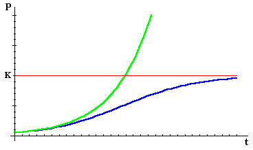
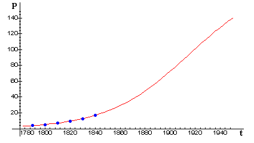
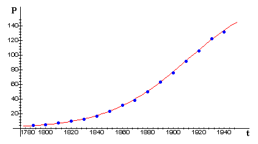
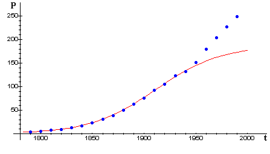

```{r setup, include=FALSE}
knitr::opts_chunk$set(dev = 'pdf')
library(ggplot2)
library(showtext)
showtext::showtext_auto()
```
## 

\LARGE 第八章$~$可直线化的非线性回归分析

## 非线性关系

- 线性关系

  - 直线关系是两个变量间最简单的关系
  
  - 在较小取值范围内，任意非线性关系都可以用线性关系来表示。
  
  - 缩小研究范围在使用上很不方便：
    
    - 不能对变量间关系有一个整体上的把握
    
    - 在不同取值范围内还要换用不同的方程

- 非线性关系

  - 在研究过程中经常可以遇到变量间的非线性关系，用来表示两个变量间关系的曲线种类很多
  
  - 有的曲线类型可以通过数据转换而变形为直线形式（直线化）
  
  - 用转换后的数据建立直线回归方程，然后在反转换为曲线回归方程，这就是\textcolor{red}{可直线化的非线性回归分析}
  
## 非线性回归

- 非线性回归分析

  - 已知曲线（公式）类型
  
    - 如果已知曲线类型，回归效果会有保证
    
    - 在多数情况下我们对所研究的对象都有一定的了解，可以根据理论和经验得出可能的曲线类型
  
  - 未知曲线（公式）类型
  
    - 如果曲线类型未知，可以利用多项式回归
    
    - 通过逐渐增加多项式的高次项来拟合，从而确定最优回归方程
  
## 第一节$~$非线性回归的直线化 $~$`一、曲线类型的确定`

- 生物学中变量间的曲线关系通常有：

  - 倒数函数曲线
  
  - 指数函数曲线
  
  - 对数函数曲线
  
  - 幂函数曲线
  
  - S形曲线
  
- 需要借助于有关专业知识所提供的推断，不应和专业实践结果相矛盾

- 从专业理论中得到解释，并使这些解释严密化和数量化

## 第一节$~$非线性回归的直线化 $~$`一、曲线类型的确定`

曲线类型$\clubsuit$

- \textcolor{red}{确定曲线类型}是非线性回归分析的关键

- 通常的方法有以下几种：

  - 图示法
  
    - 根据所获得的试验资料的自然尺度绘出散点图
    
    - 按照散点图的趋势绘出能够反映它们之间变化规律的曲线
    
    - 与已知的曲线相比较，找出与之较为相似的曲线图形
  
  - 直线化法
  
    - 根据散点图进行直观的比较并选出一种曲线类型
    
    - 将原始数据进行转换，将曲线方程直线化
    
    - 用转换后的数据绘出散点图，若图形为直线趋势，表明所选取的曲线类型是恰当的
  
## 第一节$~$非线性回归的直线化 $~$`一、曲线类型的确定`

- 曲线配合的好坏，通常以所配曲线与实测点吻合程度的高低来衡量

- 吻合程度取决于离回归平方和与总平方和的比例大小
$$
\frac{\sum(y - \hat{y})^2}{\sum(y - \bar{y})^2}
$$
- 如果比例小，说明所配曲线与实测点吻合程度高，反之则低

- 曲线回归的相关指数（决定系数），记为$R^2$，反映了自变量对因变量的可解释比例
$$
R^2 = 1 - \frac{\sum(y - \hat{y})^2}{\sum(y - \bar{y})^2}
$$
- 可以通俗地理解为使用均值作为误差基准，看预测误差是否大于或者小于均值基准误差

## 第一节$~$非线性回归的直线化 $~$`一、曲线类型的确定`

相关系数$r$和决定系数$R^2$

$$
\begin{split}
&r = \frac{\sum(x-\mu_x)(y-\mu_y)}{\sqrt{\sum (x-\mu_x)^2 \times \sum (y-\mu_y)^2}}\\
&R^2 = 1 - \frac{\sum(y - \hat{y})^2}{\sum(y - \bar{y})^2}
\end{split}
$$

- 相关系数$r$用来描述两个变量线性相关程度$[-1, 1]$，$r$对变量的平移和缩放不敏感

- 决定系数$R^2$一般用在回归模型用于评估预测值和实际值的符合程度，$R^2$越接近1表示回归分析中自变量对因变量的解释越好

## 第一节$~$非线性回归的直线化 $~$`一、曲线类型的确定`

总体流程：

- 对于同一组实测数据，根据散点图性状，用若干相近的曲线进行拟合，同时建立若干曲线回归方程

- 根据$R^2$的大小和生物学专业知识，选择既符合生物学规律，又有较高拟合度的曲线回归方程来描述两个变量间的曲线回归关系

## 第一节$~$非线性回归的直线化 $~$`二、数据变换的方法`

- 进行非线性化回归曲线的直线化，对原数据进行转换的方法通常有

  - 直接引入新的变量：直接引入新的变量
  
    - 对数函数方程$y = a + b\lg{x}$，令$x' = \lg{x}$，得到$y = a + bx'$
  
  - 方程变换后再引入新变量：将原曲线方程进行数学变换后引入新的变量
  
    - 幂函数曲线方程$y = ax^b$取对数得$\lg{y}= \lg{a} + b \lg{y}$，得到$y' = a' + bx'$
    
- 统计学已经证明，大部分曲线方程只要变量变换后的直线化回归关系达到显著，变量反转后得到的曲线线程关系也较好
  
## 第二节$~$倒数函数曲线

- 常见表达式：

$$
\begin{split}
  \hat{y} = \frac{a+bx}{x}\\
  \hat{y} = \frac{1}{a+bx}\\
  \hat{y} = \frac{x}{a+bx}
\end{split}
$$

- 对应的图形：
```{r echo=FALSE, fig.align='center', crop=TRUE, fig.asp=0.33}
  par(xaxs = "i", yaxs = "i", mfrow= c(1,3))
  x <- seq(0.1, 10, 0.1)
  a <- 2
  b <- 3
  y_1 <- (a + b*x)/x
  plot(x, y_1, type = "l", xlim = c(0, 10), ylim = c(1, 10), main = expression(hat(y) == (a+bx)/x), ylab = "y", col = "red", lwd = 2)
  y_2 <- 1/(a + b*x)
  plot(x, y_2, type = "l", xlim = c(0, 10), ylim = c(0, 0.5), main = expression(hat(y) == 1/(a+bx)), ylab = "y", col = "blue", lwd = 2)
  y_3 <- x/(a + b*x)
  plot(x, y_3, type = "l", xlim = c(0, 10), ylim = c(0, 0.5), main = expression(hat(y) == x/(a+bx)), ylab = "y", col = "orange", lwd = 2)
```

## 第二节$~$倒数函数曲线

对以上方程进行直线化的表达方式：

- 若令$y' = xy$，则

  $\hat{y}' = a+bx$

- 若令$y' = 1/y$，则

  $\hat{y}' = a+bx$

- 若令$y' = x/y$，则

  $\hat{y}' = a+bx$
  
## 第二节$~$倒数函数曲线

如果两个变量在坐标系中的分布趋势类似于倒数函数曲线图，可适配$\hat{y} = \frac{a+bx}{x}$型的回归方程。

```{r echo=FALSE, fig.align='center', crop=TRUE, fig.asp=1, out.height="40%"}
  x <- seq(0.1, 10, 0.1)
  y_1 <- (2 + 3*x)/x
  plot(x, y_1, type = "l", xlim = c(0, 10), ylim = c(-5, 15), main = expression(hat(y) == (a+bx)/x), col = "red", lwd = 2, cex.main = 3)
  text(4, 5, labels = expression(paste(y == (2 + 3*x)/x, ", (a > 0, b > 0)")), col = "red", cex = 3)
  y_2 <- (-2 + 3*x)/x
  lines(x, y_2, type = "l", col = "blue", lwd = 2)
  text(4, 1, labels = expression(paste(y == (-2 + 3*x)/x, ", (a < 0, b > 0)")), col = "blue", cex = 3)
  y_3 <- (2 - 3*x)/x
  lines(x, y_3, type = "l", col = "orange", lwd = 2)
  text(4, -3, labels = expression(paste(y == (-2 + 3*x)/x, ", (a > 0, b < 0)")), col = "orange", cex = 3)
```
- 引入新变量$y'=xy$

- 用$y'$与$x$进行直线回归分析，求得$a$和$b$

- 经过数据还原可得倒数函数方程

## 第三节$~$指数函数曲线
  
- 应用$\hat{y} = \frac{a+bx}{x}$的条件：

  - $x$的观测值无0
  
  - $xy$应具有专业意义，而不是抽象的量
  
  - 以$y' = xy$和$x$为坐标绘制出的散点图有明显的直线性

  - $y'$和$x$的相关系数显著

## 第三节$~$指数函数曲线

- ‘苏品1号’玉米在不同密度下的平均株重和经济系数的关系

```{r echo=TRUE}
maize <- data.frame(
  x = c(399, 329, 247, 191, 145, 119, 90), 
  y = c(0.38, 0.379, 0.371, 0.343, 0.317, 0.301, 0.248))
```

- 绘制散点图，与$\hat{y} = \frac{a+bx}{x}$中$a<0, b>0$的曲线相似
```{r echo=FALSE, fig.align='center', crop=TRUE, fig.asp=0.33, out.height = "40%"}
  par(xaxs = "i", yaxs = "i", mfrow= c(1,3))
  plot(maize$x, maize$y, type = 'p', xlim = c(50, 450), ylim = c(0.2, 0.5), pch = 20, xlab = "玉米株重", ylab = "经济系数")
  
  x <- seq(0.1, 10, 0.1)
  a <- -2
  b <- 3
  y_1 <- (a + b*x)/x
  plot(x, y_1, type = "l", xlim = c(0, 10), ylim = c(0, 5), main = expression(hat(y) == (a+bx)/x), ylab = "y", col = "red", lwd = 2)

  plot(maize$x, maize$x*maize$y, type = 'p', xlim = c(50, 450), ylim = c(0, 200), pch = 20, xlab = "x", ylab = expression(paste(y, "'", "=xy")))
```

## 第三节$~$指数函数曲线

- 直线化回归方程的显著性检验

  计算$x$和$y'$的相关系数并对其进行显著性检验
$$
r_{xy'} = \frac{\sum(x-\bar{x})(y'-\bar{y'})}{\sqrt{\sum (x-\bar{x})^2 \times \sum (y'-\bar{y'})^2}}
$$
```{r prompt=TRUE, echo=TRUE}
cor.test(maize$x, maize$x*maize$y, 
         alternative = "two.sided",conf.level = 0.99)
```

## 第三节$~$指数函数曲线
- 配合倒数函数方程，进行直线回归分析，得到$a$和$b$值
$$
  \begin{cases}
  a = \bar{y} - b \bar{x}\\
  b = \frac{\sum(x- \bar{x})(y - \bar{y})}{\sum(x- \bar{x})^2}
  \end{cases}
$$

```{r echo=TRUE, prompt=TRUE}
lm(x * y~x, data = maize)
```
- 代入公式，得到$y$和$x$之间的倒数函数方程

$$
\hat{y}= \frac{-14.5363 + 0.4206\times x}{x}
$$

## 第三节$~$指数函数曲线

```{r echo=FALSE, fig.align='center', crop=TRUE, fig.asp=1, out.height="30%"}
  plot(maize$x, maize$y, type = 'p', xlim = c(50, 450), ylim = c(0.2, 0.5), pch = 20, xlab = "玉米株重", ylab = "经济系数", cex.lab = 2)
  x <- 50:450
  y <- (-14.5363 + 0.4206*x)/x
  lines(x, y, type = 'l', lwd = 2, col = "red")
```
- 计算曲线回归方程的决定系数$R^2$
$$
R^2 = 1 - \frac{\sum(y - \hat{y})^2}{\sum(y - \bar{y})^2}
$$
```{r echo=TRUE, prompt=TRUE}
summary(lm((-14.5363 + 0.4206*maize$x)/maize$x
           ~ maize$x))$r.squared
```

## 第三节$~$指数函数曲线

- 常见表达式：
$$
\begin{split}
  &\hat{y}= ae^{bx}\\
  &\hat{y}= ab^x
\end{split}
$$

- 对应的图形:
```{r echo=FALSE, fig.align='center', crop=TRUE, fig.asp=0.5}
  par(xaxs = "i", yaxs = "i", mfrow= c(1,2))
  x <- seq(0.1, 10, 0.1)
  a <- 2
  b <- 3
  y_1 <- a * exp(1)^(b*x)
  plot(x, y_1, type = "l", xlim = c(0, 1.5), ylim = c(0, 100), main = expression(hat(y) == ae^{bx}), ylab = expression(hat(y)), col = "red", lwd = 2)
  y_2 <- a * b^x
  plot(x, y_2, type = "l", xlim = c(0, 5), ylim = c(0, 100), main = expression(hat(y) == a * b^x), ylab = expression(hat(y)), col = "blue", lwd = 2)
```

## 第三节$~$指数函数曲线

- 在指数函数中，$x$是作为指数出现的，系数$b$用以描述增长或衰减速率。

  - 对曲线方程$\hat{y}= ae^{bx}$来说
    - $b>0$表示增长曲线
    - $b<0$表示衰减曲线
  - 对曲线方程$\hat{y}= ab^x$来说
    - $b>1$表示增长曲线
    - $0<b<1$表示衰减曲线
    
```{r echo=FALSE, fig.align='center', crop=TRUE, fig.asp=0.5, out.height="50%"}
  par(xaxs = "i", yaxs = "i", mfrow= c(1,2))
  x <- seq(0.1, 10, 0.1)
  a <- 2
  b <- 2
  y_1 <- a * exp(1)^(b*x)
  plot(x, y_1, type = "l", xlim = c(0, 1), ylim = c(0, 10), main = expression(hat(y) == ae^{bx}), ylab = expression(hat(y)), col = "red", lwd = 2)
  text(0.6, 6, labels = expression(hat(y) == 2*e^{2*x}), col = "red", cex = 1)
  a <- 4
  b <- -2
  y_2 <- a * exp(1)^(b*x)
  lines(x, y_2, type = "l", col = "blue", lwd = 2)
  text(0.6, 2, labels = expression(hat(y) == 2*e^{-2*x}), col = "blue", cex = 1)
```

## 第三节$~$指数函数曲线

- 指数函数$\hat{y}= ae^{bx}$的直线化表达式

  - 两边取自然对数，得到
$$
  \ln{\hat{y}} = \ln{a} + bx
$$
  - 令$y' = \ln{\hat{y}}$，$a' = \ln{a}$，变形为
$$
  \hat{y'} = a' + bx
$$

  - 以$x$和$y' = \ln{y}$进行直线回归，求出$b$和$a'$（将$a'$转换为$a$），代入原始方程即可

## 第四节$~$对数函数曲线

- 常见表达式：
$$
  \hat{y}=a +b\lg{x}
$$

- 对应的图形:
```{r echo=FALSE, fig.align='center', crop=TRUE, fig.asp=1, out.height="50%"}
  x <- seq(0.1, 10, 0.1)
  a <- 2
  b <- 3
  y_1 <- a + b * log10(x)
  plot(x, y_1, type = "l", xlim = c(0, 10), ylim = c(-1, 5), main = expression(hat(y) == a + b%*% lg(x)), ylab = expression(hat(y)), col = "red", lwd = 2, cex.main = 2)
  text(6, 3, labels = expression(hat(y) == 2 + 3%*% lg(x)), col = "red", cex = 2)
  a <- 2
  b <- -3
  y_2 <- a + b * log10(x)
  lines(x, y_2, type = "l", col = "blue", lwd = 2)
  text(6, -1, labels = expression(hat(y) == 2 -3%*% lg(x)), col = "blue", cex = 2)
```

## 第四节$~$对数函数曲线

- 如果两个变量的观测值在坐标系中的散点图分布趋势类似于对数函数曲线，可配合对数曲线方程

- 对数函数$\hat{y}=a +b\lg{x}$的直线化表达式
  - 令$\lg{x} = x'$，则表达式$\hat{y}=a +b\lg{x}$可以写成：
$$
  \hat{y}=a+bx'
$$
  - 用$x'$与$y$进行直线回归分析，求出$a$和$b$，就可以得到对数函数方程
  
## 第五节$~$幂函数曲线

- 常见表达式：
$$
  \hat{y}= ax^b
$$
- 对应的图形:
```{r echo=FALSE, fig.align='center', crop=TRUE, fig.asp=0.5, out.height="60%"}
  par(xaxs = "i", yaxs = "i", mfrow= c(1,2))
  x <- seq(0.1, 10, 0.1)
  a <- 2
  b <- 3
  y <- a * x^b
  plot(x, y, type = "l", xlim = c(0, 10), ylim = c(0, 2e3), main = expression(hat(y) == ax^b), ylab = expression(hat(y)), col = "red", lwd = 2)
```

## 第五节$~$幂函数曲线

- 如果两个变量的散点图类似于幂函数曲线，可以用幂函数曲线进行拟合
```{r echo=FALSE, fig.align='center', crop=TRUE, fig.asp=0.5, out.height="40%"}
  par(xaxs = "i", yaxs = "i", mfrow= c(1,2))
  x <- seq(0.1, 10, 0.1)
  a <- 2
  b <- 2
  y_1 <- a * x^b
  plot(x, y_1, type = "l", xlim = c(0, 10), ylim = c(0, 200), main = expression(hat(y) == ax^b), ylab = expression(hat(y)), col = "red", lwd = 2)
  text(5, 20, labels = expression(hat(y) == 2*x^2), col = "red", cex = 1)
  a <- 60
  b <- 0.5
  y_2 <- a * x^b
  lines(x, y_2, type = "l", col = "blue", lwd = 2)
  text(2, 110, labels = expression(hat(y) == 50*x^{1/2}), col = "blue", cex = 1)
```
- 对表达式两边取对数，得
$$
\lg{\hat{y}} = \lg{a} + b\lg{x}
$$
- 令$y' = \lg{y}$，$x' = \lg{x}$，$a' = \lg{a}$, 得到直线方程
$$
\hat{y'}=a' +bx'
$$
 
## 第五节$~$幂函数曲线

- 对$x'$和$y'$都取对数，如果通过相关性的检验，就说明选用幂函数曲线是适合的

```{r echo=TRUE, fig.align='center', crop=TRUE, fig.asp=0.5, out.height="40%"}
leaf <- data.frame(
  x = c(12, 15, 19, 25, 32, 35, 38, 41, 46, 49, 58), 
  y = c(0.17430, 0.11080, 0.06340, 0.05310, 0.04155, 0.04080, 0.04020, 0.03998, 0.03762, 0.03538, 0.03533))
cor(log10(leaf$y), log10(leaf$x))#幂函数
cor(leaf$y, log(leaf$x))#对数函数
cor(log(leaf$y), leaf$x)#指数函数
cor(leaf$y, leaf$x)#直线函数
```

## 第六节$~$Logistic生长曲线$~$`一、Logistic生长曲线的由来和基本特征`

- 当生物种群拥有足够的食物和生存空间，没有外界威胁的情况下，倾向于以一定比例生长

- 已知在每个单位时间上一部分群体会产生新的个体

- 如果繁殖活动是连续进行的，那么增长率可以表示为：
$$
\frac{\mathrm{d}P}{\mathrm{d}t} = rP
$$
  - 其中$P$是种群数量与时间$t$的函数，而$r$是比例常数

- 这个自然增长方程的求解方程是：
$$
P(t)=P_0 \times e^{rt}
$$ 
  - $P_0$是时间$t=0$时的种群数量
  - 不受约束的自然增长是指数增长

## 第六节$~$Logistic生长曲线$~$`一、Logistic生长曲线的由来和基本特征`

- 实际上，大多数生物种群都受到资源限制的制约，没有一个种群是永远不受限制的

- 因此，种群增长的两种可能途径
  
  - 绿色曲线遵循指数的无约束模式
  - 蓝色曲线受到约束，使人口总是小于某个数字*K*

- 当种群数量相对于*K*来说比较小的时候，两种模式几乎是相同的（约束条件并没有什么区别）
- 对于第二个途径，当*P*成为*K*的一个重要部分时，曲线开始分化，当*P*接近*K*时，增长率下降到0

```{r echo=FALSE, fig.align='center', out.height="30%"}

```

## 第六节$~$Logistic生长曲线$~$`一、Logistic生长曲线的由来和基本特征`

- 我们可以通过在模型中加入一个系数1-P/K
  - 当P远小于K时接近于1，来说明没有影响
  - 当P接近K时接近于0，来说明增长率下降到0
$$
\frac{\mathrm{d}P}{\mathrm{d}t} = rP(1-\frac{P}{K})
$$

- 以上称为Logistic增长模型或Verhulst模型
  - logistic没有特别的含义，只是它被普遍接受
  - Verhulst模型是为了纪念*P.F.Verhulst*，一位比利时数学家在19世纪研究了这个想法
  - *P.F.Verhulst*利用美国前五次人口普查的数据，在1840年对美国1940年的人口进行了预测（结果误差不到1%）

## 第六节$~$Logistic生长曲线$~$`一、Logistic生长曲线的由来和基本特征`

```{r echo=FALSE}
us_censuses <- data.frame(Date = c(1790, 1800, 1810, 1820, 1830, 1840), Population = c(3.929, 5.308, 7.240, 9.638, 12.866, 17.069))
```
美国的前五次人口普查数据

| Date (Years AD) | Population (millions) |
| ----------- | ----------- |
| 1790	| 3.929 |
| 1800	| 5.308 | 
| 1810	| 7.240 |
| 1820	| 9.638 |
| 1830	| 12.866 |
| 1840	| 17.069 |
```{r echo=FALSE, fig.align='center', out.width="30%"}

```

## 第六节$~$Logistic生长曲线$~$`一、Logistic生长曲线的由来和基本特征`
- 到1940年的美国实际人口普查数据
```{r echo=FALSE, fig.align='center', out.width="30%"}

```
- 近半个世纪的美国人口普查数据
```{r echo=FALSE, fig.align='center', out.width="30%"}

```
  - 该模型失去了预测能力，有可能反映了哪些美国历史上的重大事件，如内战、大萧条、两次世界大战？
  
## 第六节$~$Logistic生长曲线$~$`一、Logistic生长曲线的由来和基本特征`
- Logistic增长模型的线性方程形式是：
$$
\hat{y} = \frac{K}{1 + ae^{-bx}}
$$
- 基本特征：
  - 当$x=0$，$\hat{y} = \frac{K}{1 + a}$; 当$x=+\infty$，$\hat{y} =K$
  - 当$x = \frac{-\ln(1/a)}{b}$，曲线有一个拐点，这时$\hat{y} = \frac{K}{2}$
  - 在$x = \frac{-\ln(1/a)}{b}$前曲线下凹，在$x = \frac{-\ln(1/a)}{b}$后曲线上凸
  
## 第六节$~$Logistic生长曲线$~$`二、Logistic生长曲线方程的配合`
- 根据Logistic增长模型的线性方程，只要确定了K值，就可以利用直线化方法求方程的两个统计数$a$和$b$
$$
\hat{y} = \frac{K}{1 + ae^{-bx}}
$$
- 对以上方程移项
$$
ae^{-bx} = \frac{K - \hat{y}}{\hat{y}}
$$
- 两边取自然对数后得到

$$
\ln a - bx = \ln \frac{K - \hat{y}}{\hat{y}}
$$

- 令$a' = \ln a$ $b' = -b$ $\hat{y'} = \ln \frac{K - \hat{y}}{\hat{y}}$
$$
\hat{y'} = a' + b'x
$$

## 第六节$~$Logistic生长曲线$~$`二、Logistic生长曲线方程的配合`

- *K*值的确定：

  - 如果因变量$y$是累积频率，则$y$增长的极限是100%，可用$K=100$表示
  
  - 如果因变量$y$是生长或者繁殖量，取3对自变量$x$为等间距的观测值$(x_1, y_1)$，$(x_2, y_2)$和$(x_3, y_3)$，代入以下方程得到方程组:
  
$$
\begin{cases}
  \frac{K - y_1}{y_1} = ae^{-bx_1}\\
  \frac{K - y_2}{y_2} = ae^{-bx_2}\\
  \frac{K - y_3}{y_3} = ae^{-bx_3}\\
\end{cases}
$$
因为是等间距，所以$x_2= \frac{x_1+x_3}{2}$，得到
$$
K = \frac{y_2^2(y_1+y_3)-2y_1y_2y_3}{y_2^2-y_1y_3}
$$

## 第六节$~$Logistic生长曲线$~$`思考题`

下列能用变量代换进行线性化的方程是____（思考题）

A、所有曲线回归方程

B、Logistic生长曲线方程

C、多项式回归方程

D、没有 

## 课后思考题

在非线性回归分析中，请综合论述如何量化判断曲线拟合的质量？

