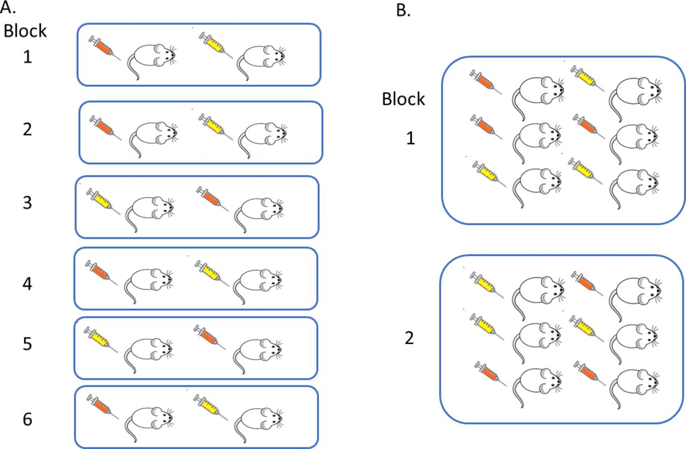

```{r setup, include=FALSE}
knitr::opts_chunk$set(dev = 'pdf')
library(ggplot2)
library(showtext)
showtext::showtext_auto()
```
## 

\LARGE 第九章$~$试验设计及其统计分析

## Check In App Release version_0.87

```{r echo=FALSE, crop=TRUE, fig.align='center'}
p <- c(1, 2, 3)
pp <- expand.grid(p ,p)
pp$Var2 <- pp[9:1, 2]

random_lib <- list(
  a <-list(c(1,2), c(1, 4), c(1, 5)),
  b <-list(c(2,1), c(2, 5), c(2, 3)),
  c <-list(c(3,2), c(3, 5), c(3, 6)),
  d <-list(c(4,1), c(4, 5), c(4, 7)),
  e <-list(c(5,2), c(5, 4), c(5, 6), c(5, 8)),
  f <-list(c(6,3), c(6, 5), c(6, 9)),
  g <-list(c(7,4), c(7, 5), c(7, 8)),
  h <-list(c(8,7), c(8, 5), c(8, 9)),
  i <-list(c(9,6), c(9, 5), c(9, 8))
)
random_generate <- function(x){
  repeat {
    m <- x
    n <- sample(random_lib[[m]], 1)[[1]][2]
    o <- sample(random_lib[[n]], 1)[[1]][2]
    p <- sample(random_lib[[o]], 1)[[1]][2]
    random_out <- c(m, n, o, p)
    if (sum(duplicated(random_out))==FALSE) {
      break
    }
  }
  return(random_out)
}
checkin <- random_generate(sample(1:9, 1))
par(xaxs = "i", yaxs = "i")

plot(expand.grid(p ,p), type = 'p', pch = 20, cex = 10, col="red", xlim = c(-1, 5), ylim = c(xlim = c(-1, 3.5)), axes = F, main=bquote("Check In Code: "*.(checkin[1])*.(checkin[2])*.(checkin[3])*.(checkin[4])) , xlab=NA, ylab=NA)
text(1, 3, "1", col='white', family="sans")
text(2, 3, "2", col='white', family="sans")
text(3, 3, "3", col='white', family="sans")
text(1, 2, "4", col='white', family="sans")
text(2, 2, "5", col='white', family="sans")
text(3, 2, "6", col='white', family="sans")
text(1, 1, "7", col='white', family="sans")
text(2, 1, "8", col='white', family="sans")
text(3, 1, "9", col='white', family="sans")
for (n in 1:3) {
  pos1 <- pp[checkin[n], ]
  pos2 <- pp[checkin[n+1], ]
  arrows(x0 = pos1$Var1, y0 = pos1$Var2, x1 = pos2$Var1, y1 = pos2$Var2, angle = 20, length = 0.1, lwd = 2, col = rgb(0, 0, 255, 80, maxColorValue=255))
}
```

## 试验设计

- 为使所获得的数据能准确可靠地反映事物的真实规律，在进行试验或调查之前，对整个试验或调查过程应做一个全面安排，这就是试验设计。

- 试验设计由英国科学家罗纳德·费舍尔（*Ronald Aylmer Fisher*, 1890 – 1962）为满足科学试验的需要而提出的。

## Ronald Aylmer Fisher

- 著名成就
  - 最大似然估计：得到最有可能导致已知数据出现的模型参数值
  - 方差分析：按照处理和误差效应分解总变异并作出数量估计
  - 试验设计
  - 费舍尔信息

- 高影响力著作
  - The Correlation Between Relatives on the Supposition of Mendelian Inheritance, 1918 建立以生物统计为基础的遗传学及方差分析理论
  - Statistical Methods for Research Workers, 1925 发展方差分析理论，并且提出实验设计的随机化原则，使科学试验可以同时进行多参数检验并减少样本偏差
  - The Genetical Theory of Natural Selection，1930 说明孟德尔遗传定律与达尔文理论是相辅相成的，进化驱动力来自选择的因素大于突变。将统计分析的方法带入进化论研究，为解释现代生物学的核心理论打下坚实的基础
  - Statistical methods and scientific inference，1956 提出显著性水平定为0.05
  
  
## 第一节$~$试验设计的基本原理 

- 试验数据往往存在一定的差异，这种差异可能

  - 由于随机误差产生

  - 由于试验处理所引起

- 试验处理的效应往往和随机误差混淆，不容易分开

- 通过概率的计算和假设检验作出正确判断

## 第一节$~$试验设计的基本原理 $~$`一、试验设计的意义`

- 合理的试验设计对科学试验非常重要
 
  - 节省人力、物力、财力和时间
  
  - 能够减少试验误差，提高试验的精确度，取得真实可靠的试验资料
  
  - 为统计分析得出正确的推断和结论奠定基础
  
- 一项工作要取得客观理想的结果，必须做到

  - 试验目的明确
  - 试验设计合理
  - 试验操作精细
  - 采用正确的统计方法对试验结果进行分析

## 第一节$~$试验设计的基本原理 $~$`二、生物学试验的基本要求`

- 生物学试验

  - 认识生物的生殖和生长发育规律
  
  - 生物活动受到诸多难以控制环境条件的影响
  
- 生物学试验的基本要求

  - 试验目的明确
    - 抓住急需解决的问题作为试验项目，同时对结果和可能遇到的问题有预见性
  
  - 试验条件要有代表性
    - 试验条件能够代表将来进行推广的实际条件和未来发展
  
  - 试验结果要可靠
    - 提高试验的准确度和精确度
    - 精确度：经过一系列的试验后，测量结果都比较接近
    - 准确度：经过一系列的试验后，测量结果都与真实值很接近
  - 试验结果要能重演
    - 在相同条件下，重复进行相同试验能得到与原试验结果相同或相近的结果

## 第一节$~$试验设计的基本原理 $~$`三、试验设计的基本要素`

- 试验设计包括3个基本组成部分

  - 处理因素
    
    - 单因素处理：试验只有一个处理因素
    
    - 多因素处理：包含两个或两个以上处理因素
    
    - 非处理因素：引起试验误差的主要来源，尽量加以有效控制

  - 受试对象
  
    - 根据研究目的而确定的观测总体
    
    - 必须对受试对象所要求的具体条件作出严格规定，以保证其同质性

  - 处理效应
  
    - 处理因素作用于受试对象的反映
    
  - 试验效应
  
    - 处理效应和试验误差共同构成了试验效应
    
    - 在分析试验效应时，需要按照一定的数学模型通过方差分析等将处理效应和试验误差进行分解，并进行检验，以确定处理效应是否显著

## 第一节$~$假设检验的原理与方法 $~$`四、试验误差及其控制途径`

（一）试验误差的概念

- 在试验中受偶然影响或者说非处理因素影响使观测值偏离试验处理真值的差异称为试验误差

- 试验误差是衡量试验精确度的依据，误差小说明精确度高

- 在试验设计和执行过程中，必须注意合理估计和降低试验误差的问题

- 统计上所说的误差通常是指随机误差，不是系统误差

## 第一节$~$假设检验的原理与方法 $~$`四、试验误差及其控制途径`

（二）试验误差的来源

- 生物学试验材料是变异丰富的生物有机体，试验影响因素千变万化，其中有些条件难以控制

  - 试验材料固有的差异：供试材料在遗传和生长发育方面存在差异

  - 试验条件不一致：各试验单位的构成不一致和各试验单位所处外部环境条件不一致

  - 操作技术不一致：各处理和处理组合在培养、采样等操作过程中存在着时间上和质量上的差别

  - 偶然性因素的影响：试验因素以外的人工无法控制的环境差异和遗传差异引起的误差


## 第一节$~$假设检验的原理与方法 $~$`四、试验误差及其控制途径`

（三）控制试验误差的途径

- 选择纯合一致的试验材料

- 改进操作管理制度，使之标准化

- 精心选择试验单位

- 采用合理的试验设计

## 第一节$~$假设检验的原理与方法 $~$`五、试验设计的基本原则`

- 进行试验设计的目的在于\textcolor{red}{减少试验误差}

  - 提高试验的准确度和精确度
  
  - 获得无偏的处理平均值及试验误差的估计量
  
  - 以较少的投入获得可靠的大量数据

- 试验设计必须遵循三项基本原则 

  - Fisher's three principles
  
  - R.A. Fisher在英国农场的农业资料研究中提出的假设检验方法

  - Replication，Randomization，Local control

## 第一节$~$假设检验的原理与方法 $~$`五、试验设计的基本原则`

（一）重复

- 在试验中，同一处理设置的试验单元数称为重复

- 重复的主要作用

- 估计试验误差

  - 试验误差是客观存在的，通过同一处理内不同重复之间的差异来估计

- 降低试验误差

  - 平均数标准误与标准差之间的关系为$s_{\bar{x}}=\frac{s}{\sqrt{n}}$
  
  - 重复越多，误差越小
  
## 第一节$~$假设检验的原理与方法 $~$`五、试验设计的基本原则`

（二）随机

- 一个重复中的某一处理或处理组合被安排在某一个试验单元不被主观成见影响

  - 试验中每一个处理都有同等机会设置在任何一个试验单位上

  - 随机化和重复相结合，试验就能提供无偏的试验误差估计值

- 在具体试验中，随机化体现在以下两方面

  - 用随机方法来确定每个试验单位接受哪种处理

  - 如果一个试验中试验条件的安排，试验指标测定的顺序可能影响到试验结果时，应采用随机化方法

## 第一节$~$假设检验的原理与方法 $~$`五、试验设计的基本原则`

（三）局部控制

- 生物学试验中，对所有非处理因素控制均衡一致是不易做到的

- 根据非处理因素的变化趋势将大的试验环境分解成若干个相对一致的小环境，在小环境内分成若干个实验单位安排不同的试验处理，在局部对非处理因素进行控制，这就是局部控制

  - 非处理因素相对一致的小环境称为区组、窝组
  
  - 田间试验中，所安排的试验单位称为试验小区

- 小环境间的变异可以通过方差分析剔除，所以局部控制可以最大限度减低试验误差

\underline{一个良好的试验设计，}
\underline{必须遵循重复、随机、局部控制三项原则周密安排试验，} 
\underline{才能由试验获得真实的处理效应和无偏的、最小的试验误差估计，}
\underline{从而对各处理间的比较得出可靠的结论}。

## 第二节$~$对比设计及其统计分析

- 对比设计是一种最简单的试验设计方法

- 设置一个试验组或几个试验组与许多标准/对照区依次比较，在同一个重复内各处理顺序排列

- 对比设计适用于单因素试验

- 根据对照区的设置不同，分为

  - 邻比设计
  
  - 间比设计

- 不同重复排成多排时，应注意不同重复间的相同处理不要排在一条直线上，可采用阶梯式或逆向式排列


## 第二节$~$对比设计及其统计分析$~$`一、对比设计`

- 邻比法排列的特点是每一个处理均直接排列于对照旁边，使每个小区都能与相邻的对照进行比较，能充分反映出处理的效应

- 邻比法排列示意图
$$
\begin{split}
\begin{matrix}
Replication[I]: & 1 & C & 2 & 3 & C & 4 & 5 & C & 6\\
Replication[II]: & 3 & C & 4 & 5 & C & 6 & 1 & C & 2\\
Replication[III]: & 5 & C & 6 & 1 & C & 2 & 3 & C & 4
\end{matrix}
\end{split}
$$

## 第二节$~$对比设计及其统计分析$~$`一、对比设计`

- 间比设计的特点是

  - 在一条地块上排列的第一小区和末尾的小区一定是对照区
  
  - 中间每隔相同数目的若干处理小区设置一个对照区
  
  - 一般设置重复2~4个，每个重复可拍成一排或多排，当排成多排时则多采用逆向式排列
  
- 间比法排列示意图
$$
\begin{split}
\begin{matrix}
Replication[I]: & C & 1 & 2 & 3 & 4 & C & 5 & 6 & 7 & 8 \\
Replication[II]:& C & 8 & 7 & 6 & 5 & C & 4 & 3 & 2 & 1
\end{matrix}
\end{split}
$$


## 第二节$~$对比设计及其统计分析$~$`二、对比设计试验结果的统计分析`

- 对比设计的试验结果一般采用百分比法与对照相比较分析

- 设对照为100%
  - 邻比试验设计是将各处理与相邻对照进行比较求出其百分数
  - 间比试验设计是将各处理与前后两个对照的平均数相比求出百分数

- 对比法试验为顺序排列，未体现随机原则
  - 不能正确地估计出无偏的试验误差
  - 结果不能采用方差分析的方法进行显著性检验

## 第三节$~$随机区组设计及其统计分析$~$`一、随机区组设计`

- 随机区组设计
  - 根据局部控制和随机原理
  - 将试验单位按性质不同分成与重复数一样多的区组
  - 使区组内非试验因素差异最小而区组间非试验因素差异最大
  - 每个区组均包括全部的处理
- 区组内各处理随机排列，各区组独立随机排列
- 随机法排列示意图（9处理3重复）
$$
\begin{split}
\begin{matrix}
Replication[I]: & 3 & 8 & 4 & 6 & 2 & 5 & 9 & 1 & 7 \\
Replication[II]:& 5 & 6 & 2 & 3 & 7 & 9 & 1 & 8 & 4 \\
Replication[III]:& 2 & 4 & 7 & 8 & 6 & 3 & 9 & 5 & 1
\end{matrix}
\end{split}
$$

## 第三节$~$随机区组设计及其统计分析$~$`一、随机区组设计`

- 如果试验处理数或重复数较多，试验田面积相应增大，环境差异增大
  - 将试验田按照与土壤肥力变化趋势垂直的方向设置与重复数相同的区组
  - 每个区组内再划分小区，一个小区安排一个处理
  - 不同区组间土壤差异大，每个区组内同一个重复的不同处理间土壤差异较小
    - 区组间的差异可以运用适当的统计方法予以分解
    - 影响试验误差的主要是区组内不同小区间非常小的土壤差异
  - 有效减小试验误差，提高试验精度
  
## 第三节$~$随机区组设计及其统计分析$~$`一、随机区组设计`

- 动物试验中的窝组设计
  - 同窝组动物来源相同，以窝组为单位安排试验
  - 同一窝组内各试验动物的安排是随机的

```{r echo=FALSE, fig.align='center', out.width="60%"}

```
\tiny
在随机区组中，每个区组可被视为一个小型实验。在一个区组内（本示意图显示为蓝色方块内的一组小鼠），实验单位（小鼠）被随机分配到一个处理内（注射器）。(A)表示一个有六个区块的实验，每个区块的每个处理水平只有一个实验单位。(B)表示一个有两个区块的实验，每个区块的每个处理水平有多个重复。

## 第三节$~$随机区组设计及其统计分析$~$`一、随机区组设计`

- 随机区组设计的优点

  - 设计简单，易于掌握
  
  - 设计富于弹性，单因素、多因素及综合性的试验都可应用该设计方法
  
  - 能提供无偏的误差估计，在大区域实验中能有效减少非试验因素的单向差异，有效降低试验误差
  
  - 对试验区的形状要求不严，不同区组亦可分散设置再不同地段上
  
- 不足之处
  
  - 不允许处理数太多，处理数多会导致区组的规模增大，区组内误差也会相应增大，局部控制的效率就会降低
  
  - 处理或处理的组合也不能太少，太少导致误差项的自由度太小，误差就会相应增大，也会降低假设检验的灵敏度
  
## 第三节$~$随机区组设计及其统计分析$~$`二、随机区组设计试验结果的统计分析` 

（一）单因素随机区组试验结果的统计分析

- 把区组看成一个因素，与处理因素一起作为二因素，按照*二因素无重复观测值*的方差分析方法进行

- 区组因素*A*，处理因素*B*
$$
\begin{bmatrix}
A \\
A_1 \\
A_2 \\
\vdots\\
A_i \\
\vdots\\
A_n
\end{bmatrix}
\begin{bmatrix}
B_1 & B_2 & \cdots & B_i & \cdots & B_k \\
x_{1,1} & x_{2,1} & \cdots & x_{i,1} & \cdots & x_{k,1}\\
x_{1,2} & x_{2,2} & \cdots & x_{i,2} & \cdots & x_{k,2}\\
\vdots & \vdots &   & \vdots &   & \vdots\\
x_{1,j} & x_{2,j} & \cdots & x_{i,j} & \cdots & x_{k,j}\\
\vdots & \vdots &   & \vdots &   & \vdots\\
x_{1,n} & x_{2,n} & \cdots & x_{i,n} & \cdots & x_{k,n}\\
\end{bmatrix}
$$ 

## 第三节$~$随机区组设计及其统计分析$~$`二、随机区组设计试验结果的统计分析` 

（一）单因素随机区组试验结果的统计分析

- 设试验有$k$个处理、$n$个区组，整个试验共有$k\times n$个观测值，其每个观测值$x_{ij}$的线性模型为
$$
x_{ij} = \mu + \alpha_i + \beta_j + \epsilon_{ij}
$$
  - $\mu$为总体平均数，$\alpha_i$为处理效应，$\beta_j$为区组效应，$\epsilon_{ij}$为误差，总体$N(0, \sigma^2)$
  
- 总平方和与总自由度均可可分解为区组、处理和误差的相应部分，即
$$
\begin{cases}
SS_T = SS_r + SS_t + SS_e\\
df_T = df_r + df_t + df_e
\end{cases}
$$
  - $T$为总和，$r$为处理，$e$为误差

## 第三节$~$随机区组设计及其统计分析$~$`二、随机区组设计试验结果的统计分析` 

（一）单因素随机区组试验结果的统计分析

- 自由度$df$的计算公式
$$
\begin{cases}
df_T = nk -1 \\
df_r = n - 1 \\
df_t = k - 1 \\
df_e = (n - 1)(k - 1)
\end{cases}
$$
- 各部分平方和的计算公式

$$
\begin{cases}
SS_T = \sum_{1}^{k}\sum_{1}^{n}(x - \bar{x})^2 \\
SS_r = k\sum{1}{n}(\bar{x}_r - \bar{x})^2 \\
SS_t = n\sum{1}{k}(\bar{x}_t - \bar{x})^2 \\
SS_e = \sum_{1}^{k}\sum_{1}^{n}(x - \bar{x}_r - \bar{x}_t + \bar{x})^2 = SS_T - SS_r - SS_t
\end{cases}
$$


## 第三节$~$随机区组设计及其统计分析$~$`二、随机区组设计试验结果的统计分析` 

（一）单因素随机区组试验结果的统计分析

- 方差分析的步骤：

  - 整理原始资料
  - 分解平方和与自由度
  - 列方差分析表

## 第三节$~$随机区组设计及其统计分析$~$`二、随机区组设计试验结果的统计分析` 
（一）单因素随机区组试验结果的统计分析

R DEMO

```{r}
raw_data <- data.frame(amount = c(10.9, 9.1, 12.2, 10.8, 
  12.3, 14.0, 11.1, 12.5, 10.5, 9.1, 10.7, 10.1,11.8, 13.9, 
  16.8, 10.1, 10.6, 11.8, 10.0, 11.5, 14.1,9.3, 10.4, 14.4),
  block = rep(c("I", "II", "III"), 8), 
  type = rep(LETTERS[1:8], each = 3)
)
```
```{r echo=FALSE}
knitr::kable(head(raw_data))
```

## 第三节$~$随机区组设计及其统计分析$~$`二、随机区组设计试验结果的统计分析` 
（一）单因素随机区组试验结果的统计分析

R DEMO

```{r echo=TRUE, warning=FALSE}
fit <- aov(amount ~ block + type , data = raw_data)
summary(fit)
```

## 第三节$~$随机区组设计及其统计分析$~$`二、随机区组设计试验结果的统计分析` 
（一）单因素随机区组试验结果的统计分析

R DEMO
\tiny
```{r echo=TRUE, warning=FALSE}
library(agricolae)
print(LSD.test(fit, "type", alpha = 0.05)$groups)
```

```{r echo=FALSE, fig.align='center', out.height="35%", crop = TRUE}
plot(LSD.test(fit, "type", alpha = 0.05))
```

## 第三节$~$随机区组设计及其统计分析$~$`二、随机区组设计试验结果的统计分析` 

（二）二因素随机区组试验结果的统计分析

- 二因素随机区组设计包含两个因素*A、B*，设*A*因素有$a$个水平，*B*因素有$b$个水平，区组数为$n$
- 试验中两因素各水平组成$ab$个处理组合，每一套处理组合随机分配在$n$个区组内，全部试验三向分组资料共得$abn$个观测值

- 每一观测值$x_{ijk}$的线性模型为
$$
x_{ijk} = \mu + \alpha_i + \beta_i + (\alpha\beta)_{ij} + \gamma_k + \epsilon_{ijk}
$$
  - $\mu$为总体平均数
  - $\alpha_i$为*A*因素主效，$\beta_i$为*B*因素主效，$(\alpha\beta)_{ij}$为*AB*交互作用效应
  - $\gamma_k$为区组效应
  - $\epsilon_{ijk}$为随机误差，具有$N(0, \sigma^2)$

## 第三节$~$随机区组设计及其统计分析$~$`二、随机区组设计试验结果的统计分析` 

（二）二因素随机区组试验结果的统计分析

- 二因素随机区组试验的处理效应可进一步分解为*A*因素，*B*因素和*AB*互作3部分效应
- 相应的平方和与自由度可分解为
$$
\begin{cases}
SS_T = SS_r + SS_A + SS_B + SS_{AB} + SS_e\\
df_T = df_r + df_A + df_B + df_{AB} + df_e
\end{cases}
$$
其中
$$
\begin{cases}
SS_t = SS_A + SS_B + SS_{AB}\\
df_t = df_A + df_B + df_{AB}
\end{cases}
$$
  - $T$为总和，$r$为区组，$t$为处理，$e$为随机误差，*A、B、AB*为因素或两因素互作

## 第三节$~$随机区组设计及其统计分析$~$`二、随机区组设计试验结果的统计分析` 

（二）二因素随机区组试验结果的统计分析

- 各部分平方和由下列各式计算

$$
\begin{cases}
SS_T = \sum_{1}^{abn}(x - \bar{x})^2 \\
SS_r = ab\sum_{1}^{n}(\bar{x}_r - \bar{x})^2 \\
SS_t = n\sum_{1}^{k}(\bar{x}_{ij} - \bar{x})^2 \\
SS_A = bn\sum_{1}^{a}(\bar{x}_{i} - \bar{x})^2 \\
SS_B = an\sum_{1}^{b}(\bar{x}_{j} - \bar{x})^2 \\
SS_{AB} = n\sum_{1}^{ab}(\bar{x}_{ij} - \bar{x}_{i}  - \bar{x}_{i} + \bar{x})^2 \\
SS_e = \sum_{1}^{abn}(x - \bar{x}_r - \bar{x}_{ij} + \bar{x})^2 = SS_T - SS_r - SS_t
\end{cases}
$$

## 第三节$~$随机区组设计及其统计分析$~$`二、随机区组设计试验结果的统计分析` 

（二）二因素随机区组试验结果的统计分析

- 各部分自由度由下列各式计算
$$
\begin{cases}
df_T = abn -1 \\
df_r = n - 1 \\
df_t = ab - 1 \\
df_A = a - 1 \\
df_B = b - 1 \\
df_{AB} = (a - 1)(b - 1)\\
df_e = (ab - 1)(n - 1)
\end{cases}
$$

## 第三节$~$随机区组设计及其统计分析$~$`二、随机区组设计试验结果的统计分析` 

（二）二因素随机区组试验结果的统计分析

- 方差分析的步骤：

  - 整理原始资料
  - 分解平方和与自由度
  - 列方差分析表
  - 多重比较
  
## 第四节$~$拉丁方设计及其统计分析$~$`一、拉丁方设计`

- 拉丁方

  - 将$k$个不同符号排成一个$k$阶方阵，使每个符号在每一行、每一列都仅出现依次
  
  - 这个方阵称为$k\times k$拉丁方
  
- 拉丁方设计就是在行和列两个方向上都进行局部控制，使行、列两向皆成完全区组或重复，
  - 比随机区组设计多一个区组的设计
  - 需保持行、列、处理数三者相等，缺乏伸缩性
  - 处理数太多，很难实施；处理数太小，误差项自由度不够

$5\times 5$拉丁方设计
```{r echo=FALSE, prompt=TRUE}
treatments<- c("A","C","D","E","B", "D","B","C","A","E", "E","A","B","C","D", "B","E","A","D","C", "C","D","E","B","A")

matrix(treatments, 5, 5)
```

## 第四节$~$拉丁方设计及其统计分析$~$`一、拉丁方设计`

- 拉丁方试验设计的方法步骤

  - 选择标准方
    - 标准方代表处理的字母，在第一行和第一列皆为顺序排列的拉丁方
    - 根据试验的处理数$k$选一个$k\times k$的标准方
    
  - 列随机：随机调整标准方的列顺序
  - 行随机：随机调整上一步得到的拉丁方
  - 处理随机：对处理的编号进行随机排列

$$
\begin{split}
\begin{matrix}
A & B & C & D & E \\
B & A & E & C & D \\
C & D & A & E & B \\
D & E & B & A & C \\
E & C & D & B & A
\end{matrix}
\rightarrow
\begin{matrix}
C& B &  A &  D & E \\
E& A &  B &  C & D \\
A& D &  C &  E & B \\
B& E &  D &  A & C \\
D& C &  E &  B & A
\end{matrix}
\rightarrow\\
\begin{matrix}
E& A &  B &  C & D \\
D& C &  E &  B & A \\
B& E &  D &  A & C \\
A& D &  C &  E & B \\
C& B &  A &  D & E 
\end{matrix}
\rightarrow
\begin{matrix}
2 & 5 &  1 & 3 & 4 \\
4 & 3 &  2 & 1 & 5 \\
1 & 2 &  4 & 5 & 3 \\
5 & 4 &  3 & 2 & 1 \\
3 & 1 &  5 & 4 & 2 
\end{matrix}
\end{split}
$$

## 第四节$~$拉丁方设计及其统计分析$~$`二、拉丁方设计试验结果的统计分析`

- 假定以$x_{ij}$代表拉丁方的$i$横行、$j$纵列的交叉观测值，再以$t$代表处理，则拉丁方试验的线性模型为
$$
x_{ij(t)} = \mu + \alpha_i + \beta_j + \gamma_{(t)} + \epsilon_{ij(t)}
$$
  - $\epsilon_{ij}$为随机误差，服从$N(0, \sigma^2)$
  - 如果处理与纵列或横行区组有交互作用存在，则交互作用与误差相混杂，不能得到正确的误差估计，难以进行正确的检验
  - 一般假定不存在互作

## 第四节$~$拉丁方设计及其统计分析$~$`二、拉丁方设计试验结果的统计分析`

- 拉丁方试验中行、列皆成区组，在试验结果统计分析中比随机区组多一项区组间变异
- 总变异可分解为处理间、行区组间、 列区组间和试验误差4个部分
- 自由度与平方和可按下式进行分解
$$
\begin{split}
df_T = df_{row} + df_{col} + df_t + df_e \sim \\ k^2 - 1 = (k-1) + (k-1) + (k-1) + (k-1)(k-2)\\
SS_T = SS_{row} + SS_{col} + SS_t + SS_e \sim \\ 
\sum_{1}^{k^2}(x - \bar{x})^2 = k\sum_1^k(\bar{x}_r - \bar{x})^2 + k\sum_1^k(\bar{x}_c - \bar{x})^2 + \\
k\sum_1^k(\bar{x}_t - \bar{x})^2 + \sum_{1}^{k^2}(x - \bar{x}_r -\bar{x}_c -\bar{x}_t + 2\bar{x})^2
\end{split}
$$
  - $x$为各处理观测值，$\bar{x}_r$为行区组平均数，$\bar{x}_c$为列区组平均数，$\bar{x}_t$为处理平均数，$\bar{x}$为全试验平均数

## 第四节$~$拉丁方设计及其统计分析$~$`二、拉丁方设计试验结果的统计分析`
R DEMO

```{r echo=TRUE, prompt=TRUE}
fertil <- as.factor(c(rep("fertil1",1), rep("fertil2",1), rep("fertil3",1), rep("fertil4",1), rep("fertil5",1)))
treat <- as.factor(c(rep("treatA",5), rep("treatB",5), rep("treatC",5), rep("treatD",5), rep("treatE",5)))
seed <- as.factor(c("A","E","C","B","D", "C","B","A","D","E", "B","C","D","E","A", "D","A","E","C","B", "E","D","B","A","C"))
freq <- c(42,45,41,56,47, 47,54,46,52,49, 55,52,57,49,45, 51,44,47,50,54, 44,50,48,43,46)
mydata <- data.frame(treat, fertil, seed, freq)
summary(aov(freq ~ fertil+treat+seed, mydata)) 
```

## 第五节$~$裂区设计及其统计分析$~$`一、裂区设计`

- 多因素试验设计的一种形式

- 试验处理组合数太多，而不同试验因素重要性不同或因素可控性存在差异等特殊条件下用裂区设计

- 流程
  - 将每一区组按第一因素的处理数划分小区，称为主区，在主区里随机安排主处理

  - 在主区内引进第二个因素的各个处理，即副处理，就是主处理的小区内分设与副处理数相等的更小的小区，称为裂区/副区

  - 在裂区里随机排列副处理

## 第五节$~$裂区设计及其统计分析$~$`一、裂区设计`

主区

:::::: {.cols data-latex=""}
::: {.col data-latex="{0.33\textwidth}"}
|n~2~|n~1~|n~3~|n~4~|
|:--:|:--:|:--:|:--:|
|v~1~|v~2~|v~3~|v~1~|
|v~2~|v~3~|v~1~|v~3~|
|v~3~|v~1~|v~2~|v~2~|

Replication I
:::

::: {.col data-latex="{0.33\textwidth}"}
|n~3~|n~1~|n~4~|n~2~|
|:--:|:--:|:--:|:--:|
|v~3~|v~1~|v~1~|v~2~|
|v~1~|v~2~|v~3~|v~3~|
|v~2~|v~3~|v~2~|v~1~|

Replication II
:::

::: {.col data-latex="{0.33\textwidth}"}

|n~4~|n~2~|n~1~|n~3~|
|:--:|:--:|:--:|:--:|
|v~1~|v~2~|v~1~|v~3~|
|v~3~|v~3~|v~2~|v~1~|
|v~2~|v~1~|v~3~|v~2~|

Replication III
:::
::::::

- 特点

  - 主处理分设在主区，副处理分设于主区内的副区
  
  - 副区之间比主区之间的试验空间更为接近
 
- 进行统计分析时， 分别估算主区与副区的试验误差，副区的比较比主区的比较更为精确

## 第五节$~$裂区设计及其统计分析$~$`一、裂区设计`

- 裂区设计的应用

  - 一个因素的各处理比另一个因素的个处理需要更大区域时，为了实施和管理上的方便而应用裂区设计
    - 需要较大区域的因素作为主处理
  
  - 试验中的某一个因素的主效比另一个因素的主效更为重要，要求更精确的比较，或双因素的交互比主效更为重要
    - 将要求精度较高的因素作为副处理
    
  - 已知某些因素的效应比另一个因素的效应更大的时候也可采用裂区设计
    - 将可能表现较大差异的因素作为主处理
  
  - 需临时改动再加入一个试验因素时，将原试验设计中的小区中划分若干个小区，增加一个试验因素
  
## 第五节$~$裂区设计及其统计分析$~$`二、裂区设计试验结果的统计分析` 

- 设有*A*和 *B*两个试验因素，*A*因素为主处理，具有$a$个水平；*B*因素为副处理，具有$b$个水平；区组数为$n$，整个试验共有$abn$个观测值

- 其任一观测值$x_{ijk}$的线性模型
$$
x_{ijk} = \mu + \gamma_k + \alpha_i + \delta_{ik} + \beta_j + \epsilon_{ijk}
$$
  - $\mu$为总体平均数
  - $\gamma_k$为区组效应， $\alpha_i$为主处理效应， $\beta_j$为副处理效应，$(\alpha\beta)_{ij}$为$A\times B$互作效应
  - $\delta_{ik}$和$\epsilon_{ijk}$分别为主区误差和副区误差，分别服从$N(0, \sigma_1^2)$和$N(0, \sigma_2^2)$

## 第五节$~$裂区设计及其统计分析$~$`二、裂区设计试验结果的统计分析` 

- 裂区设计的平方和与自由度可分解为
$$
\begin{cases}
  SS_T = SS_r + SS_A + SS_{e_a} + SS_B + SS_{AB} + SS_{e_b}\\
  df_T = df_r + df_A + df_{e_a} + df_B + df_{AB} + df_{e_b}
\end{cases}
$$
  - $T$为总和，$r$为区组，$t$为处理，$m$为主处理，$s$为副处理
  - $e$为试验误差，$e_a$为主区误差，$e_b$为副区误差
  
- 裂区设计的每一个主区都包括一套副区的处理，所以裂区试验和二因素随机区组试验在变异来源上的区别为：裂区设计有误差项的再分解
  - $SS_{e_a}$和$SS_{e_b}$分别为主区误差和副区误差的平方和
  - $df_{e_a}$和$df_{e_b}$分别为主区误差和副区误差的自由度
  
## 第六节$~$正交设计及其统计分析

- 正交设计是一种研究多因素的设计方法

- 多因素试验随着因素和水平数的增加，处理组合数增加

- 正交试验利用规格化的正交表来科学合理地安排试验的设计方法

- 特点
  - 在全部试验处理组合中，挑选部分有代表性的水平组合进行试验
  - 通过部分实施了解全面试验的情况，从中找出较优的处理组合


## 第六节$~$正交设计及其统计分析$~$`一、正交表及其特点` 

- 在正交设计中，安排试验和分析结果均在正交表上进行

- 常用的正交表可以在试验时根据试验条件直接套用，不需要另行编制

```{r echo=TRUE, prompt=TRUE, warning=FALSE, message=FALSE}
library(DoE.base)
knitr::kable(oa.design(L9.3.4))
```

## 第六节$~$正交设计及其统计分析$~$`一、正交表及其特点` 

- $L_9(3^4)$
  - 正交表的概念
    - L表示一张正交表
    - 3表示因素的水平数
    - 4表示最多可以安排因素（包括互作）的个数
    - 9表示试验次数（水平组合数）
    - $L_9(3^4)$表示用这张表进行试验设计，最多可以安排4个因素，每个因素取3个水平，一共做9次试验
  - 正交表的性质
    - 每一列中，不同数字出现的次数相等，这里不同数字只有3个：1、2、3，它们在每列中各出现3次
    - 任两列中，将同一横行的两个数字堪称有序数对时，每一个有序数对出现的次数相等
  - 正交表的特性
    - 均衡分散性：正交表的这部分水平组合在全部可能的水平组合中分布均匀，因此代表性强，能较好地反映全面情况
    - 整齐可比性：正交表中各因素的水平是两两正交的，任一因素任一水平下都必须均衡地包含着其他因素的各水平

## 第六节$~$正交设计及其统计分析$~$`二、正交试验的基本方法` 

- 利用正交表安排试验，一般可以分为
  - 确定试验因素数和水平数
  - 选用合适的正交表
  - 进行表头设计，列出试验方案
  - 试验

- 正交试验的安排、分析均是借助正交表进行

## 第六节$~$正交设计及其统计分析$~$`二、正交试验的基本方法` 
（一）确定试验因素数和水平数

- 根据试验目的确定要研究的因素
  - 如果对研究问题了解较少，可多选一些因素
    - 抓住主要因素进行研究
  - 因素选好以后定水平
    - 重要因素的水平可适当多一些
  
## 第六节$~$正交设计及其统计分析$~$`二、正交试验的基本方法`
（二）选用合适的正交表

- 根据试验因素和水平数以及是否需要估计因素间的互作来选择合适的正交表

- 原则是所选的正交表既要能安排下全部试验因素，又要使部分试验的水平组合数尽可能少

- 所需的最少试验次数等于各因素水平数减1之和再加1
  - 4因素2水平试验中最少的试验次数：$(2-1)\times 4 + 1 =5$
  - 从$2^n$因素正交表中选用处理组合数稍多于5的正交表安排试验
  - 选用$L_8(2^7)$正交表比较合适
  
- 如果考虑因素间的交互作用，需要再加上交互作用的自由度

## 第六节$~$正交设计及其统计分析$~$`二、正交试验的基本方法`
（三）进行表头设计，列出试验方案

- 表头设计就是把试验中所确定的各因素填到正交表的表头各列

- 表头设计的原则

  - 不要让主效应间、主效应与交互作用间有混杂现象
  - 当存在交互作用时，需差交互作用表，将交互作用安排再合适的列上
  
- 表头设计好后，把正交表中各列水平号换成各试验因素的具体水平就称为试验方案
  
## 第六节$~$正交设计及其统计分析$~$`三、正交设计试验结果的统计分析` 

- 直观分析

## 第六节$~$正交设计及其统计分析$~$`三、正交设计试验结果的统计分析` 

- 方差分析

  1. 平方和与自由度分解
  2. 列方差分析表进行$F$检验
  3. 互作分析与处理组合优选

